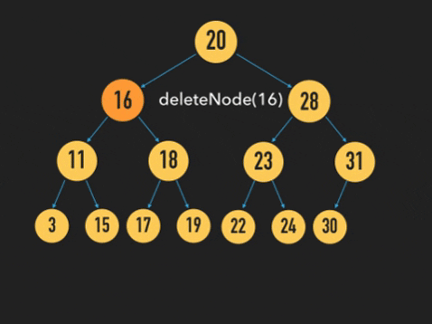

A binary search tree is a tree which is either empty or
	1. values in the **left** subtree are **smaller** than in the root
	2. values in the **right** subtree are **larger** than in the root
	3. root's left and right subtrees are also Binary Search Trees

A binary search tree is a binary tree, so all the same constructors and accessors still apply. There is an extra constraint that the node ordering must be maintained during construction and manipulation. 
 Example of a binary search tree.
**Pseudocode for Insertion in a BST**

The above pseudocode creates a new BST which is a copy of the old one but with the new value. This is inefficient for most applications.

***Java Implementation of a BST tree and Insertion Method***
```java
public class BSTTree {
	private BSTNode tree = null ;
	
	priavte static class Node { 
		private int val;
		private Node left, right;
		public BSTNode(int val, Node left, Node right){
			this.val=val, this.left=left, this.right=right;
	}
	public void insert(int v){
		if (tree == null) tree = new  Node(v, null, null);
		else insert (v, tree)
		}
	private void insert(int v, Node ptr){
		if (v < ptr.val){
			if(ptr.left == null)
				ptr.left = new Node(v, null, null);
			else insert(v, ptr.left);
		}
		else if (v > ptr.val){
			if (ptr.right == null)
				ptr.right = New node(v, null, null);
			else insert (v, ptr.right);
		}
		else throw new Error("Value already in tree.")
	}
}
```

***Searching Binary Search Trees***
You can search binary search trees recursively or iteratively, as shown below:

The worst-case complexity of a search (when the largest or smallest value is the root node, so the tree is fully one-sided) is O(n). 
The average-case complexity of a search is O(log2 n). Thus the average complexity of insertion is also O(log2 n) as searching is the bulk of computation when inserting.
The average height of a General Binary Tree is O(sqrt(n)).

***Deleting from a Binary Search Tree***
 1. Find the node containing the element to be deleted: 
 2. If it is a leaf, just remove it 
 3. Else, if only one of the node’s children is not empty, replace the node with the root of the non-empty subtree 
 4. Else, 
	 4.1 find the left-most node in the right sub-tree (this contains the smallest value in the right sub-tree) 
	 4.2 replace the value to be deleted with that of the left-most node 
	 4.3 replace the left-most node with its right child (maybe empty) 
This is of complexity O(log2 n)

*(GIF Showing Step 4)*
```java
delete(value v, tree t){
	if ( isEmpty(t))
		error("Error: given item is not in the tree")
	else
		if ( v < root(t))
			return MakeTree(root(t), delete(v, left(t)), right(t))
		else if ( v > root(t))
			return MakeTree(root(t), left(t), delete(v, right(t)))
		else
			if ( isEmpty(left(t)) )
				return right(t)
			elseif ( isEmpty(right(t)) )
				return left(t)
			else return
				MakeTree(smallestNode(right(t)), left(t),
                removeSmallestNode(right(t)))
}
smallestNode(tree t){
	if ( isEmpty(left(t)))
		return root(t)
	else
		return smallestNode(left(t))
}
removeSmallestNode(tree t){
	if ( isEmpty(left(t)))
		return root(t)
	else
		return MakeTree(root(t), removeSmallestNode(left(t)), right(t))
}
```
***Checking Whether a Binary Tree is a BST***
1. If the tree is empty, it is a valid BST
2. Else, it is a valid BST if:
	1. all values in the left branch are less that the root and
	2. all values in the right branch are more that the root and
	3. the left branch is a valid BST and
	4. the right branch is a valid BST

