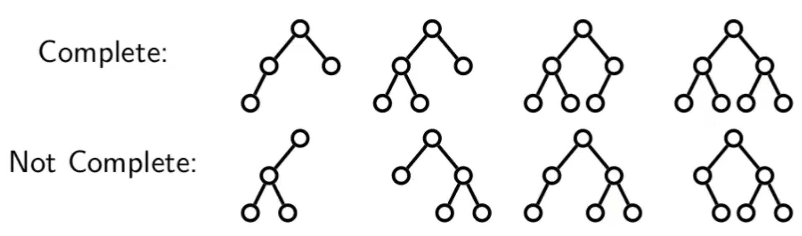
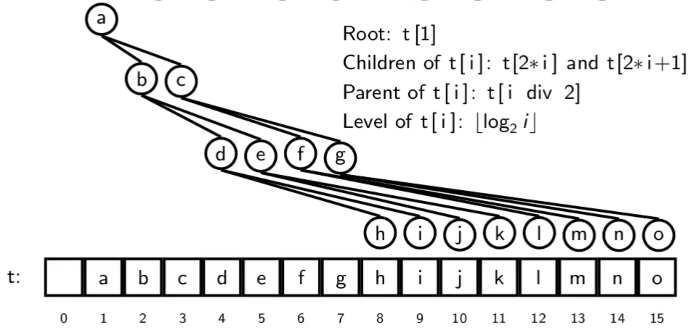
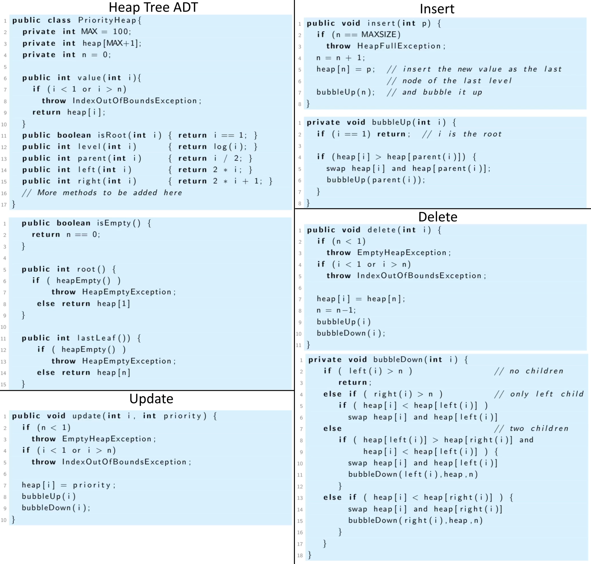
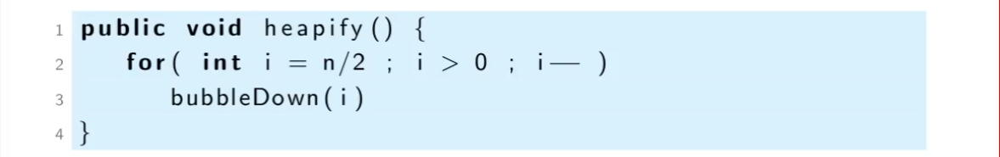
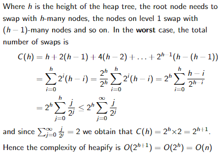

Priority queues are an ADT that maintains a collection of items which has an associated priority value and can get (and remove) the item with the highest priority efficiently. New items with arbitrary priorities can be added at any time.

We can implement this in many ways, first we will use a complete binary tree called a **Binary Heap Tree**. 
**Complete Trees**
A binary tree is complete if all level, excluding the leaf level, are full, and all the leaves on the last level are placed as far to the left as possible.

**Array Implementation of Binary Tree**
Here we see an array implementation of a binary tree:

If a binary tree is NOT complete, then:
	-this implementation is wasteful, as there is space reserved for missing nodes.
	-when a node is missing, the array cell needs to be marked to indicate this by either using an invalid value (null, -1) or by using a separate data structure to indicate which cells contain a real value.
If a binary tree is always complete, then:
	-a single integer to record the number of nodes is sufficient to identify the end of the tree
	-you don't need to mark missing nodes.

**Binary Heap Trees**
A binary heap tree is a complete binary tree which is either empty or satisfies the following conditions:  
	1. The priority of the root is greater than or equal to that of its children. 
	2. The left and right su`insert 20 (HeapNode 50 (HeapNode 100 Empty Empty) (HeapNode 200 Empty Empty))`btrees of the root are heap trees.
There is no restriction on the relationship between left and right children of any node, they are unordered.

**Heapify**
The complexity of building a heap tree of size `n` using the above insert code is order O(n log n). 
Instead, we put the list into an array, this is already a complete binary tree, but to convert to a heap tree we perform `bubbledown` operations from the last parent node in the array, working towards the first element.

The logic of the above code is that the leaf nodes (which are ~50% of all nodes) do not have bubble downs performed on them. Instead, we start with the first parent node (at n/2).

The complexity for heapify is O(n), as calculated below:

**Merging Binary Heap Tree**
There are three approaches to merge binary heap trees:
Use this approach if merging a very small tree and a large tree. 
	-Insert each item of one tree into the other, n inserts, O(n log n)
Use this approach if the trees are similar sizes.
	-Remove the last elements of the bigger tree and insert them into the smaller until the tree made from a dummy root node and smaller tree as its left child and larger tree as its right child is a complete tree, then delete the dummy root node. This is O(n log n) too but about 1/4 operations, so faster than above method.
Use this approach if both trees are relatively large, but there is still a large % disparity between size
	-Concatenate the array forms of the two trees and call `heapify()`
