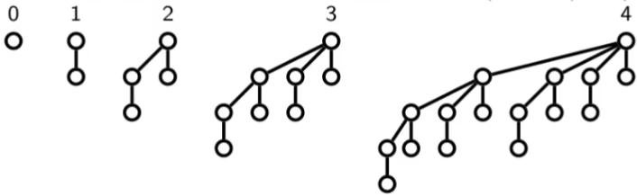
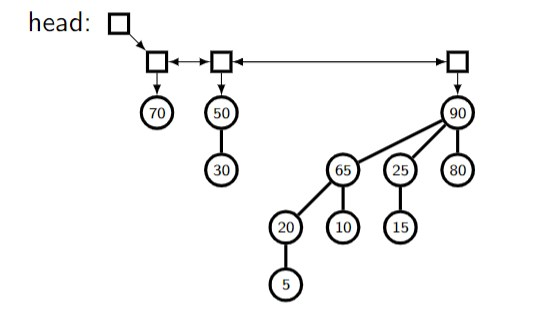
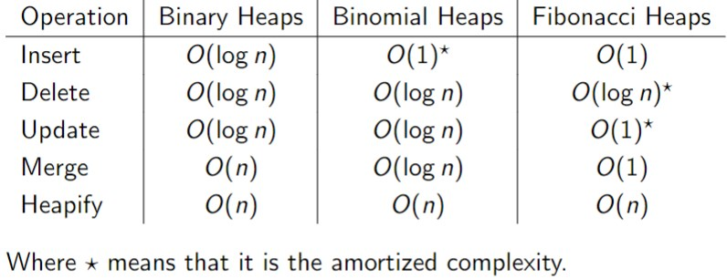

**Binomial Trees**
A binomial tree is defined recursively as follows:
	-A binomial tree of order 0 is a single node
	-A binomial tree of order k has a root node with k children that are roots of binomials trees of orders k-1, k-2, ..., 2, 1, 0
A binomial tree has exactly $2^k$ nodes and can be constructed from 2 binomial trees of order  k-1 by attaching one of them as a new leftmost child of the root of the other.

**Binomial Heap**
A binomial heap is a list of binomial trees with the properties:
	-There can be only zero or one Binomial Trees of each order.
	-Each binomial tree satisfies the priority ordering property: node has priority ≤ its parents.
We order the bionomial heap in ascending order of component binomial trees.

Usually we use a doubly linked list to implement a binomial heap, like so:

There is no ordering between the keys in the different component binomial trees.
To find the node with the highest priority, we simply traverse the list. There are log n trees required to store n values, so this is O(log n).

**Binomial Heap Merge**
Say we have a binomial tree of size 16, and we want to add a single element. This is not possible, which is why we use a binomial heap. Two binomial trees can only merge when they are of equal order, we treat this as a "carry out" in the following operations.

Iterate through the list in ascending order and, for each order, set the resulting tree and carry out to be the merge of any carry in and the H1 / H2. See below an example:

Merging two binomial trees is O(1), and merging two binomial heaps requires, in general, the merging of O(log n) binomial trees, hence Binomial Heap Merge is of O(log n).

Inserting merges two Binomial heaps, one of order 0 (a single element), there is a probability of:
-50% that the other heap contains a tree of order 0, so merge order 0.
-25% that the other heap has binomial tree of order 1 and requires a merge.
-12.5% etc..
So the amortized cost of inserting one element is O(1).

**Other Operations for Binomial Heap**
There is no fast way to build a binomial heap from a collection of n key values, we have to simply insert n times: O(n)

To change the priority of a node in a binomial heap, we can use a bubble up/down process similar to that of binary heaps: O(log n)

Deleting the highest priority node requires finding it, using a linear search is O(log n), and removing the root node of that tree and merging the subtrees back into the binomial heap: also O(log n), so total cost is O(log n).

Deleting non-root nodes can be done by setting the node's priority to infinity, bubbling it up to the root and then deleting it as in the previous case: O(log n)

**Fibonacci Heaps**
Fibonacci heaps are similar to Binomial heaps in that they are also a collection of trees, but with different constraints on their structure. They are considerably more complex than Binomial Heaps, and make use of lazy modifications to keep themselves organized.  
Their advantage over Binomial Heaps are that they achieve complexity of O(1) for merge, and updating the priority of a node has amortized complexity of O(1).

