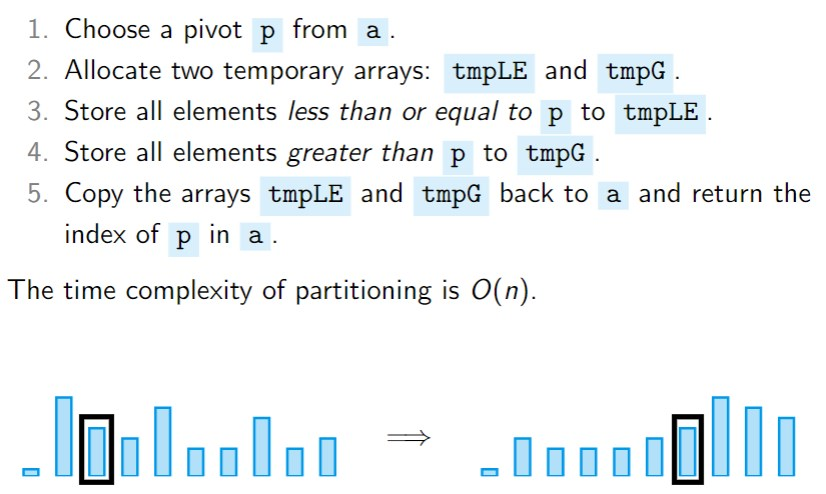

**Quick TLDR of Different Sorts**
**Bubble sort** iterates through the array and compares a value at index i to the value at index i+1 and swaps if i > i+1, each pass confirms one new element is in correct place, from the end of array back.

**Insertion sort** splits the array into unsorted (contains element at index 0 initially) and sorted, and iterates through the unsorted array to find where to put the element in the sorted array.

**Selection sort** splits the array into unsorted (empty initially) and sorted, and iterates through the unsorted array to find the smallest value, then inserts into the sorted list.

**Heap sort** uses a priority heap to select and remove the value of highest priority, and then adds it to the end of the output array. Every time we take the highest priority item from the heap, which is in index 1, and we put that in location n, and put n in location 1 and bubble down.

**Merge sort** splits iteratively splits the array, and thus subarrays, into two halves, and then merges them in sorted order. Read the merge code for more details.

**Quick sort** uses a pivot and splits by that pivot, putting all the values less than the pivot to the left of the pivot, and all the values more than the pivot to the right. We perform this recursively to end up with an ordered list. Pivot selection is key with this sort.

**Sorting**
Sorting is the process of arranging a set of elements in a particular order. Most sort algorithms use a comparison function that defines the order between two given elements. In some special cases, the nature of the data means that we can sort without using a comparison function.

Java provides two interfaces to implement comparison functions:
`Comparable`: A `comparable` object can compare itself to another object using its `compareTo()` method. There can only be one such method for any class, so this should implement the default ordering of objects of this type. `x.compareTo(y)` should return a negative int, 0, or a positive int, if `x` is less than or equal to, or greater than `y` respectively.
`Comparator`: A `comparable` object can be used to compare two objects of some type using the `compare()` method. This method takes two arguments, each of the objects to be compared. Similar to above `compare(x, y)` should return a negative int, 0, or a positive int, if `x` is less than or equal to, or greater than `y` respectively. 

There are a number of basic strategies for comparison-based sorting:
	-**Enumeration**: For each item, count the number of items less than it, say N, then put the current item at position N + 1.  
	-**Exchange**: If two items are found to be out of order, exchange them. Repeat until all items are in order.  
	-**Selection**: Find the smallest item, put it in position 1, find the smallest remaining item, put it in position 2, . . .  
	-**Insertion**: Take the items one at a time and insert into an initially empty data structure, such that the data structure continues to be sorted at each stage. 
	-**Divide and conquer**: Recursively split the problem into smaller sub-problems till you just have single items that are trivial to sort. Then put the sorted ‘parts’ back together in a way that preserves the sorting.

We can formulate a **decision tree**, where each leave is a possible ordering of the items. Example: 

The above tree is for sorting of 3 elements, a1, a2 and a3.
The minimum number of comparisons necessary to sort n items is the height of a binary tree with n! leaves. The maximal leaves a binary tree can have is $2^h$, so **h $\ge$ log$_2$ n!** and log$_2$ n! = $\Theta$(n log n), thus we need **at least n log n comparisons** to complete a comparison based sort in general.

A **stable sorting algorithm** does not change the order of items in the input if they have the same sort key. What this means is, say we sort a list of students by first name and there are 2 "John"s, and then we sort by age. If they John's are both 19, they will be placed next to eachother in the list sorted by age. 
Using stable sorting algorithms, we can "**pipeline**" sorting steps to construct a particular order in stages.

**Bubble Sort** (Exchange)
Bubble sort does multiple passes over an array of items, swapping neighbouring items that are out of order as it goes. Each pass guarantees that at least one extra element ends up in its correct position, so consecutive passes work on the smaller and smaller subset of the array that is unsorted.
```java
bubblesort(a, n){
	for(i=1 ; i<n ; i++){
		for(j=n-1 ; j>= i ; j--){
			if(a[j] < a[j-1]){
				swap a[j] and a[j-1]
}}}}
```
The outer loop is iterated n-1 times. The inner loops is iterated n-i times, with each iteration executing a single comparison, so the total number of comparisons is:

Thus best, average and worst case complexities are all **O($n^2$).** Bubble sort is **a stable algorithm**, as only neighbouring pairs of values can be swapped and the swap is only carried out if one is strictly less than the other.


**Insertion Sort** (Insertion)
Insertion sort works by taking each element of the input array and inserting it into its correct position relative to all the elements that have been inserted so far. To do this the array is partitioned into a sorted part at the front and an unsorted part at the end. Initially the first element is the only part of the array that is *sorted*. 

The outer loop is iterated n-1 times. In the worst case, the inner loop is iterated 1 times for the first outer loop iteration, 2 times for the 2nd, and so on. Thus, in the worst case, the number of comparisons is:

The average case is half of that, so **$(n(n-1))/4$**. Hence, **average** and **worst** case **complexity** is O($n^2$).
Consider two elements which are in an array sorted by a criterion, and they are then sorted by a second criterion. During the selection sort process, we will only swap the ordering of any two items if the item on the right is less than the item to its left. Therefore, the ordering of two equivalent items will always be preserved in insertion sort. So insertion sort is **stable**.

**Selection Sort** (Selection)
Selection sort works by selecting the smallest remaining element of the input array and appending it at the end of all elements that have just been inserted so far. It's similar to Insertion sort, as it partitions the array into a sorted part and an unsorted part, but instead of searching the sorted array to find where to insert, we search the unsorted part to find the next element to insert.
Initially, the sorted part of the array is empty.

The outer loop is iterated n-1 times. In the worst case, the inner loop is iterated n-1 times for the first outer loops iteration, n-2 times for the 2nd, and so on. 
Hence, **best**, **average** and **worst** case complexity is O($n^2$)
If we have a presorted array and we are to use selection sort to sort by another criterion, the algorithm will find the next lowest in the array, this maintains the initial order in each group of the same value, therefore **selection sort is** **stable**.

**Heap Sort** (Selection)
Heap sort uses a priority heap to efficiently select and remove the value of highest priority from a collection of values. We then take the item of largest priority and add it to the end of the output array. Every time we take the highest priority item from the heap, which is in index 1, and we put that in location n, and put n in location 1 and bubble down.


Heapify is O(n). Then we have to do n bubble down operations, each of complexity O(log n) which gives a cost of **O(n log n)** in total. The bubble down operations reorders the initial list, so this is **unstable**.

**Merge Sort** (Divide and Conquer)

 
 
Merging two arrays of length n1 and n2 is in O(n1 + n2), and the amount of calls required is log n, so the worst / average / best time complexity of merge sort is **O(n log n)**. 
The splitting phase does not change order, and the merging phase merges the left with the right, and takes values from the leftmost sub-array before the rightmost (when values are equal). Therefore, mergesort is **stable**.

**Quick Sort** (Divide and Conquer)
Quick sort is also a divide and conquer style algorithm, we choose a pivot and split by that pivot, putting all the values less than the pivot to the left of the pivot, and all the values more than the pivot to the right. We perform this recursively to end up with an ordered list.


Theory of partitioning is below:
Pseudocode for two partitioning techniques:

The time complexity of quick sort depends on where the pivot sits in the ordered list of values. If the pivot is the median value, we get the best-case time complexity of O(n log n). If the pivot is always the least element in the sorted array, for every iteration of the partition, then worst-case time complexity of O(n$^2$).
The average case depends on the strategy chosen for choosing pivot, if there are $\geq$ 25% many small entries or $\geq$ 25% many large entries in almost every iteration, then the partitioning happens approximately log$_{4/3}$ n-many times, time complexity is O(n log n).]

**Pivot selection strategies**
We could choose:
	1. the middle entry (good for sorted sequences)
	2. the median of the leftmost, rightmost and middle entries
	3. a random entry (50% chance of good pivot)
In practice we usually use 3, or sometimes a variant of 2.

When we have partitioned down to 16 or so elements, it's often faster to use selection sort or another sort, as the overhead of quick sort makes it computationally expensive at this size of n.

**Non-Comparison Sort**
**Binsort**
**Binsort** doesn't compare individual key values but instead assigns them into a bin, implemented with a queue. For example, splitting a deck of cards into suits, or value. These bins are then concatenated into a single list. This is a stable sort, as value that belong in the same bin are enqueued in the order they appear in the input list. Binsort does one pass through the input to fill the bins, and one pass through the bins to generate the output list, and so is O(n).
Dates are suitable values to do such “multiphase” binsorts on: sort first by day, then by month, then by year to obtain the list of dates in Year, Month, Day order.  
A variant on binsort is **bucketsort**, where instead of “scattering” records into bins based just on a value (which could be numeric or categorical), they are scattered into buckets based on a **range of numeric** **values** or a set of categories. For example, 5$\le$x<10.

**Radix Sort**
**Radix sort** is a multi-phase binsort where the key sorted on in each phase is a different, more significant base power of the integer key. For example, in base 10 we would sort key values into order of their units value, then into order for there 10s value, then 100s, then 1000s etc.  

(Radix sort in base 2)
Complexity is O(kn), where k is the number of bits in a key. 

**Pigeonhole Sort**
A special type of sort, where the keys to be sorted are from 0 to n-1. This is used when our key values have records attached. The idea here is to create an output array of size n, and iterate through the input list, directly assigning the input records to their correct location in the output array.
```java
pigeonhole_sort(a, n){
	create array b of size n
	for (i=0; i<n; i++)
		b[a[i]] = a[i] 
	copy array b into array a
}
```
We can alternatively pigeonhole sort **in-place**.
```java
pigeonhole_sort_inplace(a, n){
	for (i=0; i<n; i++)
		while( a[i] != i)
			swap a[a[i]] and a[i]
}
```
Both of these implementations are O(n).

**Comparison of Sorts**


