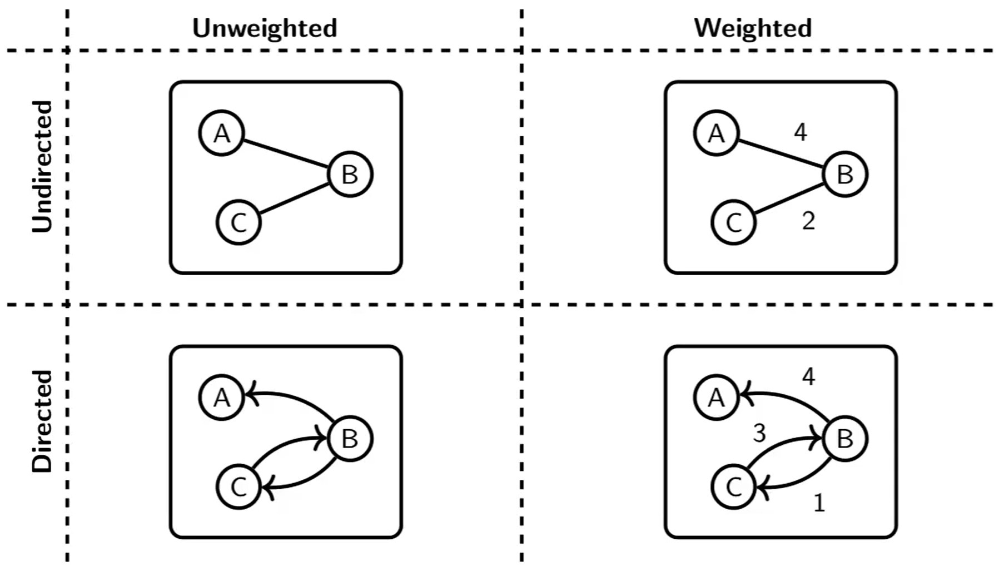
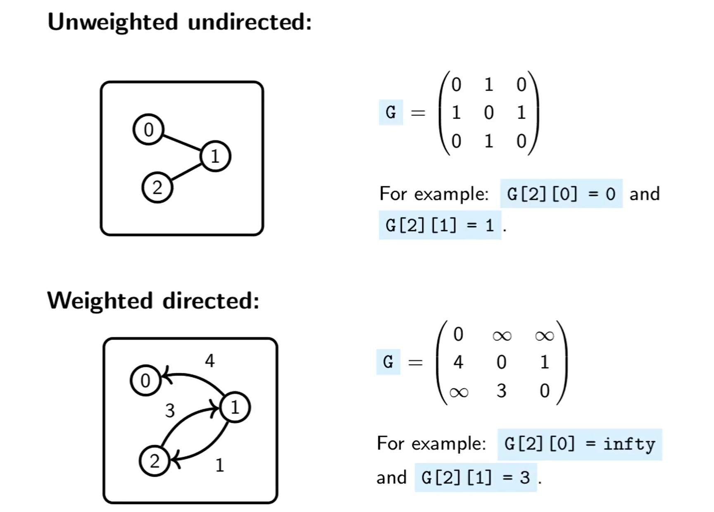

A directed graph is sometimes called a **digraph**.

A graph is simple if it has **no self loops**, and there is **no more** than **one** edge between two nodes.

A **cycle** is a non-empty path whose first vertex is the same as the last vertex. A path is simple when no vertex appears on it twice.

An undirected graph is **connected** if every pair of vertices has a path connecting them.

A directed graph is: 
	**weakly connected**: if for every two vertices A and B, there is either a path from A to B or B to A.
	**strongly connected**: if there are paths leading **both ways**.

Two vertices, A and B, connected by an edge e are said to be **neighbours**, and e is said to be **incident** to A and B.

Two edges with a vertex in common are said to be **adjacent**.

We can represent a graph as an **adjacency matrix**:

Or as **adjacency lists** (implemented with linked lists):

A graph is **sparse** if it has few edges relatives to its number of vertices, $\frac{m}{n}$ is small.

	