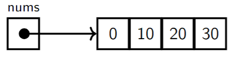
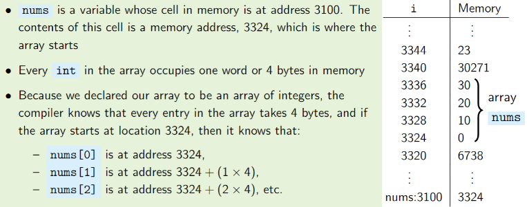
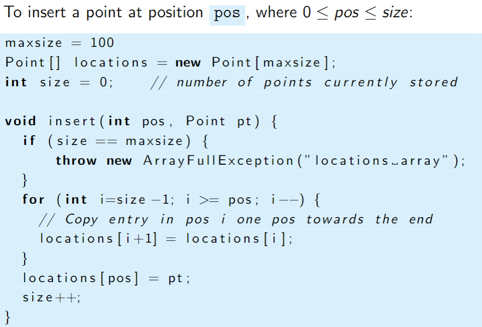

**Arrays**
An array is laid out sequentially in memory - in Java they are indexed with the first cell as index 0 and last as len(array)-1. Arrays are declared to contain a specific data type, you can even have an array of arrays.

A basic array has very few operations:
	Array Creation:
	`int[] nums = new int[4]` (this is array of size 4)
	Accessing values:
	`val = nums[0]`
	Assigning values to cells:
	`nums[1] = 23`
	Getting length of the array:
	`len = length(nums)`

```
int[] nums = new int[4]  
for(i=0, i<length(nums); i=i+1)  
	nums[i] = i∗10
```

In memory, the above code would be assigned 4 byes of memory (int takes one byte) and each address would contain `0, 10, 20, 30`. We can diagrammatically show this as below:

This is the standard diagram for displaying memory locations / allocation in this module, with the arrow representing a pointer. Notice that each of the entries in the array are next to each other, signifying their sequential nature in memory.



To insert into an array at a specific position we need to check the array isn't full, then move every element above the specified position 'up' one in memory to make space, then we can insert. See photos below for a pseudocode implementation of this:


If the array is already full, we might need to generate a new array of a larger size and copy all the elements of the old array, and new elements, into the new array. This is computationally expensive, though, and so often the array implementation allows the array to be dynamic in size.