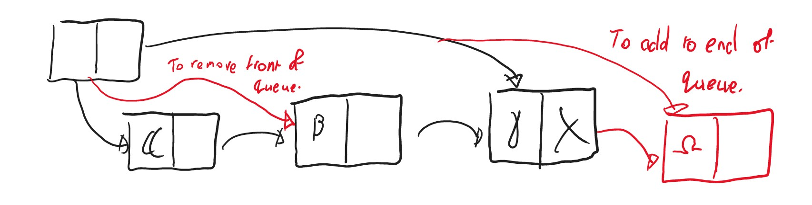
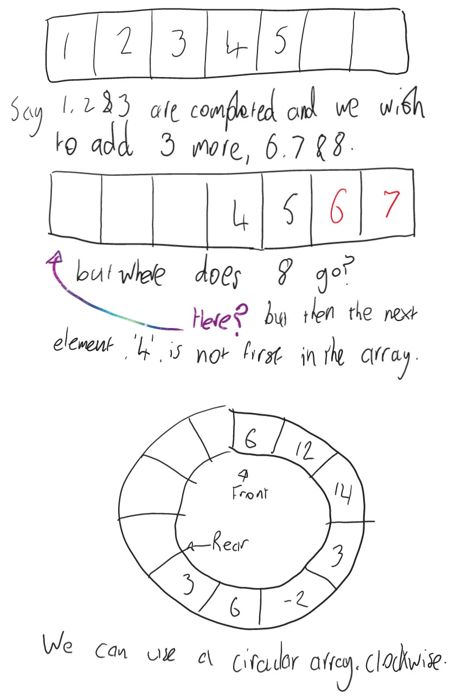
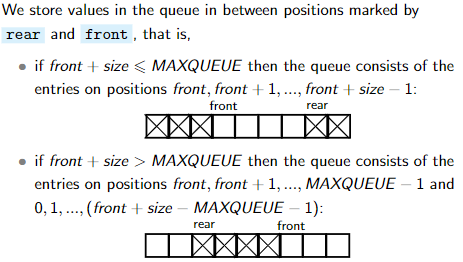

**Queues**

A queue is an ADT defined by its three operations:
	`enqueue(x)` puts value `x` at the rear of the queue
	`dequeue(x)` takes out a value from the front of the queue (or throws an EmptyQueueException if empty)
	`isEmpty(x)` returns whether the queue is empty

A queue is a list of values, with two ends, front and rear. Values are added to the rear/end of the queue, and taken from the front of the queue in a First In First Out (FIFO) manner.

The list of possible operations for a queue ADT (constructors and accessors):
	`EmptyQueue` - returns an Empty queue
	`push(element, queue)` - pushes an element to the back of the queue
	`top(queue)` - returns value at the front of the queue without changing it.
	`pop(queue)` - returns the queue with the front element removed
	`isEmpty(queue)` - returns whether the queue is empty

If we were to use a normal single linked list to implement a queue then, you would either have constant time queuing with linear time de-queuing OR constant time de-queuing with linear time queuing. Either way, a single linked list cannot implement a queue without some linear time complexity operations. We can instead use a linked list with the first node pointing towards the first and last value-holding nodes.

Linked List implementation of a queue:


We can use an array to implement a queue, but we run into some issues.

We can implement a circular array by storing the `front` and `size` in two variables. The values are stored at the indexes `front`, `front +1`, `front +2`,... To `enqueue` a new value we can check that `front + size ≤ MAXQUEUE` and if true then store the new value at `front + size` and then increment `size`

NOTE: Invariants is a condition on code - they must always be true, such as the `front + size <= MAXQUEUE` above, for the code to execute.

DIGRESSION: `div` and `mod` are integer division and remainder method respectively.
```
123 div 10 = 12
123 mod 10 = 3
58.7 div 10 = 5
58.7 mod 10 = 8.7
```
Note that `a div b` is always an integer and 0 ≤ `a mod b` < 10 such that:
`(a div b) * b + (a mod b) = a`
Consequently:
```
-7  div 10 = -1
-7 mod 10 = 3
-123 div 10 = -13
-123 mod 10 = 7
```

**CIRCLE ARRAY IMPLEMENTATION**
```
queue = new int[MAXQUEUE];
front = 0;
size = 0;
```

The invariants maintained in this implementation are
	0 ≤ front < MAXQUEUE 
	0 ≤ size ≤ MAXQUEUE

We calculate the rear, when needed, by `rear = (front + size) mod MAXQUEUE`. 

The queue is full when `size == MAXQUEUE` and empty when `size == 0`

To enqueue we first check the queue is not full, and put the new value at index 
`(front + size) mod MAXQUEUE`, and then increment the size.

To dequeue, we check the queue is not empty, get the value at index position `front`, increment front by calculating `front = (front + 1) mod MAXQUEUE` and then decrementing size.

```
queue = new int [MAXQUEUE];  
front = 0;  
size = 0; 

boolean isempty() {  
	return size == 0;  
}  

boolean isfull() {  
	return size == MAXQUEUE;  
}  

void enqueue(int val){  
	if (size == MAXQUEUE) {throw QueueFullException;}  
	queue [(front+size) mod MAXQUEUE] = val;  
	size ++;  
}  

int dequeue () {  
	int val; 
	if (size == 0) {throw QueueEmptyException;}  
	val = queue [front];
	front = (front + 1) mod MAXQUEUE  
	size −−;  
	return val ;  
}
```
