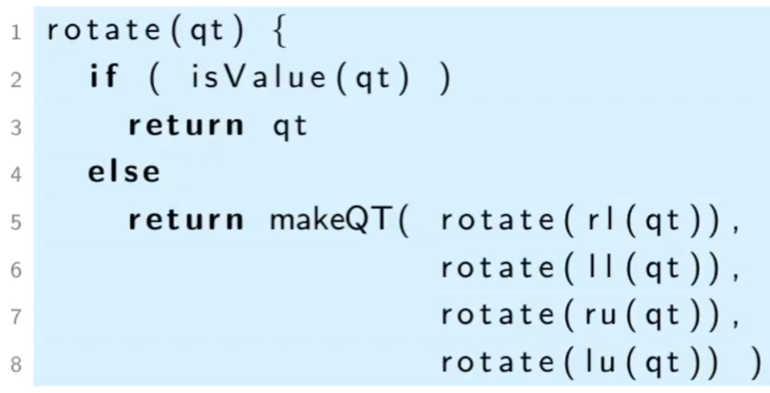

A **Quad Tree** is a novel type of tree that has two distinct features:
	1. The values are ONLY at the leaf level, no values in the internal nodes.
	2. Internal nodes have 4 children.
This is useful for representing / manipulating some kinds of 2d data, such as images.
**Example of a Quad Tree and the 2D Data it Represents**

***Quad Tree ADT***
• Constructors: 
	• `baseQT(v)` : returns a single, leaf node quad tree with a value 
	• `MakeQT(luqt, ruqt, llqt, rlqt)` : returns a new quad tree built from four sub-quad trees.
• Accessors: 
	• `isValue(qt)` : return true if `qt` is a value node quad tree, otherwise returns false 
	• `lu(qt)` : returns the left upper sub-quad tree of `qt` 
	• `ru(qt)` : returns the right upper sub-quad tree of `qt` 
	• `ll(qt)` : returns the left lower sub-quad tree of `qt` 
	• `rl(qt)` : returns the right lower sub-quad tree of `qt`  
If `qt` is a value node quad tree, then we conventionally refer to the value stored in the node as `qt`, rather than define another accessor `value(qt)` for that purpose.
**Pseudocode to Rotate a Quad Tree**

