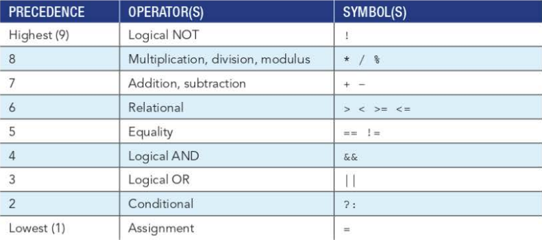

**Planning Decision-Making Logic**
It's often useful to plan an application's logic before coding it, whether this be via pen and paper, or writing pseudocode, or flowcharts, it's worth fully understanding the line-by-line logic of a program
A step-by-step flowchart with no decisions is called a **sequence structure**. A flowchart with decisions is a **decision structure**.

**`if` and `if else` Statements NEW KNOWLEDGE ONLY**
Variables declared within an if or else block are local to that variable.

&& is the AND operator for conditionals.
|| is the OR operator for conditionals.
^ is the XOR operator for conditionals.
! is the NOT operator for conditionals. (E.G.  **`if(!(x > y))`**)

**`switch` Statements**
If you are testing for multiple statements you can use a switch statement like so:
```java
switch(year)
{
	case 1998;
		//BLOCK1
		break
	case 1999;
		//BLOCK2
		break
	case 2000;
		//BLOCK3
		break
	default;
		//DEFAULT BLOCK IS NO CASE OCCURS (No break needed)
}
```

**`switch` Expressions**
`switch` expressions are similar to switch statements but ALWAYS return a value, like so:
```java
String message = switch (paymentStatus) {
	case UNPAID -> "The order has not been paid yet.";
	case PARTPAID -> "The order is partially paid.";
	case PAID -> "The order is fully paid.";
	default -> throw new IllegalStateException("Invalid payment status");
};
```
You can use the -> to return a value OR you can use `yeild` as seen below:
```java
String message = switch (paymentStatus) {
    case UNPAID:
        yield "The order has not been paid yet.";
    case PARTPAID:
        yield "The order is partially paid.";
    case PAID:
        yield "The order is fully paid.;
    default:
        throw new IllegalStateException("Invalid payment status");
};
```

**Conditional Operators**
You can use the conditional operator to shorten these conditional statements further, like so:

`smallerBalance = (account1 < account1 ) ? account1 : account2;`

If the first statement, `(account1 < account1 )` is true, then `smallerBalance` is assigned to `account1`, if not then it is assigned to `account2`.

**Operator Precedence**
Its good practice to separate operators with parentheses, but here's the precedence table:


