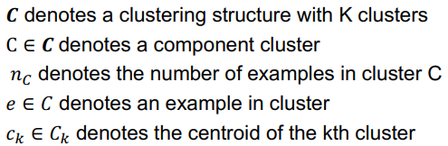
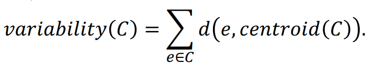
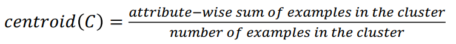
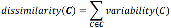
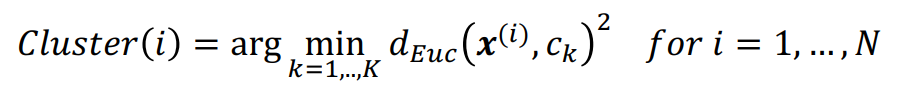
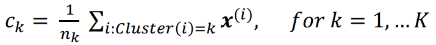
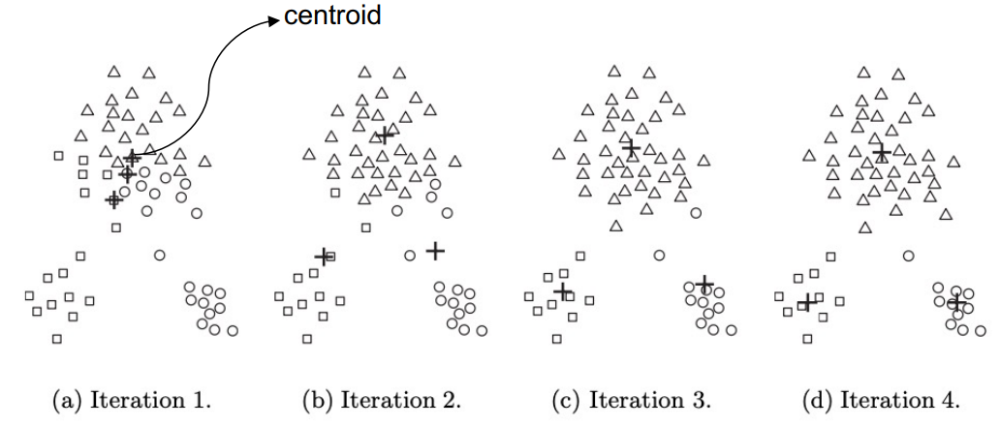
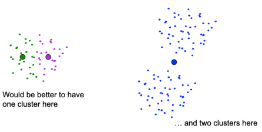
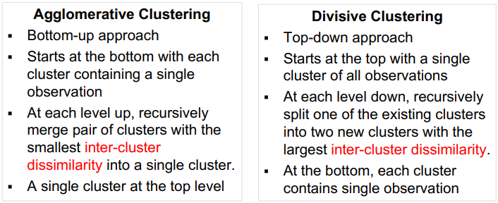
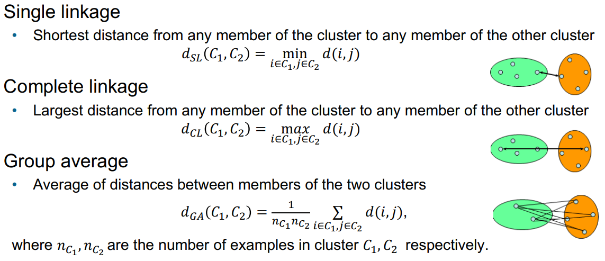

**Partitional Clustering**

In partitional clustering, our goal is to assign a group of N observations in K clusters (K<N) to ensure high intra-cluster similarity and low inter-cluster similarity. We can formulate this problem as a combinatorial optimization problem.

Notation:

We saw the measure of intra-cluster similarity is: 

Where C is the cluster, e is an observation, d(e, centroid) is the distance from each point to the centroid - a lower variability signifies a more compact cluster. The centroid is usually taken as the average of all examples in the cluster, like:

Dissimilarity or 'Within Cluster Sum of Squares' (WCSS) of a cluste ring structure **C** is:

This can also be written as:

We can formulate this problem as a combinatorial optimization by minimizing dissimilarity(**C**). Large clusters with high variability are discouraged. Under squared Euclidean distance, minimizing dissimilarity(**C**) is equivalent to maximizing overall inter-cluster dissimilarity.

The Total Sum of Squares (TSS) is the sum of WCSS, and the ' Between Cluster Sum of Squares' (BCSS, which is the sum of the square of the distance between each centroid and the centre of all the data):

*centroid(data)* is the distance between each centroid and the centre of all the data, and such TSS is a constant, independent of our clustering structure. BCSS accounts for inter-cluster dissimilarity, and since WCSS+BCSS is a constant, minimizing WCSS is equivalent to maximizing BCSS.

As we said before, finding an exact solution is prohibitively hard, but we can use iterative greedy algorithms such as K-means or K-medoids, to give us a suboptimal approximate solution:

**K-means**
K-means iteratively alternates between the following steps:
-Assignment step: for a given set of K cluster centroids, assign each example to the cluster with the closest centroid.
-Refitting step: re-evaluate and update the cluster centroids.

Input: Number of K clusters, and N examples $x^{(1)},...,x^{(n)}$.
1. Select K examples as centroids $c_1,..,c_K$.
2. Loop until centroids do not change:
	1. Assignment step:
	2. Refitting step, where $n_k$ is the total number of examples in the kth cluster:

**Space and Time Complexity of K-Means**
Space complexity is modest, because only observations and centroids are stored, O((N+K)m), where m is the number of feature attributes. Time complexity is O(I * K * N * m), where I is the number of iterations required for convergence, the time complexity is linear in N.

K-means always converges, yet the objective function might not always be convex, so it may get stuck in local optima.

Choosing the initial cluster centroids well is crucial to getting good clustering. Different initialization may lead to different optima, meaning K-means is a non-deterministic algorithm.

We can run K-means multiple times from different randomly chosen cluster centroids, and choose the cluster assignment with the minimum dissimilarity. 

Another method, K-means++, chooses the first centroid at random, then for each other data point, computes the dist(x) from the nearest centroid, then choose a data point x randomly, with probability proportional to dist(x)^2 as the next centroid. This encourages that the initial centroids are adequately spaced. We continue this until all clusters centroids are obtained. 

**Choosing the Number of Clusters K**
One strategy we can use to pick the number of clusters, K, is by using the *elbow* method.
-Apply K-means algorithm multiple times with different number of clusters.
-Evaluate the quality of the obtained clustering structure in each run of the algorithm using the metric dissimilarity(**C**)
-As the number of clusters increases, dissimilarity(**C**) tends to decrease. 
-Plot dissimilarity(**C**) as a function of the number K of clusters. 
-Optimal K* lies at the elbow of the plot.

**Hierarchical Clustering**

Generates a sequence of nested partitions, so clusters within clusters.
Input: Distance Matrix
Example: agglomerative clustering, divisive clustering

*We can use a **dendrogram** to visualize the structure of a hierarchical clustering structure*

**Agglomerative Clustering**
1. Start with all data points in their own clusters.
2. Repeat until only one cluster remains:
	1. Find 2 clusters $C_1, C_2$ that are most similar (i.e., that have the smallest inter-cluster dissimilarity $d(C_1, C_2)$)
	2. Merge $C_1, C_2$ into one cluster

Output: a dendrogram
Reply on: an inter-cluster dissimilarity metric

There are various ways to measure the similarity between clusters:

Single linkage:
• Determined by the pair of examples in the two clusters that are the closest; other dissimilarities between examples in the groups do not matter
• Chaining effect = tendency to combine examples linked by a series of close intermediate examples
• Sensitive to outliers
• Results in clusters that are not compact: single linkage can produce clusters with large diameter, i.e $diam(C_1) = max(i,j\in,C_1) d(i,j)$ is large.

Complete Linkage
• Requires all examples in the two clusters to be relatively similar
• Produces compact clusters with small diameters
• Robust to outliers
• However, members can be closer to other clusters than they are to members of
their own clusters

Group Average Linkage
• Attempts to produce relatively compact clusters that are relatively far apart
• Depends on the numerical scale on which the distances are measured

**Reading a Dendrogram**
§ Height at which two clusters merge corresponds to their intercluster dissimilarity distance.
§ Possesses a monotonicity property, i.e., inter-cluster dissimilarity between merged clusters is monotone increasing with the level of the merger.
§ Horizontally cutting dendrogram at a particular height partitions observations into disjoint clusters.

**Space and Time Complexity**
Storage complexity: O(N^2), as we only store the distance matrix and the clusters.
Time complexity: naively O(N^3), depends on the choice of inter-cluster dissimilarity measures adopted, by using clever sorting algorithms, complexity can be brought down to O(N^2 log N)

**Characteristics of Hierarchical Clustering**
§ Lack of a global objective function
• Need not solve hard combinatorial optimization problem as in K-means
• No issues with local minima or choosing initial points
§ Deterministic algorithm
§ Merging decisions are final
§ May impose a hierarchical structure on an otherwise unhierarchical data