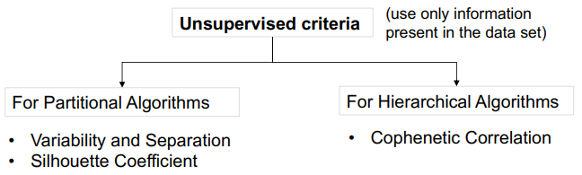

Supervised learning has well-accepted evaluation measures and procedures (e.g. accuracy, cross-validation). In contrast, cluster evaluation is not trivial. We might need to use very different evaluation criteria for different clustering algorithms.

Questions we might have, with cluster validation:
-Is there a clustering tendency in the observed data, i.e., determine whether a non-random structure exists in the data?
-Can we evaluate how well the results of a clustering algorithm fit the data (or natural grouping) without external information?
-Can we evaluate how well the results of a clustering algorithm fit the data with external information?
-Can we compare two sets of clusters to determine which is better?
-Can we determine the correct number of clusters?

Goal: evaluate in a quantitative and objective manner the cluster structure found by an algorithm according to a validation criterion
Validation criterion: Index used to measure the adequacy of the found cluster structures.

*In supervised learning we have seen two different types of algorithms (K-means is partitional)*

**Variability and Separation**
We have various different methods of measuring clustering for K-means, like:

