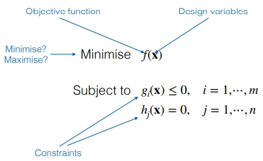
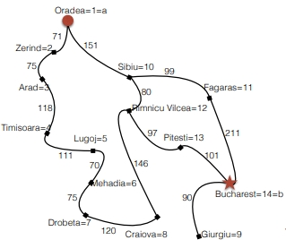
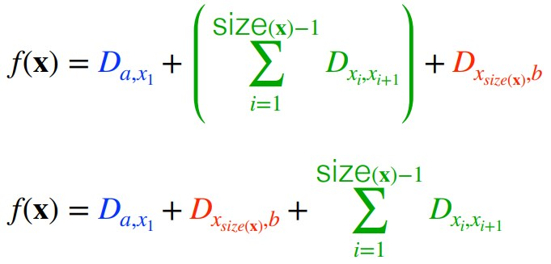
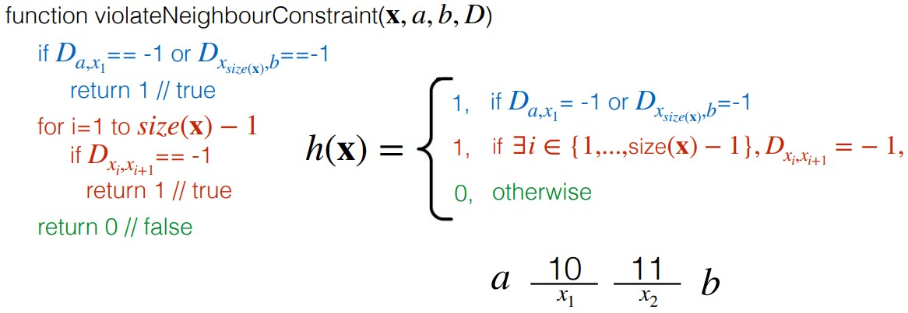
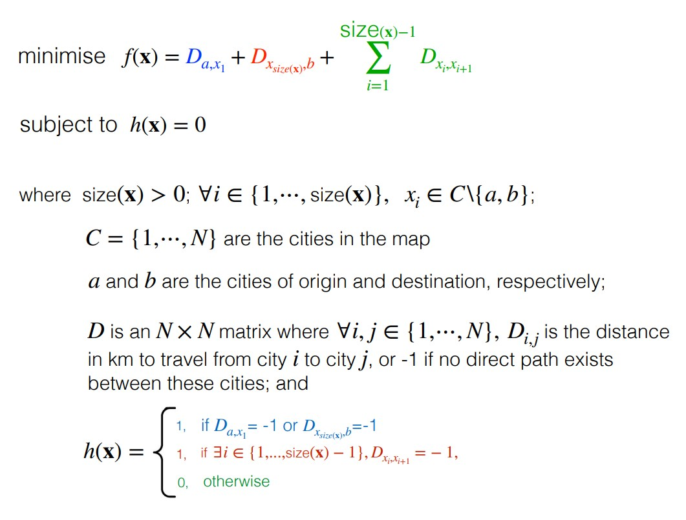

Optimisation problems: find a solution that **minimises** / **maximises** one or more pre-defined objective functions.

• **Design variables** represent a candidate solution. 
	-Design variables define the search space of candidate solutions. 
• **Objective function** defines the cost (or quality) of a solution. 
	-Function to be optimized (minimized or maximized). 
• ( *Optional* ) Solutions must satisfy certain **constraints**, which define solution feasibility. 
	-Candidate solutions may be feasible or infeasible.

*Example optimization problem*

**Pictured example**

The **design variables** represent a **candidate solution**, in the above case this would be a 1-D array containing a sequence of cities to be visited from the city of origin to the destination (but not including them).

The **objective function** is to **minimize the cost** of the distance travelled. 

Solutions must satisfy the given constraints, which define solution feasibility. We could impose certain restraints, like not visiting a specific city. There are some implicit constraints, like that we must start and finish at the city of origin and destination, and that we can only use cities given to us from the map. There are also some explicit constraints, like that we can only have paths between neighbouring cities.

To mathematically formalize:

**Design variable**

$C = {1, ..., N}$
$A \in C$ : city of origin
$B \in C$ : city of destination

Design variable: 
Vector $x, size (x) > 0$ 
$\forall i \in \{1,... ,size(x)\},  x_i \in C$ 

**Objective Function**:
Assume we have a 2-d distance matrix with the distances for all paths from each city to each other connected city, and -1 for all impossible routes.

$\text{function pathDistance(X, a, b, D)}$
	$dist = D$
	$for\text{ i = 1 to size(x)} - 1$
		$dist = dist + D_{x_{i},x_{i+1}}$
	$dist = dist + D_{x_{size(x)},b}$ 
	$\text{return dist}$

**Constraints**

The end result problem formulation is as follows:

**Search vs Optimization**
	-In **search**, we are interested in **searching for a goal state** by taking feasible actions (possibly, while minimizing cost).
	-In **optimization**, we are interested in **searching for an optimal solution** (possibly, while satisfying constraints).
	-As many **search problems** have a cost associated to actions, they **can also be formulated as optimization problems**.
	-Similarly, **optimization problems** can frequently be **formulated as search problems** associated to a cost function.
	-Many search algorithms will “search” for optimal solutions (see A* as an example). 
	-Optimization algorithms may also be used to solve search problems if they can be associated to an appropriate function to optimized

