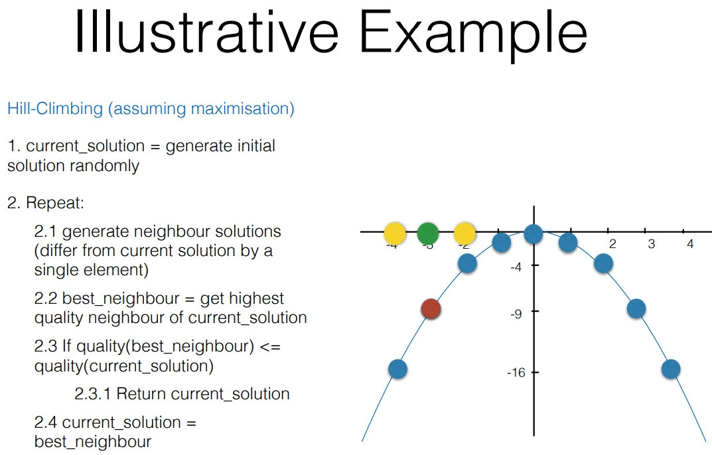

**Greedy best-first hill climbing** algorithm involves:
```
1. current_solution = generate initial candidate solution randomly
2. Repeat:
	1. generate neighbour solutions (differ from current solution by a single element)
	2. best_neighbour = get highest quality neighbour of current_solution
	3. if quality(best_neighbour) <= quality(current_solution)
		1. return current_solution;
	4. current_solution = best_neighbour
```

The **design variable** represents a candidate solution:
$x \in Z$ (our search space are all integer numbers)

The **objective function** defines the quality of a solution:
$f(x) = -x^2$ to be maximized


We iterate through the neighbours, slowly moving towards the optimum. 


• **Optimality**: 
	Hill Climbing is **not guaranteed** to find **optimal** solutions.
• **Time complexity** (worst case scenario): 
	We will run until the **maximum number** of iterations **m** is reached.
	Within each iteration, we will generate a **maximum number of neighbours n**, each of which may take **O(p)** each to generate. 
	Worst case scenario: **O(mnp)**
• **Space complexity** (worst case scenario): 
	Assume that the design variable is represented by O(q). 
	Within each iteration, we will generate a **maximum number of neighbours n**. 
	Assume that neighbours are generated sequentially and that the space r needed to generate them is negligible compared to **n** and **q**. 
	Space complexity: **O(nq+r) = O(nq)**

Hill-climbing is an example of **greedy local** search optimisation algorithm.
• It can **quickly find a local optimum**, but **may not** find optimal solutions.
• Its success **depends on the shape of the objective function**. As it is a relatively simple algorithm, it can be attempted before more complex algorithms are investigated.
