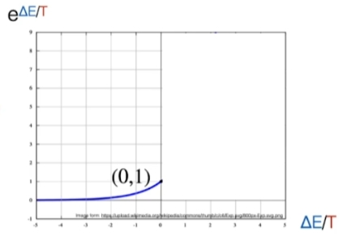

The hill climbing algorithm, shown in 3 has some flaws. It requires that the state space can be defined discretely, or that the optimal solution is at one of the discrete levels of a continuous curve. It also cannot deal with curves that have local minimums/maximums or plateaus, this is because hill climbing (assuming maximization) is greedy.

**Simulated annealing** adds a factor of **probability** when **picking a neighbour** - we **randomly** select a neighbour from the possible neighbour solutions and `if quality(rand_neighbour) <= quality(current_solution)` then **`with some probability current_solution = rand_neighbour`,** else if the quality of the random neighbour is better, then `current_solution = rand_neighbour`.

This **probability** should factor in the difference in quality - if the rand_neighbour quality is **much worse** than the current_solution, then the probability **should be smaller**. Also at the **beginning**, we want a **high probability** at the beginning, to allow us to explore the search space. The **rate** at which we **decrease** this probability is important to finding the global optimum. 

The **probability function** we use is $e^{\Delta E/T}$, where $\Delta E$ = quality(rand_neighbour) - quality(current_solution) and T = temperature.



We **start** with a **high temperature** to increase the probability. The **best value** to start the temperature at is **problem-specific**. The way we reduce (update) the temperature is by using a rule (schedule), for example T = aT, where a is a number close to 1, like 0.95

```
INPUTS =  initial temperature Ti, minimum temperature Tf

current_solution = generate initial solution randomly
T = Ti
Repeat:
	rand_neighbour = generate random neighbour of current_solution
	if(quality(rand_neighbour) <= quality(current_solution))
		with probablity e^{Delta E/T}
			current_solution = rand_neighbour
	else current_solution = rand_neighbour
	T = schedule(T)
	UNTIL a minimum temperature Tf is reached, or the current solution "stops changing"
```

Simulated annealing is **not guaranteed** to find the **optimum** in a reasonable amount of time, whether it finds the optimum depends on the termination criteria and the schedule. If we leave the **algorithm running indefinitely**, it **WILL find the optimum** (assuming the schedule function doesn't reduce the T to zero), however the time required can be prohibitive.

The time and space complexity is problem specific, and can vary wildly (can be worse than even brute forcing the optimum).

