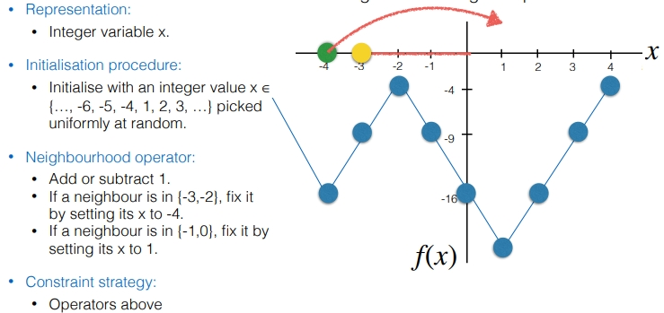

The hill climbing and simulated annealing algorithms shown previously have no means to deal with constraints. 

First we need to formulate our optimization problem; **design variable and search space** & **objective function** & **constraints**. After we have formulated the problem, we need to **design algorithm operators** specifically for how to solve **our problem**. 
The **algorithm operators** are: the **representation** of our **design variable**, the **initialization procedure**, and the **neighbourhood operator**. We also need a **strategy** to deal with **constraints**.

The following problem has a **constraint** that our solution cannot be >0:

Notice how both the **implicit** (and design variable adjustments) and **explicit** **constraints** result in the same problem formulation.

**Dealing With Constraints Based on Algorithm Operators**
An example for the algorithm operators for the above pictured example would be:
-Representation
	-Integer Variable x
-Initialization Procedure
	-Initialize with an integer value picked uniformly at random
-Neighbourhood Operator
	-Add or subtract 1

**BUT** if we initialize with an integer value picking uniformly at random, **we might start** within the range of **infeasible solutions**, and head in the positive-x direction, giving an infeasible solution, we can solve this by **adjusting our algorithm operators**:
-Representation
	-Integer Variable x
-Initialization Procedure
	-Initialize with an integer value **picked from x $\in$ {..., -4, -3, -2, -1, 0}** uniformly at random.
-Neighbourhood Operator
	-Add or subtract 1
	-If a neighbour has **x > 0, set its x to 0**

This solution has some pros and cons:
Advantages: 
	Ensure that **no infeasible candidate solutions** will be generated, facilitating the search for optimal solutions.
Disadvantages: 
	May be **difficult to design**, and the **design** is **problem-dependent**. 
	Sometimes, it could **restrict the search space** too much, making it difficult to find the optimal solution

*For example: this problem is tricky to deal with just algorithm operators as if our initial variable is to the left of the infeasible range, it will never reach the global optimum.*

**Dealing With Constraints By Modifying the Objective Function**

We can introduce a **death penalty** to our objective function:

Notice our problem formulation and algorithm operators **are the same, EXCEPT for our objective function**, with the addition of `C`, which is very large value.

There are some weaknesses to the death penalty method - we want to consider a solution closer to the feasible region as better than one far away, but right now the **penalty is constant** regardless of distance away from the feasible range. To fix this, we could use a function that distinguishes between value that are close to the feasible region, and far away.

To factor in the '**level of feasibility**' we can introduce a **new function** within our objective function, rather than using a discontinuous function like show of the left-side of the above picture. Say our constraint was x $\leq$ 0 or -x $\leq$ 0, then we would have:

Notice that when we rearrange our inequality constraints { *g(x)* } into the format ## $\leq$ 0, then we can **multiply** this by C to factor in the solution's level of feasibility. We also need to introduce a function $v_{gi}$ , which is 1 if $g_i$ is violated, and 0 otherwise, so that we can only add the penalties when they violate the constraints. We must factor in both our inequality constraints and function constraints like so:

As seen above, we could square the level of infeasibility to give larger distinctions between different infeasible solutions.

**Completeness**

If we use a strategy to **deal with constraints** that **never enables** any **infeasible** solution to be **generated**, algorithms such as Hill Climbing and Simulated Annealing **are complete**.
Otherwise:
	Hill Climbing: **not complete** if the objective function has **local optima** (a local optimum may be infeasible).
	Simulated Annealing: **not guaranteed** to find a feasible solution **within a reasonable amount of time** (we may stop before finding a feasible solution).
