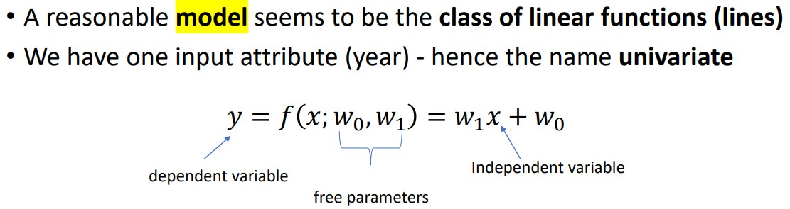
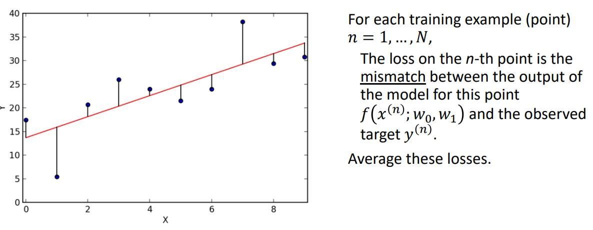
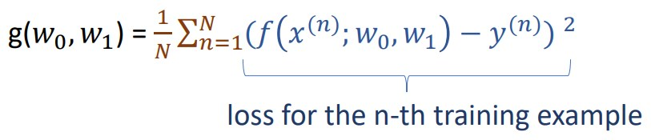
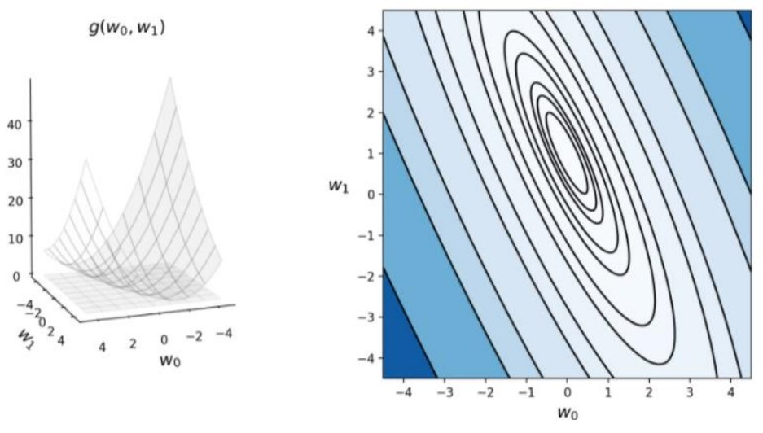
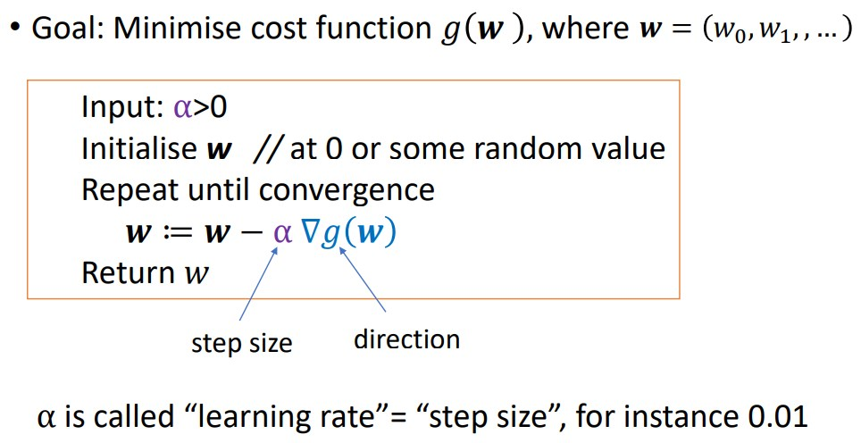
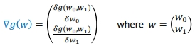

 Regression means learning a function that captures the “trend” between input and output, we then use this function to predict target values for new inputs.

Univariate Linear Regression

We need a criterion that, given the data, for any given line will tell us how bad that line is, this is called the **loss function**, or **cost function**. AKA, loss, error function.

The loss expresses an error, so it must always be non-negative, we often use square loss to measure mismatch for regression. 

**Mean Square Error (MSE)**

*An example for one point*
Suppose a linear function with parameters $w_0$ = 0.5, $w_1$ = 0.5
Compute the loss function value for this line at the training example: (1,3).
f(0.5,0.5) = 0.5 * 1 + 0.5 = 1 (output of the model)
y = 3 (actual target)
Square loss for this point: (1-3)^2 = 4.
Cost = 4.

We can represent the two parameters $w_0$ and $w_1$ on the two bottom axis, and cost on the height, we then get a curve which is an easier representation to optimize.

**Gradient Descent** is a general strategy to minimize cost functions. The general algorithm is:

Note that *w* is a vector containing the different parameters of our estimated line of best fit, for the above examples we would only have $w_0$ and $w_1$, for y = **m**x + **c**. 

$\nabla$g(w) is the vector ***gradient*** of g(w), it is a composite vector of the partial derivatives of $g(w)$ with respect to $w_0$ and $w_1$. 

The negative of the gradient gives us the direction of steepest descent.

*Partial Derivative Maths Reminder*

*An example of calculating and formulating an algorithm for a specific problem.*

This is the end result of continued iterations of the above algorithm, shown with 3 different initial states. Note that gradient descent has no way to deal with local optima.

**Multivariate Regression vs Univariate**

Multivariate regression introduces more than 1 independent variable, for example the function 
$y = w_0 + x_1w_1 + x_2w_2$ where $x_1$ and $x_2$ are both independent variables. Previously above, we have only been looking at univariate regression. 

We can also have univariate non-linear regression, e.g. $y= w_0 + w_1x^2 + w_3x^3$, where we only have one independent variable, but different at different polynomial orders.
