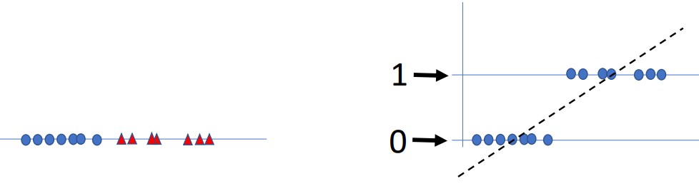
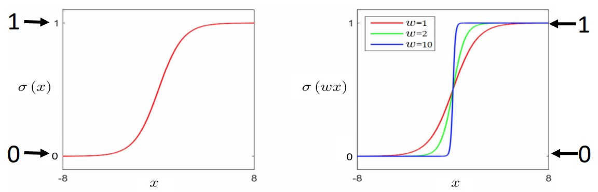
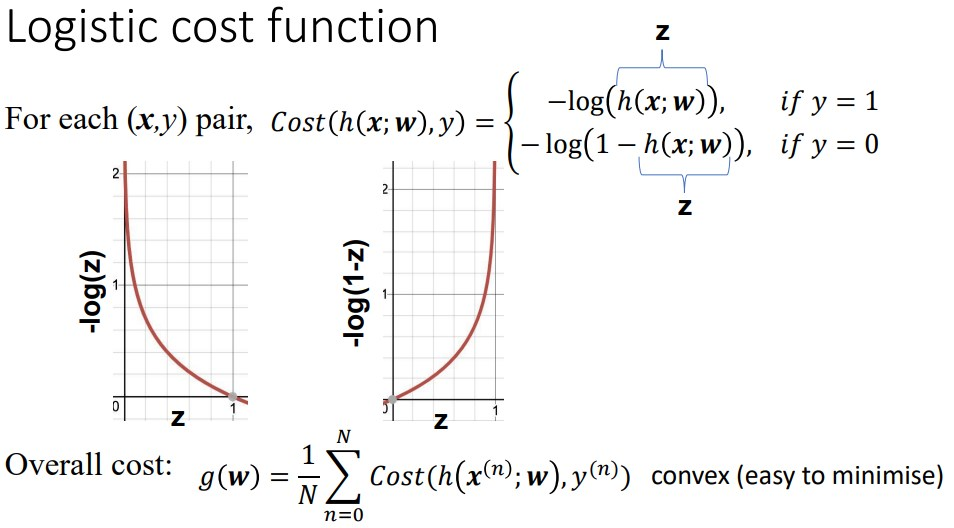
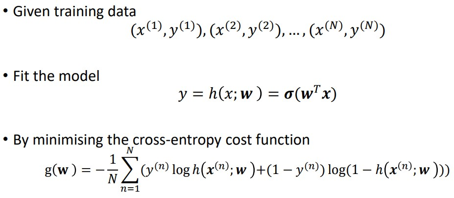
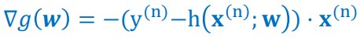
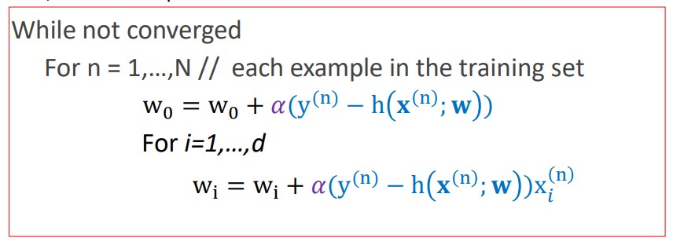

	 **Logistic regression** is a linear model for *classification*. The main steps are: model formulation, cost function, and learning algorithm by gradient descent. 

1. MODEL

In classification, we want to put a boundary between 2 classes - if x has a single attribute, this boundary can be a point; if x has 2 attributes, we can use a line; for 3, we can use a plane; for more than 3 attributes, we can use a hyperplane.

If we wanted to plug classification data into linear regression, it may not perform well:

We change the linear model slightly by passing it through a non-linear function, called the sigmoid function, which will allow this to better fit the data.

The sigmoid function takes a single argument - it always returns a value between 0 and 1, which is the probability that the label is 1.

0.5 is the decision boundary, below which we predict 0, above which we predict 1. 

NOTE: f(x) = h(x; w) = $\sigma (w^Tx)$

**Cost Function**

The model above allows us to perform inference, but we still need to optimize our weights to properly map the data; we can use a cost function to help us define these weights.

We need a new cost function; as mean squared error used in linear regression produces a very bendy function with the new hypothesis function - our new cost function will still have that:
	-each data point contributes a cost, and the overall cost function is the average of these.
	-the cost is a function of the free parameters of the model

Notice above that if the ground-truth data is 1 and we are close to predicted 1, then the cost is 0, but if we predict close to 0, then the cost tends to infinity.

The combination of the two functions:

**Learning Algorithm by Gradient Descent**

We use gradient descent to minimize the cost function.

The gradient vector is:

*This is still a component vector of the partial derivatives with respect to each variable.* 
(This is a lengthy calculation to work this out.)

**No Free Lunch**

The no free lunch theoretical result shows us that there is no AI classification Inference algorithm that can solve, on average over ALL problem,  more than 0.5 of the problems. More formally, NFL contends all optimization methods are equally effective when their performance is averaged across all potential objective functions.

This is an important result to show that if learner A1 is better than learner A2 for a task f, then there is another task g for which learner A2 is better than learner A1. So we need to know many learning methods & try them on the task at hand.