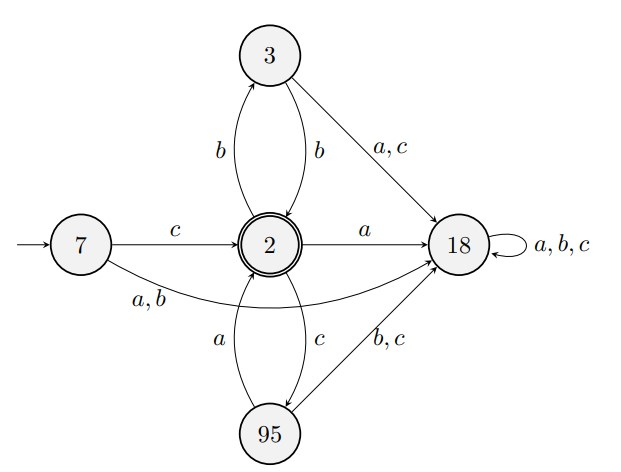
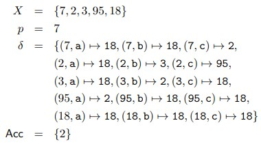
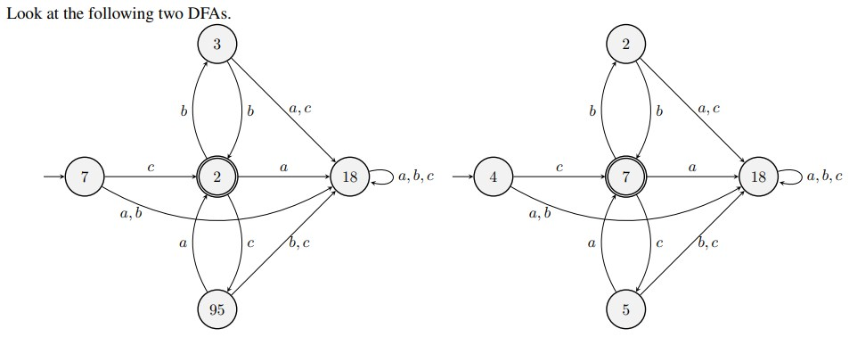
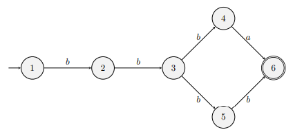
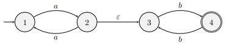

 General principles of reasoning applied to computational problems, and exploration of computational problems.
 Three types of computational problems:
	 -Possiblie in a reasonable amount of time (fast)
	 -Believed to be difficult
	 -Known to be impossible

**Matching Finding Problems**
Let's say a string is a valid password when it has at least 8 characters and at least 2 digits.
Given a specific string, what if we want to say whether it's a valid password or not - this is a **matching problem**.

Given a file, list all the occurrences of email addresses in the file, where an occurrence is (i, p), where **i** is the start position and **p** is the length - this is a **finding problem**.

The user of a tool that solves these problems must specify what a valid password / email / etc.. looks like - one way is by using a **regular expression** (Regex).

Let $\Sigma$ be an **alphabet** / set of characters, could be ASCII or UNICODE or any specified **finite** set.
$\Sigma$* is the set of all '**words**'.
A **language** is a set of words, i.e. a subset of $\Sigma$*.

The regex **a** matches only the word **a**, and regex **b** matches only the word **b**.
The regex $\epsilon$ (epsilon) matches only the **empty word**.
If E and F are regex's, then EF matches any words that's a concatenation of words E matches or F matches. 
If E and F are regex's, then E | F matches any words that's either E matches or F matches. 

**Precedence of Regular Expressions**
**Juxtaposition** (e.g. AB, EF) has a higher precedence than **|**, but a lower precedence than \*.
So c(bb | ca)* is parsed as c { ( (b b) | (c a) )\*}. 

E$^+$ is equivalent to EE*.

A decision problem is one such that it has a yes/no answer. A decision problem is said to be decidable when there is some program that, given an argument, says whether the answer is Yes or No. The finding problem above returns (i, p), so it is not a decision problem, aka not **'decidable'**. The above matching problem is **decidable**, as it would return true or false if the regex matched our word.

**Automata**

**Deterministic Automata**

The circles above are **states**. 7 is the initial state in the example above, we start there and read a letter, if we see c we go to state 2, if we see a or b we go to state 18. The double circle around 2 is an **accepting state**, this means when we have completed parsing the entire word, if we end on an accepting state, then the answer is **True**, if it's not an accepting state, or a **rejection state**, (single circle) then the automata returns **False**. 

The above automaton is referred to as a **deterministic finite automaton**, or **DFA**. This is deterministic because the initial state and the result of each transition are specified, and finite because the set of states is finite.

A DFA consists of the following data:
	- A finite set X of states
	- An initial state p $\in$ X
	- A transition function $\delta$ : X x $\Sigma \implies$ X
	- A set of accepting states Acc $\subset$ X

In the pictured example above:

**Isomorphisms**

This is called an **isomorphism**. It is a bijection (one to one correspondence) between the sets of states of the left DFA and the set of states of the right DFA with the following properties. 
• The initial state in the left DFA corresponds to the initial state in the right DFA. 
• For each state x in the left DFA corresponding to x 0 in the right DFA, and for each character c, the result of starting at x and reading c in the left DFA corresponds to the result of starting at x 0 and reading c in the right DFA. 
• For each state x in the left DFA corresponding to x 0 in the right DFA, they’re either both accepting or both rejecting.

**Partial Deterministic Automata**

**Non-Deterministic Automata** 

A non-deterministic finite automaton (NFA) differs from a DFA in two respects. Firstly, an NFA can have **several initial states**. Secondly, from a given state, when a (or any other character) is input, there can be **several possible next states**. Thus, δ is a relation but not a function. The automaton chooses its initial state, and chooses what state to move to as it inputs a character. A word w is acceptable when there is some path from an initial state to an accepting state that goes through the characters of w.

(An example of an NFA, at node 3 there are two options for the input 'b')

We can **determinize** an NFA into a DFA like so:

Sometimes even an NFA is difficult to obtain, but we can obtain an automaton that spends some time thinking. As it thinks, it moves from one state to another without inputting any character. Here’s an example, for the regexp a(aa)∗b(bb)∗:

The ε refers to a transition with no required input. We call this either a nondeterministic automaton with **eplison** transitions, or **εNFA**.

We can remove epsilon transitions as shown above. We do this by breaking down paths into ***slow transitions*** and ***slow acceptance states***. These are a **series of epsilons followed by a transition or arrival at an acceptance state**. For example, 7 goes to 6 via two epsilons and one '*a*', so we replace this with just an '*a*' from 7 to 6. NOTE: 1 to 73 is a '*b*' followed by an epsilon, in this example we consider the b as normal and this is not a slow transition as the epsilon comes after the '*b*'.

