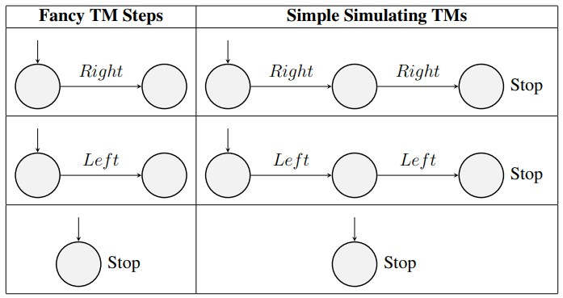
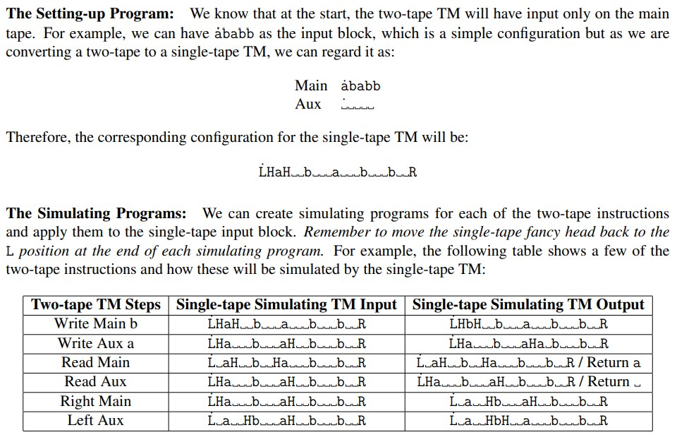
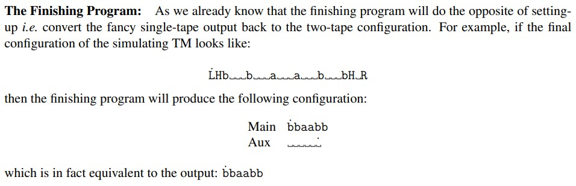
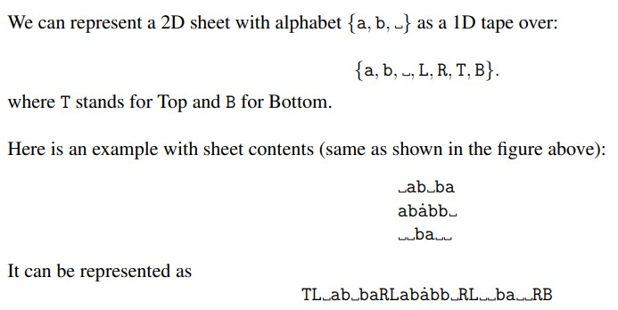

Recall the types of machines we saw:
-Simple TMs
-TM with auxiliary chars
-Two-tape TM
-2D-TM

We can convert from the more complicated machines back into a simple TM, whilst maintaining functionality and maintaining polynomial time (order may change though).

Say input is {a, b}, and we use auxiliary chars {c, d}. We start at the leftmost non-empty cell with a word, w, and are converting for some output, f(w), and at the end of the process, the tape is empty except for f(w) and the head is at the leftmost char.

To convert from a fancy TM to a simple TM, generally involves four steps:

	1. Give a relation between the tape configurations of fancy TM and the tape configuration of the simple TM. In simple words, define a way to represent the tape configuration (i.e. tape contents plus head position) of the fancy TM as a configuration of the simple TM. This is a creative step! 
	2. Give a program to convert the initial configuration of the fancy TM into a corresponding configuration of the simple TM (The “Setting-up” program). 
	3. For each instruction of the fancy TM, show how to simulate it on a simple TM. In other words, show how to “perform” each step of the fancy TM on a simple TM (The “Simulating” programs). 
	4. Give a program to convert the result of simple TM to the fancy TM result (The “Finishing” program).

For step 1, say we have A, B, C, D, -, we can convert this to a simple TM by representing all chars as pairs like, A=AA, B=BB, C=AB, D=BA, - = --,  and we place the head on the leftmost of the new pairs - this would convert it with no ambiguity. Defining this relation is our first step.

For step 2, in order to code a machine to perform this first step to convert initial configurations, we can use a turing machine - this will be O($n^2$). The goal is to *stretch* the string, e.g. aabab -> aaaabbaabb
There are many ways to do this, but here's one example. We move the leftmost character to the left (previously a '-'), and iterate through to the end and move each of the characters to the right by one slot. When we reach the leftmost, we will now have one more additional character (a -> aa), we then repeat this process throughout the string - thus giving $O(n^2)$.

For step 3, we need to redefine our intructions by simulating the fancy TM steps on the simple TM.

We can do this for write instructions too, by converting a 'Write A' step to 'Write A -> Right -> Write A -> Left'. This ends us on the left character of the *tuple* of chars representing the single character in the fancy TM.

For step 4, we want a program that takes the output of our simple TM that *simulates* the fancy TM, and *squashes* it back into an output that we would expect from our fancy TM. E.G. will take aabbbbaabb and output abbab. This program is also of $O(n^2)$.

All these combined steps produce a simple TM that can simulate a fancy TM, in this case one with auxiliary characters, and performs all of the steps in polytime - we mantain that if the fancy TM worked in polytime, we can contruct a simple TM that will simulate the fancy TM, also in polytime.

**Two-tape Turing Machine**

Now that we have shown we can simulate a turing machine with auxiliary characters, we can easily simulate a two-tape turing machine - all we need to do is to format the two tapes onto one tape, then convert using a macro of the above steps for the auxiliary TM. We can do this simply by using a character set {a,b,-,L,R,H}.

Each of these processes i.e. setting-up, simulating and finishing programs are polynomial time. So again,
when we have an auxiliary tape:
1. There is no change in the functions we can program using a two-tape machine.
2. There is no change to what we can do in polynomial time.

**2-Dimensional Turing Machines**

We can also convert / simulate a 2DTM:

