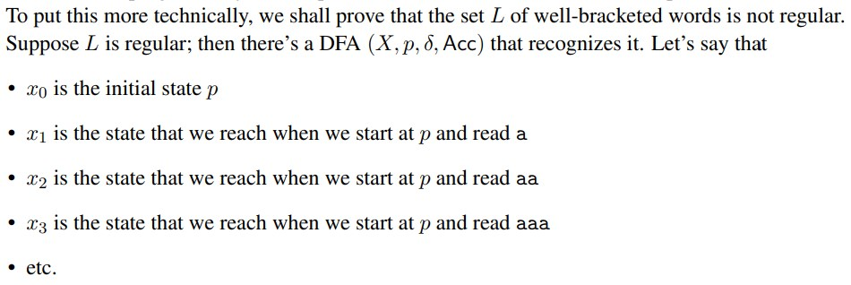

There are many non-regular languages, this is clear as there are countably many regexes and uncountably many languages.

Here's an example of a useful non-regular language:

Suppose a word is built up from open brackets, written a, and closed brackets, written b, and we want to know whether it’s well-bracketed. This is a commonly arising problem; for example, when you use IntelliJ to write a Java program, IntelliJ checks whether your brackets match correctly. This can be done using a stack. When you read a, you push a pebble onto the stack, and when you read b you pop the pebble off the stack. If you reach the end of the word, and the stack is empty, then you know the word is well-bracketed. But if it’s not empty, or you read b when the stack is empty, the word is not well-bracketed.

Let’s think for a moment about your computer. It has a finite memory, and therefore only finitely many states. It can try to run the above program, allocating part of its memory to represent the stack. But if the word begins with a very large number of a’s, the stack will overflow.

Can your computer run a program that works for all words? The program should read in a word, letter by letter, and then announce whether the word is well-bracketed.

One solution is to use an external stack. That way, even though your computer has only finite memory, there’s no limit on the amount of memory that the stack can occupy. But what if you don’t have access to external memory? Can you install such a program on your computer? The answer is No. We shall now prove this.

In summary, $X_n$ is the state that we reach when we start at $p$ and read $a^n$. Now we’re going to show that these states are all distinct, which implies that there are infinitely many states, a contradiction.

Suppose m and n are natural numbers, with $m < n$. We want to show that $x_m \neq x_n$. If we start at $x_m$ and read $b^m$ we reach an accepting state, because $a^m b ^m$ ∈ L, but if we start at $x_n$ and read $b^m$ we reach a non-accepting state, because $a^nb^m \notin$ L. So $x_m$ and $x_n$ can’t be the same.

