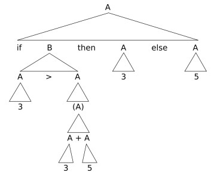

Context-free grammars are a more powerful way of describing languages. The set of all languages that can be generated using context-free grammars are known as context-free languages. 

This is the BNF for the example language. A and B are called nonterminals while the characters in Σ are called terminals. Each line with ::= is called a production, and it tells us how to replace a nonterminal with a string of terminals and nonterminals.

Formally, a context free grammar is a 4-tuple (V, Σ, R, S), where:
	-V is a finite set called the variables or non-terminals,
	-Σ is a finite set, disjoint from V, called the terminals,
	-R is a finite set of rules or productions, with each rule consisting of a variable and a string of variables and terminals, and
	-S ∈ V is the start variable.

The principles of derivation:
	We start with the Start non-terminal
	At each step we replace a nonterminal (indicated with a dot) by a string of terminals and non-terminals according to one of the productions in the grammar
	At the end, we have the desired word, consisting only of terminals, in $\Sigma$*

This grammar is called "context-free" because you can apply a production to any non-terminal regardless of the other symbols in the string. The set of strings that can be produced or generated from a grammar is known as the language of this grammar, and can be written as L(G). A language from a context-free grammar is known as a context-free language (CFL).

We can systematically derive words, from the leftmost non-terminal first, or say the rightmost non-terminal first.

We could also draw a derivation tree (or parse tree), like so:

Given a context-free grammar, we **can** solve the **matching problem** with certain algorithms - that is, there exists some program: 
`boolean f (string w){ .... }`, such that we can check whether the word `w` is derivable, or `FALSE` otherwise. One example of an algoritm for this is the **CYK** algorithm. A program that constructs a derivation tree for a given word (if possible) is called a **parser**.

**Designing Context-free Grammars**
We can design grammars for languages like so:

For **regular languages** we can construct an equivalent CFG easily. We first need the regular language in DFA form, then:
	1. Create a variable $R_i$ for each state $q_i$ of the DFA.
	2. Add the rule $R_i$ ::= $aR_j$ to the CFG, if $\delta (q_i,a) = q_j$ is a transition in the DFA.
	3. Add the rule $R_i$ ::= $\epsilon$, if $q_i$ is an accepting state of the DFA.
	4. Make $R_0$ the start variable of the grammar, where $q_0$ is the start state of the machine.

We can verify that the resultant CFG generates the same language as the DFA easily:

**ADD EXAMPLE OF VERIFYING A CONVERSION FROM DFA TO CFG**

**Ambiguity**
We have seen that one derivation tree can arise from several different derivations - this isn't so serious - but if a word has more than one derivation tree, then the derivation of that word is ambiguous. 

The above grammar does not take into account the order of precedence of operators, so it can be interpreted in different ways. In contrast, the following grammar does take into account order of precedence of operators:

⇒ A ::= A + B | B
   B ::= B × C | C
   C ::= (A) | 3 | 5

Notice how instead of A + A, we have A + B.

It's usually undesirable to design an ambiguous grammar, so we might like to have a program that determines if a grammar is ambiguous or not, BUT it is undecidable to determine whether a CFG is ambiguous or not.

**Chomsky Normal Form (CNF)**

CNF is a type of normal form that has various uses. It only allows rules of the following kind:

A :: = BC
A :: = a

where *a* is any terminal and A, B and C are any variables - except that B and C may not be the start variable.  We might also have a rule:

S :: = $\epsilon$ 

where S is the start variable.

One use of Chomsky Normal Form is that a derivation of a non-empty word involves 2n - 1 steps, where n is the word's length. This can be proved by induction on n.

To convert a CFG into CNF, we:
	1. We begin by introducing a new start symbol (variable) to the grammar.
	2. We remove all the $\epsilon$-rules of the form A :: = $\epsilon$ 
	3. We remove all the unit productions of the form A :: = B
	4. We may need to patch-up / fix the grammar to make sure that it still produces the original language.
	5. We convert the remaining rules into proper form.

*An example of converting a CFG into CNF.*

**Emptiness and Fullness**

To test whether a CFG accepts some word, we mark each variable that is able to turn into a word. For example, if we see a production:

A :: = BCaB

and we know that B and C can turn into a word, then A can too. Just repeat this until it's not possible to go further, and see whether the start variable can turn into a word. We **cannot** test whether a CFG accepts every word over the given alphabet, this is an undecidable problem, therefore it's undecidable whether two CFGs accept the same words.