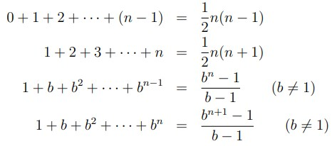

**Mathematical Precursors**

The probability of an event A is written P(A). It is an element of {x ∈ R | 0 6 x 6 1}.
The basic laws of probability are as follows:
• An impossible event has probability 0.
• A certain event has probability 1.
• For an event A, we have P(not A) = 1 − P(A). For example, suppose the probability that it’s raining is 1/3. Then the probability that it’s not raining is 2/3.
• For events A and B that are mutually exclusive, we have P(A or B) = P(A) + P(B). For example, suppose the probability that it’s raining is 1/3 and the probability that it’s sunny is 1/5. If these are mutually exclusive events, then the probability that it’s either raining or sunny is 8/15.
• For events A and B that are independent, we have P(A and B) = P(A) × P(B). For example, suppose the probability that it’s raining is 1/3 and the probability that John is happy is 1/5. If these are independent events, then the probability that it’s raining and John is happy is 1/15.

Important Summations:

Upper and Lower Bounds:
• It will take me at least an afternoon to clear my office. **Lower bound**.
• Clearing the office will take me a week at most. **Upper bound**.
• Building the new railway will cost no more than 70 billion pounds. **Upper bound**.
• For the café to be viable, we need at least 30 customers a day, maybe more.  **Lower bound**.

**Running time of a program**

