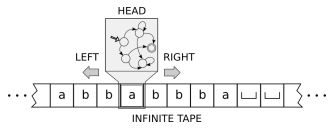
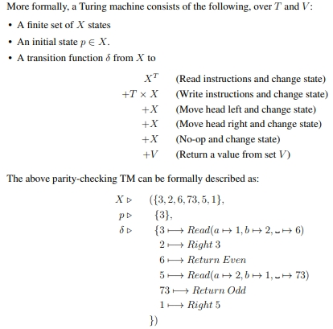
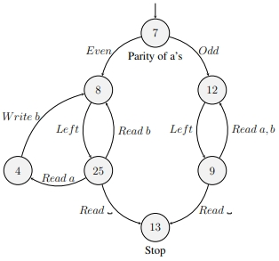
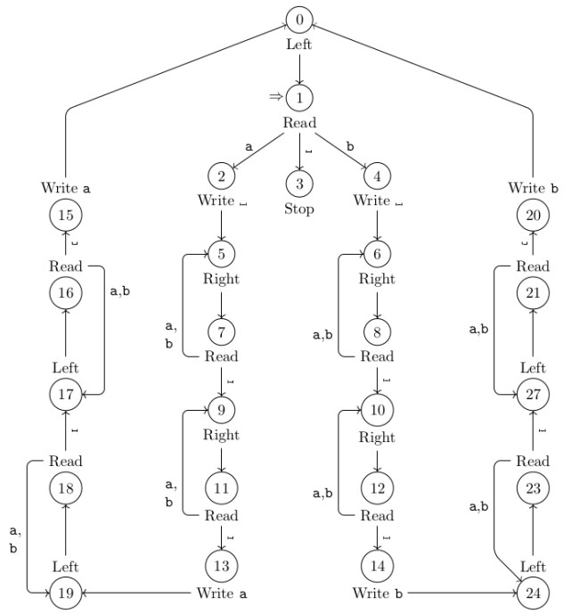
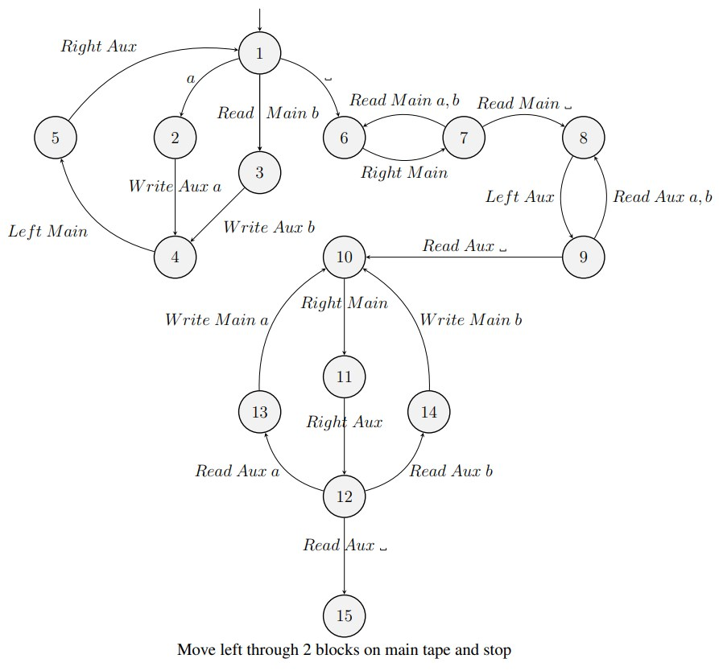

“*A Turing machine can do everything that a real computer can do. Nonetheless, even a Turing machine cannot solve certain problems. Similar to a finite automaton but with an unlimited and unrestricted memory, a Turing machine is a much more accurate model of a general purpose computer. In a very real sense, these problems are beyond the theoretical limits of computation. The Turing machine model uses an **infinite tape** as its **unlimited memory**. It has a **tape head** that can **read** and **write** symbols and move around on the tape. **Initially** the tape **contains only the input string** and is **blank everywhere else**. If the machine needs to store information, it **may write** this information **on the tape**. To read the information that it has written, the machine can move its head back over it. The machine **continues** computing **until** it decides to produce an **output**. The outputs accept and reject are obtained by entering designated **accepting** and **rejecting states**. If it **doesn**’t enter an **accepting** or a **rejecting** state, it will **go on forever**, never **halting**.*” (Sipser, 2013). 

In other words, a Turing machine is a simple formal model of mechanical computation, and a universal Turing machine can be used to compute any function, which is computable by any other Turing machine.

A Turing machine has finitely many states (like a DFA) but it also has an external memory: an infinite tape, divided into cells. The machine has a head that sits over one cell of the tape. The Turing machine can read and write symbols on the tape and move left or right (or stay put) after each step. 

Unlike a DFA, once a Turing machine enters an accepting or rejecting state, it stops computing and halts. The following diagram shows a general representation of a Turing machine:

A turing machine depends on:
	- a set *T*, the tape's alphabet, {a, b, -} for above
	- the input alphabet $\Sigma$, which is a subset of T, {a, b} for above
	- the initial word $\Sigma$*
	- a finite set V of return values, e.g. {true, false} or {done} ..

For a turing machine with set V {true, false} we have a set of instructions:
	read (can result a, b or -)
	write a
	write b
	write -
	move left
	move right
	no-op (does nothing)
	return true
	return false

It's also important to keep note of the initial and final location of the head.

For convenience, we can use **macros**, which is a state that is a composite of multiple other states - like a subroutine or a composite node in DaVinci Resolve.

Notice how state 7 IS the parity Turing machine we saw before. An arrow pointing to the *macro* state will point towards the initial of the sub-routine, which in this case is the state '3' of the parity turing machine.

Any state in the macro code that returns false, now performs a no-op and transitions to the state at the end of the odd arrow, and vice-versa.

**Hacking**

Say we wanted to build a machine that starts at the rightmost character of an a, b block on an otherwise blank tape and places a reversed copy of the input string to the right, with a blank character in between the original and reversed strings. The machine should halt with the head on the blank cell to the left of the original block. 

E.g. starts with; ABBAB  and ends with; -ABBAB-BABBA

The following Turing machine implements the desired program:

Notice how we are marking the character just read as *blank* - this is referred to as **hacking**. The general outline of the steps undertaken by this TM are given as under:
• Record the current character, whether its a or b
• Replace it with a blank (hacking!)
• Move two steps to the right and write this character
• Then go back and replace the blank with a or b (whatever was there before)
• Move one step to the left
	– Record the current character, whether its a or b
	– Replace it with a blank (hacking!)
	– Move right to the central blank character
	– Move right to the next blank and write this character
	– Move left to the central blank character
	– Move left to the character we just blanked-out
	– Replace the blank with a or b (whatever was there before)
	– Move one step to the left, if its blank then stop
	– Otherwise, begin the cycle again.

The running time is evidently quadratic: 1 + 2 + 3 .. + n times a constant. 

**Turing Machine Variants**

***Auxiliary Characters***
Suppose that, in addition to the input alphabet and blank, we have a finite set of auxiliary characters. This could be a set of character that correspond to the input alphabet, I.E. {a, b} could have auxiliaries {a', b'} to signify when these characters are being copied.

***Auxiliary/Multitape Turing Machines***
A two-tape Turing machine has a main tape and an auxiliary tape, each with a head. The main tape is the same as previous examples; the auxiliary tape must be blank at the start and blank at the end. 
Details on the available instructions are given below:
• Read Main, which may result in a or b or
• Read Aux, which may result in a or b or
• Write Main x (x = a or b or )
• Write Aux x (x = a or b or )
• Left Main
• Left Aux
• Right Main
• Right Aux
• No-op, which does nothing
• Return True (accept)
• Return False (reject)

We can solve the copy-reverse problem in linear time with this two-tape system:

This example starts with '-ABBAB-' on the main tape and '----..' on the auxiliary tape. 

In the first stage, we read from the main tape, starting from the final B and write this to the aux tape, then move right on the aux and left on the main. 

When we reach a '-' on the main tape, we then iterate through the main tapes until we are on the rightmost 'B' once again, and then, after reading the '-' after the rightmost character in main, we iterate through the aux tape to get to the '-' of the left of the leftmost character.

Then we iterate through the characters on the aux and write each one to the main tape, until we read a '-' on the aux tap, at which point we move left through two-block on the main tape and then stop. We might also want to erase the data from the aux tape, but this is not specified in the above diagram.

***Two-Dimensional Turing Machines***

A 2D-TM has an infinite sheet, rather than a tape, we now have instructions:
	Write *x*
	Read
	Right
	Left
	Up
	Down
	No-op
	Return

A program may assume that the sheet is blank except for one row, and must ensure that it is finally blank except for that row. We can think of this as inifitely many auxiliary tapes.

***Time vs Space Efficiency of TMs***

The space usage is the number of *cells* that the head passes over, so at most it could be n+1, where n is the number of steps.

Space Usage $\leq$ time usage + length of input

So it's impossible for the time usage to be $\theta$(n), and the space usage to be $\theta$($n^2$),

