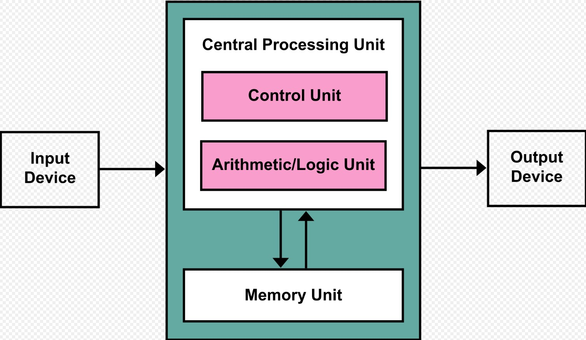

Computers broadly come in two types, application specific and general purpose. Stored-program computers are known as "von Neumann architecture", serving as the framework for general purpose computers.


*von Neumann Architecture*

The CPU consists of the control unit, the ALU and the registers. The ALU performs arithmetic operations, and the control unit is responsible for step-by-step execution of a program. The memory stores the data as needed. Registers are a form of memory within the CPU to optimize for time, and reduce reads/writes to memory. Register reads or writes have zero-time overhead.

**General Structure of a C program**

```c
#include <header file> 
foo1(){ // User-defined function 
		// Declaration of variables 
		// Arithmetic and Logical expressions 
} 
main(){ 
		// Declaration of variables
		// Arithmetic and Logical expressions 
		foo1(); // function call 
		// More arithmetic and Logical expressions 
}
```
-Program must contain a `main()` function
-Program execution starts from `main()` 
-Header file contains pre-defined library functions


When we deal with positive numbers only, we can add **unsigned** before the type and get the range doubled: 
```c
int a; // Range is -2,147,483,648 to 2,147,483,647 
unsigned int b; // Range is 0 to 4,294,967,29
```


**Constants** can be declared as **const**. A constant is stored in the read-only segment of the memory, and any effort to change a const variable will result in compilation error.

**`switch` Statements**


**`continue` Statements**
`continue` is used inside a loop. When a continue statement is encountered inside a loop, control skips the statements inside the loop for the current iteration and jumps to the beginning of the next iteration.  

```c
sum = 0; 
for(i=1; i<=5; i++){
	if(i==3) 
		continue;
	sum = sum + i; 
} 
```
Computes 1 + 2 + 4 + 5 (addition of 3 is skipped).

**`break` Statement** 
`break` is used to come out of the loop instantly. After `break` control directly comes out of loop and the loop gets terminated. 
```c
sum = 0; 
for(i=1; i<=5; i++){
	if(i==3) 
		break; 
	sum = sum + i; 
} 
```
Computes 1+2, loop terminates at i=3.

**Arrays in C** 
An Array is a data structure
	-stores a fixed-size
	-sequential collection of elements
	-all the same type. 
```c
int a[4] = {2, 5, 3, 7}; 
float b[3] = {2.34, 11.2, 0.12}; 
char c[8] = {'h','e','l','l','o'};
```
Array a[ ] is of length 4 and contains only `int`.
Index of an array starts from 0, and then increments by 1 
	a[0] is the first element in a[ ] and it is 2
	a[3] is the last element in a[ ] and it is 7

Common mistakes with arrays: 
```c
int array_size; //user input 
... 
int a[array_size];
```
Array size must be a known constant. Example: `int array_size = 4;`

C compiler does not check array limits. If memory protection is violated, then the program crashes due to segmentation fault.
```c
// Compute sum of an int array 
int a[4] = {2, 5, 3, 7}; 
int sum=0; 

for(i=0; i<500; i++) // Beyond array limit 
	sum = sum + a[i];
```
500>4, so program crashes.

**2-Dimensional Array**
`int a[3][4]; // Declaration of array with 3 rows and 4 columns`


**`scanf()` Function**
`scanf()` function can be used to receive inputs from keyboard. It is defined in `stdio.h` library and prototype is: 
`scanf("%format", &variable_name);` 
//`format` is a placeholder which depends on data-type.

```c
// Examples 
scanf("%d", &var1); // var1 is an int 
scanf("%c", &var2); // var2 is a char 
scanf("%f", &var3); // var3 is a float 
// To read var1, var2 and var3 together: 
scanf("%d%c%f", &var1, &var2, &var3);
```


**`printf()` Function** 
`printf()` function can be used to print outputs. It is defined in `stdio.h` library and prototype is: `printf("%format", variable_name); `
`format` is a placeholder which depends on data-type
```c
// Examples 
printf("%d", var1); // var1 is an int 
printf("The value is = %d", var1); 

// To print multiple variables together:
printf("%d %c %f", var1, var2, var3);
```

**Strings**

In C, a string is a 1d array of characters. ASCII code of each character is stored in consecutive memory locations. Strings are terminated by the null character '\0' (ASCII value 0).


A string can be read using sscanf:
Format conversion specifier for a sequence of non-white-space characters is `%s`. E.g. `scanf(“%s”, a)` will store only “Comp” for user input “Comp Sc”. 

And `%[^\n]` for strings with white-space included E.g. `scanf(“%[^\n]”, a)` will store only “Comp Sc” for user input “Comp Sc” Reading and printing strings 

A string can be printed using `printf()` with `%s`.

There is a library called string.h, which provides various utilities for dealing with strings:
 `strcpy()` - copy a string 
 `strcat()` - concatenate two strings 
 `strlen()` - get string length 
 `strcmp()` - compare two strings


We must maintain that there is **adequate memory allocated** at run-time for storing the string. Not automatically done by the compiler, and no checks are done at compile-time or run-time. Common source of errors like accidental overwriting of other information, which has been exploited to achieve execution of code supplied by attackers, a problem is called **Buffer Overflow.**
