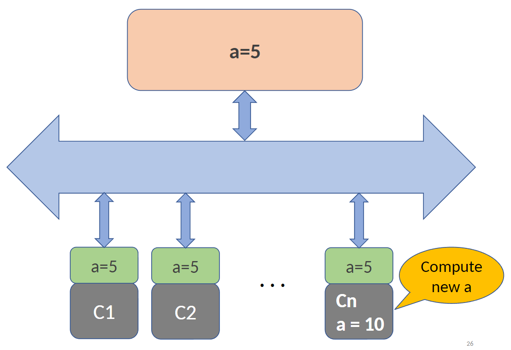

For greater efficiency of computation, processors now have many cores which concurrently compute. 

*Simplified Multicore Architecture*

*Coherence problem visualised*

If we have multiple cores, we could have multiple copies of one variable being stored in many cores caches - this can lead to inaccuracy if the variable is updated, as cores will read from their outdated value within the cache. To achieve **coherence**: a write to a memory location must cause all other copies of this location to be removed from the caches they are in.

**Coherence protocols** apply cache coherence in multicore systems. 

**MSI protocol** is a simple cache coherence protocol. In this protocol, each cache line is labeled with a state:
	• M: cache block has been modified.
	• S: other caches may be sharing this block.
	• I: cache block is invalid

*MSI Protocol Example*

When programming multicore platforms, we have two options:
	1. Program **directly targeting** processor cores
		1. Programmer takes care of synchronization
		2. Painful and error-prone
	2. Use a ***concurrency platform***
		1. It abstracts processor cores, handles synchronization and communication protocols, and performs load balancing.
		2. Hence offers much easier multicore programming environment
