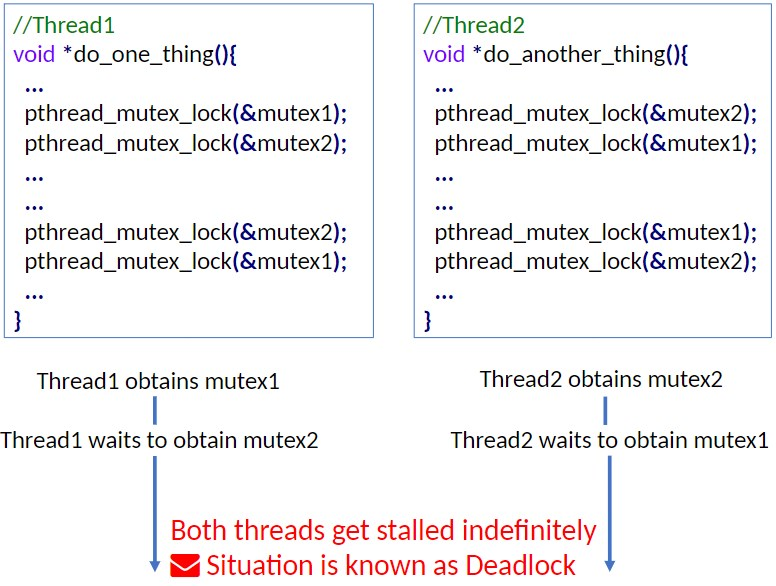

Let us take an example server-client relationship to demonstrate. 

Here's an example of a sequential server:


The solution to the above problems is to use a concurrent server, to serve multiple clients concurrently.


Task2 is parallel to task1 and task3, and parallel tasks are always concurrent. Whereas concurrent tasks may not be parallel (task1 and task3), so ‘concurrency’ is a more general term.

If it is possible to execute some of these subtasks at the same time with no change in final result (i.e., correctness), then we can **reduce overall time** by executing these subtasks **concurrently**. In C we use threads to this effect.

A thread of execution is the smallest sequence of programmed instructions that can be managed #
independently by a scheduler.


We can use the **Pthreads** library in C, and so we must `#include <pthread.h>`. To spawn a thread we use `pthread_create()`, for which the syntax is:
```C
int pthread_create( 
	pthread_t *thread_id, // ID number for thread 
	const pthread_attr_t *attr, // controls thread attributes 
	void *(*function)(void *), // function to be executed 
	void *arg // argument of function 
);
```
`pthread_create()` returns 0 if thread creation in successful, otherwise error is non-zero value.

If we wish to use the default attributes, we can replace the `const pthread_attr_t *attr` line with `NULL`. We can pass unary functions to `pthread_create`, like `void *foo1();`, `void foo2(int *);` and `int *foo3(int *);`, but not function with more than one arg like `int *foo4(int *, int*);`. 

For functions requiring multiple arguments, we can use a pack all arguments into a compound object and create a wrapper function that takes the compound argument to then unpack, before passing args to `foo()`.


```C
int main(void) { 
	pthread_t thread1, thread2; 
	pthread_create(&thread1, NULL, (void *) do_one_thing, NULL); 
	pthread_create(&thread2, NULL, (void *) do_another_thing, NULL); 
	sleep(1); // sleeps 1s 
	return 0; 
}

void do_one_thing() { 
	int i, j, x; 
	for (i = 0; i < 200; i++) { printf("doing one thing\n"); } 
} 

void do_another_thing() { 
	int i, j, x; 
	for (i = 0; i < 200; i++) { printf("doing another \n"); } 
}
```
What will the above code do? We cannot say for sure, as `do_one thing` could start printing before or after `do_another_thing`, there is no way to say in what order they will print. Also notice we must sleep after creating the threads, otherwise the program's `main` with return 0 and all threads will be closed, and nothing will print.

What if we want to share data objects among different threads? 
```c
int r1 = 0, r2 = 0; 
main(){ // main thread 
	int r; 
	... 
	Call do_one_thing() in thread1; 
	Call do_another_thing() in thread2; 
	r = r1 + r2; 
	... 
}
```
Assume that r1 is only muted by `do_one_thing()`, and r2 is only muted by `do_another_thing()`. Here it is possible that r1 and r2 will not have the values they would after the two calls have modified them when we calculate `r = r1 + r2;`, or maybe one value has been updated but not the other. Both scenarios lead to erroneous results. 

With `Pthreads` there are three **synchronization** mechanisms:
-Joins
-Mutual Exclusions
-Condition Variables

`pthread_join()` is a blocking function, which means forces the function calling it to wait for the `thread_id` thread to finish its task:
```c
int pthread_join( 
	pthread_t thread_id, // ID of thread to "join" 
	void **value_pntr // address of function’s return value 
);
```
Again, we will set `value_pntr` to NULL:
```c
int pthread_join( 
	pthread_t thread_id, // ID of thread to "join" 
	NULL 
);
```


This works perfectly for our r1 and r2 example as shown before, but we assumed that each function accesses each variable exclusively, what if several threads try to update shared data?

With this method, we could encounter the following problem:
```c
void *functionC(); 
int counter = 0; 
main(){ 
	int rc1, rc2;
	pthread_t thread1, thread2; 
	// Two threads execute functionC() concurrently 
	pthread_create(&thread1, NULL, &functionC, NULL); 
	pthread_create(&thread2, NULL, &functionC, NULL); 
	pthread_join(thread1, NULL); 
	pthread_join(thread2, NULL); 
	return 0; 
} 
void *functionC(){ 
	counter++; 
	printf("Counter value: %d\n", counter); 
}
```
Initially the counter is zero, it could be that `thread1` first adds one to the counter, or `thread2`, but what if they both access the shared global variable `counter` at the same time? The program would print: `1`, `1`, due to what is called **race conditions**.

### `mutex`
The problem of race conditions can be solved using `mutex` objects, which are offered by the `pthreads` library. A `mutex` object enforces exclusive access by a thread to a variable, or set of variables. The syntax for declaring and initializing a `mutex` object is:
`pthread_mutex_t mutex1 = PTHREAD_MUTEX_INITIALIZER;`
This statement will create a `mutex` object 'mutex1' and initialize it with the default characteristics.
Generally, we declare `mutex` objects as global.

If you want to use `mutex` to serialize access to a shared resource:
```c
... 
pthread_mutex_lock( &mutex1 ); 
counter++; 
pthread_mutex_unlock( &mutex1 ); 
...
```
Threads access 'counter' serially one after another.


The code segment that resides between `mutex_lock()` and `mutex_unlock()` is called the critical region. We can also serialize access to a set of shared objects:

Threads will access {object1, object2, ...} serially.

There are some pitfalls to `mutex`:


To deal with this problem, `pthreads` offers a function: `pthread_mutex_trylock()`, which has syntax:
`int pthread_mutex_trylock (pthread_mutex_t *mutex);`. This tries to lock a `mutex` object. If the `mutex` object is available, then it is locked and 0 is returned. Otherwise, the function call returns non-zero, and it **will not wait** for the object to be freed.


*Example of `trylock`*

So far we have seen two of the three synchronization functions:
	-Join: used to block the calling thread until the specified thread finishes
	-Mutual exclusion: user to serialize access to shared data

Condition variables are the third; a condition variable is used to synchronize threads based on the value of data (a condition). One thread waits until data reaches a particular value, or until a certain event occurs. Another active thread sends a signal when the event occurs. 

A condition variable is a variable of type `pthread_cond_t`. To create and initialize:
`pthread_cond_t condition_cond = PTHREAD_COND_INITIALIZER;`

A thread goes to waiting state based on condition by:
`pthread_cond_wait( &condition_cond, &condition_mutex );
Which takes two variables; the condition variable, and a `mutex` variable associated with the condition variable.

Waking thread based on condition: 
`pthread_cond_signal( &condition_cond );`
#### Example
```c
int count = 0; 
#define COUNT_DONE 10 
#define COUNT_HALT1 3 
#define COUNT_HALT2 6 
. . . 
void *functionCount1(){ 
	for(;;){ 
		pthread_mutex_lock( &count_mutex ); 
		count++; 
		printf("Counter value functionCount1: %d\n",count); 
		pthread_mutex_unlock( &count_mutex ); 
		if(count >= COUNT_DONE) return(NULL); 
	} 
}
. . . 
void *functionCount2(){ 
	for(;;){ 
		pthread_mutex_lock( &count_mutex ); 
		count++; printf("Counter value functionCount1: %d\n",count);
		pthread_mutex_unlock( &count_mutex ); 
		if(count >= COUNT_DONE) return(NULL); 
	} 
}
```
`functionCount1()` and `functionCount2()` are run concurrently. They increment the shared variable ‘count’ serially. The order in which the two functions increment ‘count’ is somewhat random.

Suppose, we want that only functionCount2() increments ‘count’ during the following condition: `while( count >= COUNT_HALT1 && count <= COUNT_HALT2 )`

```c
int count = 0; 
#define COUNT_DONE 10 
#define COUNT_HALT1 3 
#define COUNT_HALT2 6 
. . . 
void *functionCount1(){ 
	for(;;){ 
		pthread_mutex_lock( &condition_mutex ); 
		while( count >= COUNT_HALT1 && count <= COUNT_HALT2 ){ 
			pthread_cond_wait( &condition_cond, &condition_mutex ); 
		} 
		pthread_mutex_unlock( &condition_mutex );
		
		pthread_mutex_lock( &count_mutex ); 
		count++; 
		printf("Counter value functionCount1: %d\n",count); 
		pthread_mutex_unlock( &count_mutex ); 
		if(count >= COUNT_DONE) return(NULL); 
	} 
}
. . . 
void *functionCount2(){ 
	for(;;){ 
		pthread_mutex_lock( &condition_mutex ); 
		if(count > COUNT_HALT2 ){ pthread_cond_signal( &condition_cond ); } 
		pthread_mutex_unlock( &condition_mutex );
		
		pthread_mutex_lock( &count_mutex ); 
		count++; printf("Counter value functionCount1: %d\n",count);
		pthread_mutex_unlock( &count_mutex ); 
		if(count >= COUNT_DONE) return(NULL); 
	} 
}
```
When `functionCount1()` sees for the first time that ‘count’ is in the mentioned range, it goes to wait state. `pthread_cond_wait()` releases the condition mutex, so the condition variable can be used by the other thread now. Only `functionCount2()` increments ‘`count`’ from `COUNT_HALT1` to `COUNT_HALT2` After that, it ‘signals’ the waiting thread to wake up using the condition variable. `functionCount2()` releases the condition mutex as the other thread will get it after waking up.

