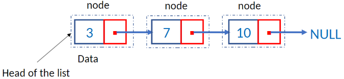
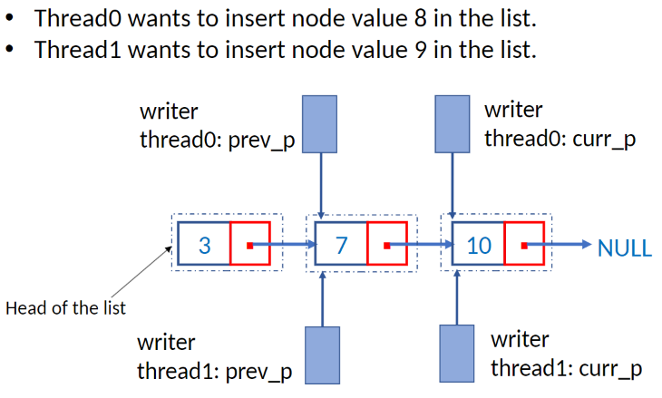
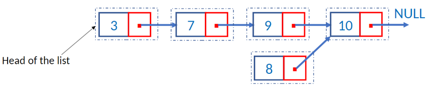
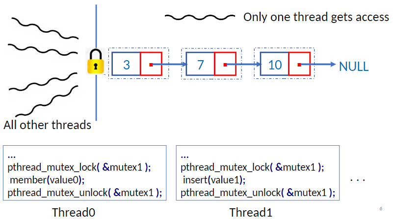
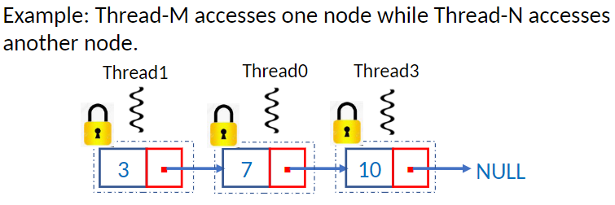

Consider a sorted linked list of integers with the following operations: 
	-Insert: inserts a new node maintaining the **sorted** order. 
	-Delete: deletes an existing node. 
	-Member: returns true/false depending on node present/absent.


What if we want multiple concurrent threads to perform these operations on a shared linked list?
Multiple threads can read concurrently, but cannot write concurrently.



One solution could be to simply **lock** the entire list to **serialize access** to the list, maybe using a **`mutex`**. There are problems with this approach; if a vast majority of operations are ‘**read**’, then this approach **fails to exploit parallelism**. On the other hand, if most of the operations are ‘write’ then this approach may be the best and easy solution.


Another solution could be to instead lock individual nodes, rather than the whole list. This gives granular access to the node. Implementation would require one `mutex` lock per node:
```C
typedef struct Node{ 
	int data; 
	struct Node *next; 
	pthread_mutex_t mutex; 
} Node;
```


The above solution works, but it gets fairly complicated. For example, the following function `Member()` returns 1 if a node with the input ‘value’ is present in the list. Otherwise, it returns 0:
```c
//Non-threaded function
int Member(list *l, int value){ 
	Node *curr_p = l->head; 
	while(curr_p!=NULL && curr_p->data < value) 
		curr_p = curr_p->next; 
	if(curr_p == NULL || curr_p->data > value)
		return 0; 
	else 
		return 1; 
}
```

With the `mutex` locks on every node, this becomes:
```c
int  Member(int value) {
   struct list_node_s* temp;
   pthread_mutex_lock(&head_mutex);
   temp = head;
   while (temp != NULL && temp->data < value) {
      if (temp->next != NULL) 
         pthread_mutex_lock(&(temp->next->mutex));
      if (temp == head)
         pthread_mutex_unlock(&head_mutex);
      pthread_mutex_unlock(&(temp->mutex));
      temp = temp->next;
   }
   if (temp == NULL || temp->data > value) {
      printf("%d is not in the list\n", value);
      if (temp == head)
         pthread_mutex_unlock(&head_mutex);
      if (temp != NULL) 
         pthread_mutex_unlock(&(temp->mutex));
      return 0;
   } else {
      printf("%d is in the list\n", value);
      if (temp == head)
         pthread_mutex_unlock(&head_mutex);
      pthread_mutex_unlock(&(temp->mutex));
      return 1;
   }
}
```

Every time a thread tries to access a node, it needs to **check** if a `mutex` lock is **available** and then **locking** and **unlocking** of the `mutex` lock, which affects performance.

The first solution only allows one thread to access the entire list at any instant, which defeats the purpose of multi-threading 

The second only allows one thread to access any given node at any instant, causing major performance problem and complicated code.

For a simpler solution, `Pthreads` provide another kind of lock known as ‘read-write lock’.

A read-write lock is declared and initialized as:
`pthread_rwlock_t lock = PTHREAD_RWLOCK_INITIALIZER;`

A read-write lock is somewhat like a mutex except that it provides two lock functions.
	Just reading: `pthread_rwlock_rdlock(&lock);`
	Read-Write access: `pthread_rwlock_wrlock(&lock);`
	Only one unlock function: `pthread_rwlock_unlock(&lock);`

Using a `rwlock` means we can allow multiple threads to read, but only allow one thread to write at any time. 

```c
pthread_rwlock_rdlock(){ 
	//If no other thread holds the lock, then get the lock. 
	//Else if other threads hold the read-lock, then get the lock. 
	//Else if another thread holds the write-lock, then wait. 
}
pthread_rwlock_wrlock(){ 
	//If no other threads hold the read or write lock, then get the lock. 
	//Else, wait for the lock.
}

```