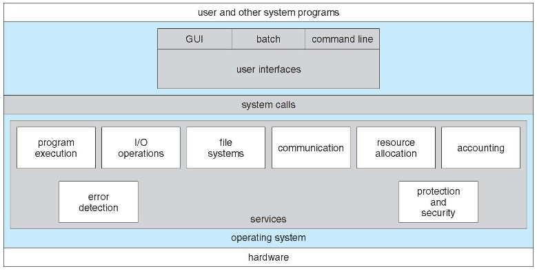
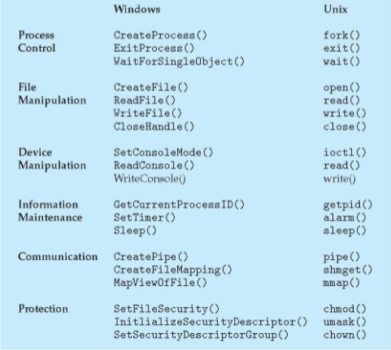
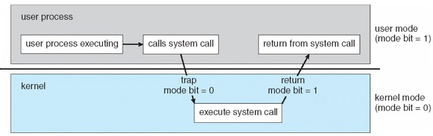
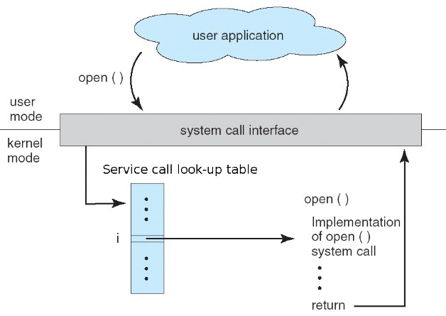

An operating system could have two valid descriptions:
	-A program that acts as an intermediary between a ‘user’ of a computer and the computer hardware 
	-The one program that is at all times running on the computer, with all else being systems programs and application programs

Main functions of an Operating System:
	-Resource allocation 
		Manages all hardware resources and decides between conflicting requests for efficient and fair resource use
	-Control system
		Controls execution of programs to prevent errors and improper use of the computer

### Basic OS Building Blocks
A small **bootstrap** program is loaded at power-up or reboot, typically stored in ROM or EPROM, generally known as firmware (e.g. **BIOS**). This initializes all aspects of the systems (detects devices, checks memory for errors, etc..) This program then loads the operating system kernel and starts it's execution.

ROM = Read Only Memory
EPROM = Erasable Programmable ROM
BIOS = Basic Input / Output System

Each device requires a controller, and these controllers are connected to the CPU and memory via a *bus*. The OS **kernel** manages the devices through the device controllers.

I/O devices and the CPU can execute concurrently. Each device controller is in charge of a particular device type, and has a local buffer (memory store for general data and / or control registers). CPU moves data from / to main memory to / from controller buffers. Device controller informs CPU that is has finished its operation by causing an ***interrupt***. 

### Interrupts
Interrupts can be implemented differently, but a common approach is through an input vector. Interrupt Vector is a reserved part of the memory, tracking which interrupts need to be handled. 

For each interrupt, the OS executes the appropriate ‘**Interrupt Service Routine**’ to handle the interrupt. The address of the interrupted instruction is saved, so original processing can be resumed after completion of the interrupt Software programs can also generate interrupts, through **system calls**, for instance when an error occurs. A software-generated interrupt is called a **trap**.

### Storage Structure
**Main memory** - only large storage media that the CPU can access directly 
**Secondary storage** - provides large non-volatile storage capacity 

Important example: magnetic disks - rigid metal or glass platters covered with magnetic recording material. The disk surface is logically divided into tracks, which are subdivided into sectors. Today also often flash memory. However, same logical division intro tracks and sectors still used

### OS Services

*Architecture of OS*

**Interfaces** interact with the OS. 
	-**Users** interact indirectly through a collection of system programs that make up the operating system interface. This will likely include a GUI, a CLI (command line interface). 
	-**Processes** (the programs in execution) interact with the Operating System by making system calls into the operating system **kernel**. Though we will see that, for stability, such calls are not direct calls to kernel functions.

#### Services for Processes
Typically, operating systems will offer the following services to process:
	**Program execution**: The system must be able to load a program into memory and to run that program, end execution, either normally or abnormally (indicating error) 
	**I/O operations**: A running program may require I/O, which may involve a file or an I/O device
	**File-system manipulation**: Programs need to read and write files and directories, create and delete them, search them, list file Information, permission management. 
	**Interprocess Communication** (IPC): Allowing processes to share data through message passing or shared memory

#### Services for the OS Itself
Typically, operating systems will offer the following internal services: 
	-**Error handling**: what if our 
	process attempts a divide by zero or tries to access a protected region of memory, or if a device fails? 
	-**Resource allocation**: Processes may compete for resources such as the CPU, memory, and I/O devices. 
	-**Accounting**: e.g. How much disk space is this or that user using? How much network bandwidth are we using? 
	-**Protection and Security**: The owners of information stored in a multi-user or networked computer system may want to control use of that information, and concurrent processes should not interfere with each other

#### System Calls
Programming interface to the services provided by the OS, which is typically written in C. Mostly accessed by programs via a high-level API rather that a direct system call. Two common APIs:
Win32 API for Windows, POSIX API for UNIX-based systems (including virtually all versions of UNIX, Linux, and Mac OS X). 

The APIs allow application code to access the kernel without requiring root privileges: it transfers control from **user mode** to **kernel mode**.

*System calls in Win / Linux*

System calls for file operations. We have the following operations for files: 
	***open*** Register the file with the operating system. Must be called before any operation on the file. Returns an integer called the file descriptor - an index into the list of open files maintained by the OS. 
	***read*** Read data from the file. Returns number of bytes read or 0 for end of file. 
	***write*** Write data to a file. Returns number of bytes written. 
	***close*** De-registers the file with the operating system. No further operations on the file are possible. 
These system calls return a negative number on error. Can use `perror`-function to display error.

#### Trapping to the Kernel
The user process calls the system call wrapper function from the standard C library.
The wrapper function issues a low-level **trap** instruction (in assembly) to switch from user mode to kernel mode.

There is some ‘magic’ happening to move from user mode to kernel mode: 
	-To get around the problem that no call can directly be made from user space to a specific function in kernel space: 
		Before issuing the trap instruction, an index is stored in a well known location (e.g. CPU register, the stack, etc.). 
		Then, once switched into kernel space, the index is used to look up the desired kernel service function, which is then called.
	-Some function calls may take arguments, which may be passed as pointers to structures via registers.

