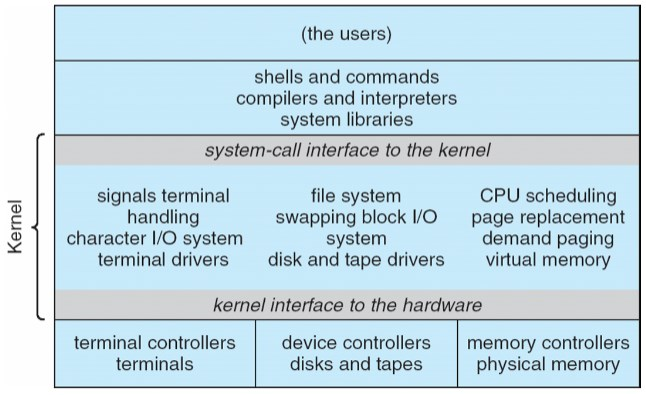
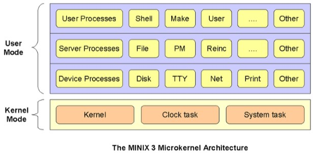

There are many different architectures for operating systems:

**Traditional UNIX** - one big kernel
	-Consists of everything below the system-call interface and above the physical hardware
	-Provides the file system, CPU scheduling, memory management, and other operating-system functions; a large number of functions for one level.
	-Limited to hardware support compiled into the kernel.

**Microkernel**
-Moves as much as possible from the kernel into less privileged “user” space (e.g. file system, device drivers, etc.) 
-Communication takes place between user modules using message passing 
	-The device driver for, say, a hard disk device can run all logic in user space (e.g. decided when to switch on and off the motor, queuing which sectors to read next, etc.) 
	-But when it needs to talk directly to hardware using privileged I/O port instructions, it must pass a message requesting such to the kernel.

Benefits: 
	-Easier to **develop** microkernel extensions 
	-Easier to **port the operating system** to new architectures 
	-**More reliable** (less code is running in kernel mode) - if a device driver fails, it can be re-loaded 
	-**More secure**, since kernel is less-complex and therefore less likely to have security holes. 
	-The system can recover from a failed device driver, which would usually cause “a blue screen of death” in Windows or a “kernel panic” in linux. 
Drawbacks: 
	-Performance overhead of user space to kernel space communication
	 
The Minix OS and L3/L4 are examples of microkernel architecture:

**Modular Kernel**
Most modern operating systems implement kernel modules 
	-Uses object-oriented–like approach 
	-Each core component is separate 
	-Each talks to the others over known interfaces 
	-Each is loadable as needed within the kernel, so you could download a new device driver for your OS and load it at run-time, or perhaps when a device is plugged in 
Overall, similar to layered architecture but with more flexibility, since all require drivers or kernel functionality need not be compiled into the kernel binary. 
## Virtual Machines

A virtual machine allows running one operating system (the guest) on another operating system (the host), providing an interface identical to the underlying bare hardware. The operating system host creates the illusion that a process has its own processor and (virtual) memory, and each guest is provided with a (virtual) copy of the underlying computer, so it is possible to install, say, Windows 10 as a guest operating system on Linux.

VMs are useful for **development**, **testing**, especially OS development, where it is trivial to revert an accidentally destroyed OS back to a previous stable snapshot. **Open Virtualization Format** (OVF) is the standard format of virtual machines, allows a VM to run within many different virtual machine (host) platforms.

**VMs** are **not** to be confused with **emulation**, where guest instructions are run within a process that pretends to be the CPU (e.g. Bochs and QEMU). In virtualization, the goal is to run guest instructions directly on the host CPU, meaning that the guest OS must run on the CPU architecture of the host.

**Para-virtualisation** presents guest with system similar but not identical to hardware (e.g. Xen Hypervisor). The Guest OS must be **modified** to run on paravirtualized 'hardware'. For example, the kernel is recompiled with all code that uses privileged instructions replaced by hooks into the virtualization layer. After an OS has been successfully modified, para-virtualisation is very efficient, and is often used for providing low-cost rented Internet servers (e.g. Amazon EC2, Rackspace).

**VMWare** implements full virtualization, such that guest operating systems do not require modification to run upon the virtualized machine. The virtual machine and guest operating system run as a user-mode process on the host operating system. As such, the virtual machine must get around some tricky problems to convince the guest operating system that it is running in **privileged CPU** mode when in fact it is not. 

Consider a scenario where a process of the guest operating system raises a divide-by-zero error. **Without** special **intervention**, this would cause the host operating system immediately to **halt** the virtual machine process, rather than the just offending process of the guest OS. So **VMWare** must **look out** for troublesome instructions and replace them at **run-time** with alternatives that achieve the same effect within user space, albeit with less efficiency, but since usually these instructions occur only occasionally, many instructions of the guest operating system can run unmodified on the host CPU.
## Linux Device Drivers

A **device driver** is software that allows other programs to interface with external devices through the **device controllers**. Device drivers run in **kernel mode** (some device management software may well run in user mode, but then typically these wouldn’t be called ‘drivers’). 

Device drivers are accessed via special files located in the `/dev` directory. From the user space's perspective, interacting with a device driver typically involves using five fundamental system calls, each serving a specific purpose:
	**`open`**: This system call is used to initialize a connection between the user space program and the device driver. It "opens" the special file associated with the device in the `/dev` directory. After a successful `open` call, the device becomes available for other system calls. 
	**`read`**: Once the device is open, the `read` system call allows the user space program to retrieve data from the device. For example, if the device is a sensor or a file, the `read` call will pull data from that device. 
	**`write`**: This system call is used to send data or commands to the device. For instance, it can be used to write to a file or send commands to control external hardware.
	**`ioctl`**: This call stands for "input/output control" and allows for more specific and specialized operations on the device. It is not always required, but when needed, it offers a means to perform various device-specific control operations that might not be covered by `read` or `write`. It's an optional call, mainly used for device-specific functionalities.
	**`close`**: After the user space program has finished interacting with the device, the `close` system call is used to terminate the connection between the program and the device driver. This action makes the device unavailable for further operations from that specific program.

A device driver must implement at least functions for `open`, `read`, `write` and `close`.

Kernel also keeps track of:
	-**Physical dependencies** between devices. Example: devices connected to a USB-hub 
	-**Buses**: Channels between processor and one or more devices, be they physical or logical
	-**Classes**: Sets of devices of the same type, e.g. keyboards, mice

Interrupt handling for devices typically follows a set sequence:
1. **Device Trigger:** The device sends an interrupt signal.
2. **Interrupt Detection:** The CPU identifies and selects the appropriate interrupt handler.
3. **Interrupt Processing:** The interrupt handler manages the received interrupt by executing specific tasks.

Two primary tasks are performed **during** interrupt handling:
- **Data Transfer:** Data is either retrieved from or sent to the device.
- **Resuming Processes:** Processes waiting for the data transfer completion are woken up.

In order to prepare for subsequent interrupts, the interrupt handler clears the interrupt bit associated with the device. To ensure efficient handling, it's crucial to minimize interrupt processing time. In practice, the focus is on swift data transfer while allowing other processing to occur at a slower pace. This separation leads to a two-part handling approach:

1. **Top Half:** This segment is directly initiated by the interrupt handler. Its primary role is to handle data transfer between the device and the appropriate kernel buffer. It schedules a software interrupt to trigger the next phase.
2. **Bottom Half:** This stage continues processing within the context of the interrupt, undertaking the remaining tasks such as protocol stack management and waking up processes. Despite being part of the interrupt handling, it operates separately to ensure efficient device management and system responsiveness.