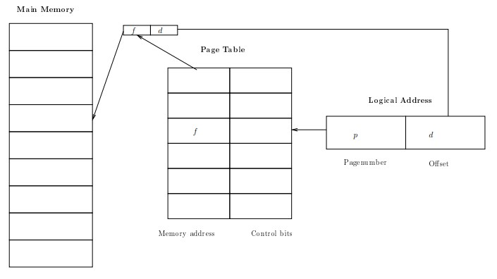

**Memory Management Overview:**
Memory hunger of applications tends to **increase** with capacity, demanding more sophisticated algorithms for effective handling. From the program's perspective, memory is envisioned as a set of memory cells beginning at address `0x0`, extending up to a specific logical address value. Similarly, hardware also initiates memory from address 0x0, ending at a particular physical address. The primary goal of memory management is to facilitate the storage of multiple program memories in the main memory simultaneously.

**Address mapping** occurs through various stages: 
	-during compile time, absolute references are generated (e.g., MS-DOS .com files) 
	-at load time, a special program manages the address mapping
	-during execution time, hardware support is necessary. 

Dynamic linking is employed to utilize a single copy of the system library, which can be accessed by mul tiple processes with assistance from the operating system.

### Swapping
Swapping becomes crucial when the system faces memory overload. During periods of high memory demand, the memory of certain processes is transferred to the disk. This technique is often coupled with scheduling, where low-priority processes are frequently swapped out to ensure smoother system operation. However, swapping presents challenges, including significant transfer time and the need to address pending I/O concerns, rendering it less ideal as the primary memory management technique.
##### Fragmentation Due to Swapping
The process of swapping introduces certain issues, such as the formation of small holes in memory over time, termed as external fragmentation. Additionally, the presence of programs slightly smaller than a hole leads to leftover, insufficient space, known as internal fragmentation. To manage these fragmented memory spaces, several strategies are employed, including first-fit, rotating first fit, best fit, and the buddy system. These techniques assist in effectively utilizing and managing memory holes within the system.
### Paging
An alternative approach in memory management involves assigning memory of a fixed size, referred to as a "page." This method aims to mitigate issues related to external fragmentation. The translation of logical addresses to physical addresses is facilitated through a page table, which serves as a mapping mechanism.

Hardware support is essential for paging to function efficiently. To optimize the process, when dealing with smaller page tables, fast registers are used. Larger page tables are stored in main memory, but the most recently used entries are cached for quicker access. This approach exemplifies a general principle in computing: for extensive lookup tables, employing a cache—small yet rapid storage—to store the most frequently used entries.

Paging also enables easy implementation of memory protection. Information related to memory protection is stored within the page table, ensuring a straightforward way to control and manage memory access and security.

In a paging system, the logical address comprises a page number and an offset
- **Page Number:** This indicates the specific page within the logical address space that the memory reference is targeting. It is used to identify the page in memory where the data or instructions are stored.
- **Offset:** The offset refers to the position within the page where the memory reference is pointing. It specifies the distance from the start of the page to the particular memory location being referenced.

For instance, in a system where the logical address is composed of a 12-bit page number and a 10-bit offset, the 12 bits might represent the page number, determining one of 4096 pages, while the 10 bits designate the specific byte location within the chosen page, allowing access to 1024 bytes within that page.

**Idea behind Memory Division:**

- **Data, Program Code, and Symbol Table:**
    - Segregating memory based on its usage by programs:
        - Data: Mutable and unique for each instance.
        - Program Code: Immutable and remains the same across instances.
        - Symbol Table: Immutable, consistent across instances, primarily used for debugging.
    - Hardware support is required for this segmentation. The principle similar to paging can be used, but overflow checks need to be implemented. Paging primarily focuses on ease of allocation, while segmentation is centered on the use of memory. A combined approach tends to work effectively.

**Segmentation:**

- Segmentation involves a Segment Table and a Control Base Limit. This method can lead to addressing errors, which may require checks and controls to prevent such errors.
    
- A Segment Table, along with the Main Memory, is used to address errors and manage logical addresses. It operates by dividing the address into a Segment Number and Offset, allowing for effective memory organization and access.
    

**Virtual Memory:**

- Virtual memory entails a complete separation of logical and physical memory. This allows programs to access an extensive amount of virtual memory. This approach is feasible because most programs use only a small fraction of memory extensively. However, efficient implementation can be challenging due to the significant difference in speed between memory access (approx. 60ns) and disk access (approx. 6ms), resulting in a vast speed gap.

**Demand Paging:**

- Virtual memory is implemented through demand paging, where memory is divided into uniform units (pages), alongside valid/invalid bits. Key strategic decisions are made:
    - Swapper decides which process to move entirely to disk and block.
    - Pager determines which pages to move to disk when additional pages are needed.
- Minimizing the rate of page faults (when a page needs to be fetched from memory) is crucial. To achieve a 10% slowdown due to page faults, a fault rate (p) of less than 10^-6 is required.

**Page Replacement Algorithms:**

1. **FIFO (First-In, First-Out):**
    - Simple to implement but doesn't consider locality, potentially leading to increased page faults.
2. **Optimal Algorithm:**
    - Selects the page that will be reused at the latest time (or not at all). While effective for comparison purposes, it's not implementable in practical systems due to its complexity.