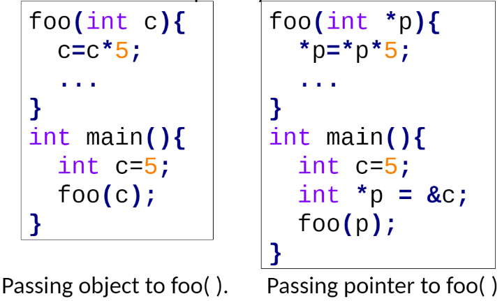

We have seen how to pass **data objects** to a function as arguments. This technique is called ‘**pass-by-value**’. We can pass **pointers** to a function as arguments. This is known as ‘**pass-by-reference**’.



In the above example, in **pass-by-value** (left) `foo()` gets a local copy of c. So, `c=c*5`=25 happens only within `foo().` `main()` still sees` c=5`. 

In **pass-by-reference** (right), `foo()` gets a local copy of `p` which contains the address of `c`. So, `*p=*p*5`=25 updates the memory location where `c` is stored. Both `foo()` and `main()` see c=25.

A function can return a pointer:
```c
int *foo(...) // Returns pointer to an int 
char *foo(...) // Returns pointer to a char 
float *foo(...) // Returns pointer to a float
```
Example: *Find the maximum value and return the pointer.*
```c
int *max(int *a, int *b){ 
	if(*a > *b) return a;
	else return b; 
} 
int main(){ 
	int a=4, b=5; 
	int *c; 
	c=max(&a, &b); 
	printf("Max value=%d", *c); 
	return 0; 
}
```

There are some pitfalls of returning a pointer from a function. `temp` is a local object. After function call, `temp` doesn’t exist. But `c` points to `temp`. So, `c` points to an object which does not exist.