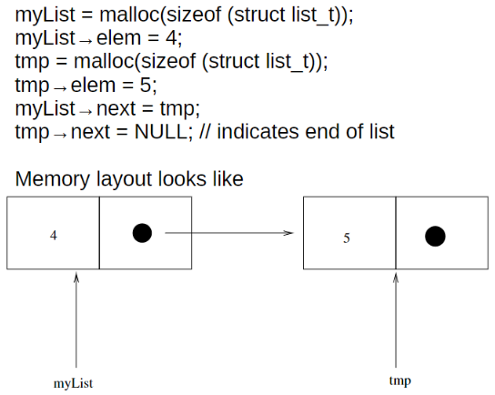

C does not have 'class', so if we want to create a user-defined composite datatype we can use **structures**.  
```c
struct tag_name { 
	T1 member1; 
	T2 member2; 
	/* declare as many members as desired, but the entire structure size must be known  to the compiler. */ 
};
```

We can create a new data-type 'Point':  
```c
struct Point { int x, y; };
```
and objects of type 'Point' can be created:  
```c
int main() { 
struct Point p1; // p1 is an object of type Point 
}
```

There is a shortcut for "struct Point p1":  
```c
typedef struct Point 
{ 
	int x, y; 
} Point;
```
We add 'typedef' before struct, and make sure to type the 'name' of our datatype after the last }.  
We can now create objects of type 'Point':  
```c
int main() {
Point p1:
}
```

Structure members are accessed using the dot operator:  
```c
Point p1;
//for p1(2,3)
p1.x = 2;
p1.y = 3;
```

We can create pointers to point to structure objects. If we want to access members using this pointer, we use the arrow (`->`) operator. `s->x` is a shortcut for `(*s).x`.  

```c
struct list_t { 
	int elem; 
	struct list *next; 
} 
struct list_t *myList;
myList = malloc(sizeof(struct list_t)); // allocate memory 
myList→elem = 4; 
myList→next = NULL;
```

  
*Example of a linked list in C*
