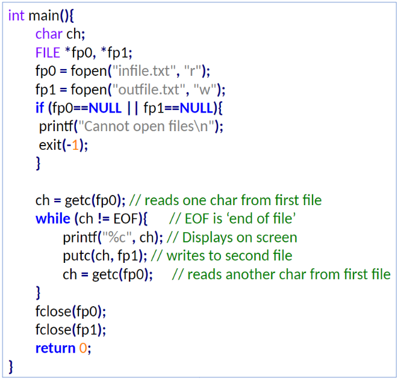

We saw `scanf("%format", &variable_name);` and `printf("%format", variable_name);` earlier. There are several functions that can perform **I/O** operations:  
`getchar()` gets a character from standard input.  
`putchar()` writes a character to standard output.  
`getline ()` reads an entire line.  

  

We can interact with **files** using various function. For opening a file, `fopen()` function is used with the required access modes.
```c
FILE *fp; /*variable fp is pointer to type FILE*/ 

fp = fopen("filename", "mode"); /*opens file with name filename , assigns identifier to fp */
```

`fopen()` returns **NULL** if it is unable to open the specified file. **File pointer** `fp` points to the ‘file’ resource, it contains all information about file and is the communication link between system and program.  

An opened file is closed by passing the file pointer to `fclose()`. This is essential, as the system puts a limit on how many files one program can open, think of it as a resource.  

**Reading** mode (r)  
	 -if the file already exists then it is opened as read-only  
	 -sets up a pointer which points to the first character in it  
	 -else error occurs.  
 
**Writing** mode (w)  
	-if the file already exists then it is overwritten by a new file  
	-else a new file with specified name created  

**Appending** mode (a)  
	-if the file already exists then it is opened  
	-else new file created  
	-sets up a pointer that points to the last character in it  
	-any new content is appended after existing content  

Different modes   
	- r+ opens file for both reading/writing an existing file  
	doesn't delete the content of if the existing file  
	- w+ opens file for reading and writing a new file  
	Overwrites if the specified file already exists  
	- a+ open file for reading and writing from the last character in the file  

There are several functions to read from or write to a file:  
	-`getc()` - read a `char` from a file  
	-`putc()` - write a `char` to a file  


*`getc()` & `putc()` example*  

We also have `fprintf()` for writing and `fscanf()` for reading one `int` each call, these are similar to `printf()` and `scanf()`.


**Typical Errors**
Errors often happen when a program:
	-Tries to read beyond end-of-file (EOF)
	-Tries to use a file that has not been opened
	-Performs operation on file not permitted by 'fopen' mode.
	-Invalid file name
	-Writing to write-protected file

We can use `if(feof(openfile))` to check if the value is end-of-file, and `ferror(openfile)`, which returns a nonzero value if error is detected, to mitigate these errors.

**Random access to file**

We can directly jump to a target byte-number in a file using:
`fseek(file-pointer, offset, position)` where:
Position: 0 (beginning), 1 (current), 2 (end)
Offset: number of locations to move from specified position

`ftell(openfile)`returns the current byte position in file, `rewind(openfile)` resets position to start of file.


## Command Line Arguments
We can modify a program to receive arguments from the command line, like: `./program arg1 arg2 arg3`. We simply change the `main` function to look like: `int main(int argc, char *argv[]){`.

`argc` (argument count) is an `int` containing the number of arguments.  
`argv` (argument vector) is an array of `char` pointers listing all the arguments. 
`argv[0]` is the name of the program.
`argv[1]` is the first argument etc..  
