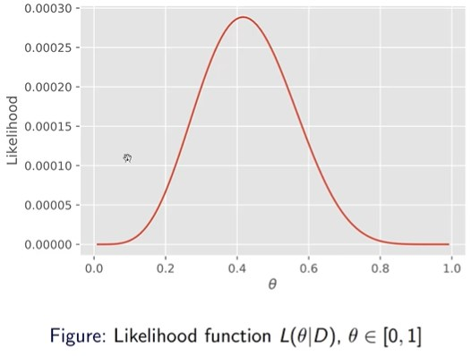

## Maximum Likelihood Method

In the above graph we can see the peak likelihood is at 5/12, ~0.41, but what about when the function is multidimensional, say 4d or 5d, we cannot visualise this one a graph, so we need a general mathematical method for more complex and high dimensional problem. We can formulate the problem as an optimization problem.

We define the maximum likelihood estimator as:

