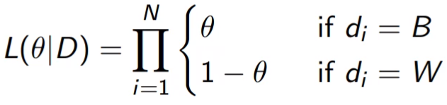
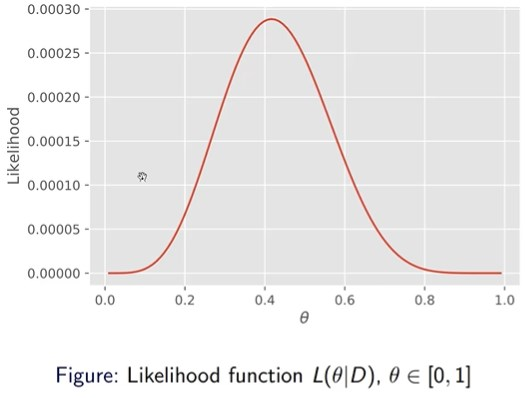
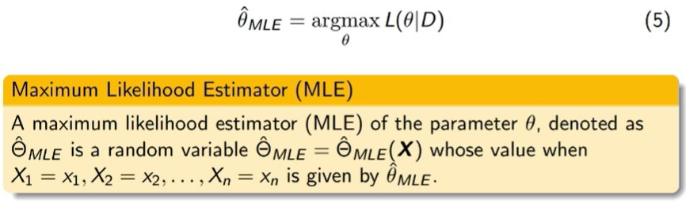
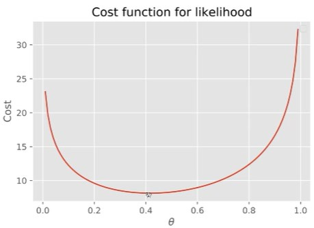
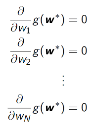

The urn problem is as follows:
	Given an urn with an unknown proportion of differently coloured balls (say black and white), and we pull a number of balls, with replacement, and get a specific sequence D (say BBWBWWBWWWBW), what is the proportin of black balls that is most likely to draw that sequence?

We can denote the probability of drawing a black ball as $\theta$ - we know this probability follows the Bernoulli distribution: P(B) = $\theta$ and P(W) = 1 - $\theta$.

Since each draw is I.I.D, we calculate the probability of getting that sequence D as the product of the probabilities of each of the individual draws:

This probability is called the **likelihood** function *L*, which is a function of $\theta$, given the samples *D*.

1. **Likelihood Function (L):** The likelihood function, denoted as L($\theta$ | D), is a fundamental concept in statistics. In this context, theta represents a parameter, specifically the probability of drawing a particular ball from the urn. D is the set of observations or samples.

2. **Goodness of Fit:** The likelihood function is used to evaluate how well a given probability parameter (theta) fits or explains the observed data (D). It essentially measures the compatibility or goodness of fit between the assumed probability distribution (determined by theta) and the actual observed data.

- **Scenario:** You have observed 10 draws from the urn, and 7 of them are red.
- **Likelihood Function:** L(theta | D), where D is the set of observed draws.
- **Goodness of Fit:** If theta = 0.7 (70% chance of drawing red), the likelihood might be high because it aligns with the observed data. However, if theta = 0.3, the likelihood might be lower as it doesn't fit well with the majority of red draws in the sample.

3. **Holding the Observation Constant (D):** The phrase "by holding this observation, D, constant" means that when calculating the likelihood function, we are treating the observed data D as fixed and unchanging. In other words, we are assuming that the data we have is fixed and not subject to change during our analysis.

4. **Varying and Changing Theta:** The likelihood function is then computed by varying and changing the parameter theta. This involves considering different values of theta to see how well each value explains the observed data. The goal is to find the value of theta that maximizes the likelihood, indicating the parameter value that best fits the observed data.

- **Scenario:** You observed 10 draws with 7 red balls.
- **Varying and Changing Theta:** Calculate the likelihood for different values of theta, say 0.1, 0.2, ..., 0.9. Evaluate how well each theta value explains the observed 7 red draws. The goal is to find the theta that maximizes the likelihood, indicating the most likely probability of drawing a red ball.

The likelihood function is a tool used in statistical inference to quantify the compatibility between a given probability parameter and observed data, assuming the observations are fixed during the analysis.

### Formal Definition of Likelihood Function

Let $\textbf{X} = (X_1, X_2,...,X_n)$ be a random sample from a distribution with a parameter $\theta$. Suppose we have observed that $X_1 = x_1, X_2 = x_2, ..., X_n = x_n$ (where $x_n$ are actual observations). We can also define the observations as a vector $\textbf{x} = (x_1, x_2, x_3, ..., x_n$).
We can define the likelihood function as either:
- If $X_i$'s are discrete:
	- $L(\theta | \textbf{x}) = L(\theta | x_1, x_2, ... , x_n)$ 
			 $= P_{\textbf{x}} (\textbf{x} ;\theta)$
	where $= P_{\textbf{x}} (\textbf{x} ;\theta)$ is the probability mass function (PMF) of $\textbf{X}$ parametrised by $\theta$ 
- If $X_i$'s are continuous:
	- $L(\theta | x) = L(\theta | x_1, x_2, ... , x_n)$ 
			 $= f_{\textbf{x}} (\theta | \textbf{x})$

In general, $\theta$ can be a vector, $\mathbf{\theta} = (\theta_1,\theta_2,...,\theta_k)$


We can plot the likelihood function against $\theta$. Note that the likelihood function is *not* a probability function, i.e. the area under the curve does not necessarily sum to 1.

### Difference between Probability and Likelihood
**Probability**: a number p $\in$ \[0,1] between 0 and 1 to describe how likely an event is to occur, or how likely it is that a proposition is true, assuming we know the distribution of the data.
**Likelihood**: a function that measures the goodness of fit of a statistical model to a sample of data for given values of the unknown parameters. It is a function of the unknown parameters, eg $\theta$.

## Maximum Likelihood Method
In the above graph we can see the peak likelihood is at 5/12, ~0.41, but what about when the function is multidimensional, say 4d or 5d, we cannot visualise this one a graph, so we need a general mathematical method for more complex and high dimensional problem. We can formulate the problem as an optimization problem.

We define the maximum likelihood estimator as:


Given the optimization problem show above, how do we solve it?
### Exhaustive Search
- We could sweep through all the input values, exhaustively searching, and finding the maximum value, but this can be computationally inefficient, and slow.
- We could use a technique called "grid search", where we split the continuous input into many discrete values with a fixed interval, we can then perform a search at each interval, and find the value of $\theta$ that gives the highest likelihood. This is still a version of an exhaustive search, we are just limiting the search space initially. This will still not be very efficient for higher dimensional search spaces.
### Optimization Algorithms
-These are a more general way to solve these problems, and generally are a more efficient way to solve these sorts of problem.
-Firstly, before applying an optimization algorithm, we must turn our the likelihood function into a cost function:
# Cost Functions

A cost function is a function that maps a set of events into a number that represents the "cost" of that event occurring. AKA the **loss function** or **objective function**.

**Cost function for likelihood**: a general one-to-one mapping with likelihood - the negative logarithm of the likelihood function:
$J(\theta , D) = - \log (L(\theta | D))$ 

Why should we use the negative logarithm as the cost function?
- Convention: by convention, many optimisation problems, are minimisation problems
- Convenience: Taking the logarithm changes multiplication to addition, i.e. log(AB) = log(A) + log(B), which is easier to differentiate
- Numerically stable: Product of $\theta$, which is a probability, will converge quickly to zero, which might cause problems for computers limited by machine precision.


Example: our new cost function, using the likelihood function from above

## Optimization
To use optimization, we must:
- construct a model
- determine the problem type
- select an optimization algorithm

Machine learning -> optimization problems:
	Some examples:
	**Supervised learning**: Given some training data, we want to train a machine learning model to explain the data. The training process is essentially a process of finding a optimal set of parameters of this model and the optimality is defined by an objective function
	**Unsupervised learning**: Given some unlabelled samples, we aim to divide them into multiple clusters or groups, of which the samples in same group are as similar as possible, but samples in different group are as different as possible.
### First-Order Optimality Condition
Optimization: For a function $g(\textbf{w})$ of *N* dimensional independent variables $w \in \mathbb{R}^n$ , the optimization problem is:
	*argmin* $g(\textbf{w})$ 

For functions with more than 2/3 variables, we cannot visualise them, so we use analytical methods. A $\textbf{w}^∗$ is the local minimum, if it satisfies the **first-order necessary condition for optimality**, which is defined as:
	$∇_w g (\textbf{w}^∗) = 0_{N×1}$ 
(In plain text, the gradients, aka every partial derivative, with respect to $w$ of $w^*$ = 0)

The point which satisfy the condition is also called **stationary point**. A stationary point can be **minimum**, **maximum** or a **saddle point**  

The first-order necessary condition for optimality can be written as a series of N first order equations:

These equations are difficult, if not impossible, to solve traditionally - so we instead use an algorithm to solve them, firstly we look at gradient descent:

### Gradient Descent
**Gradient descent** is a first-order iterative optimization algorithm for finding a local minimum of a differentiable cost function. The idea is to employ the negative gradient at each step to decrease the cost function - to do this we need to work out a **direction**, and a **magnitude** (aka step size). 
	
Formally, we define the negative gradient of a cost function $J(θ)$ as:

$−∇θJ = − \frac{dJ(θ)}{dθ}$
 
then we need to choose a magnitude or step size parameter $η$ (also called  
the learning rate) so that the update equation becomes:  

$θ(t + 1) = θ(t) − η∇_θJ(θ(t)) = θ(t) − η \frac{dJ(θ(t))}{dθ}$

In pseudocode:
```
Initialisation: Start at any value of parameter θ 

	repeat 
		change the parameter θ in the direction that decreases the  
		cost function J(θ)  
		
	until the decrease in cost with each step is very small  
	
end
```

Many real-world situations are very complex such that our observations cannot model with a known probability distribution functions, e.g., Gaussian distribution. What shall we do?