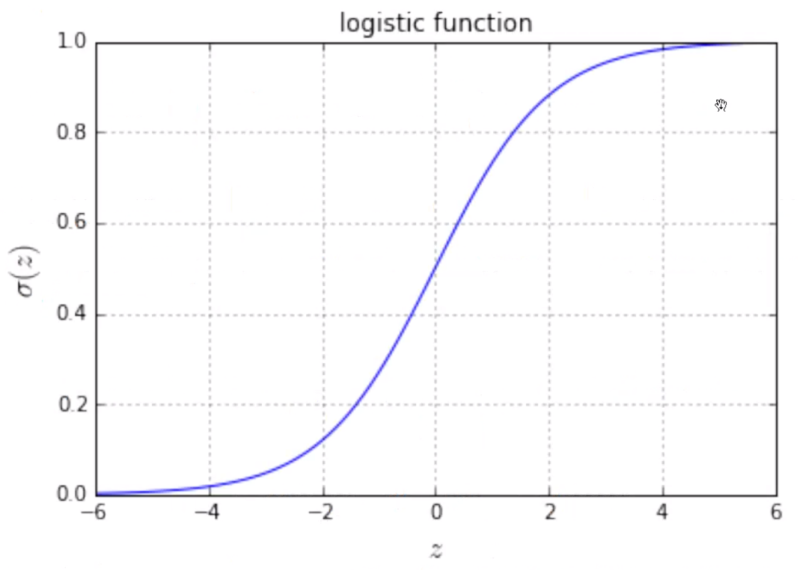
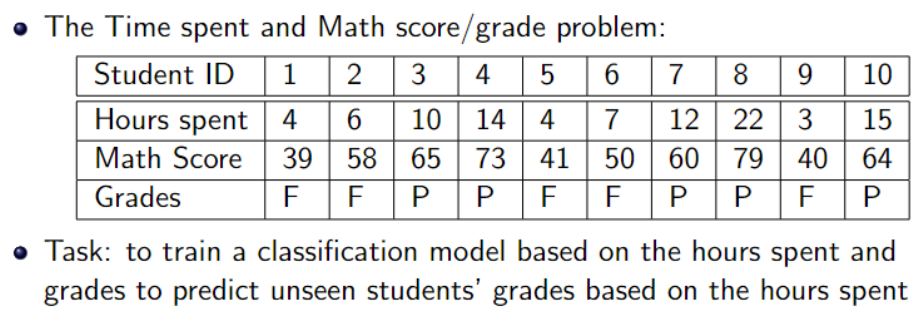
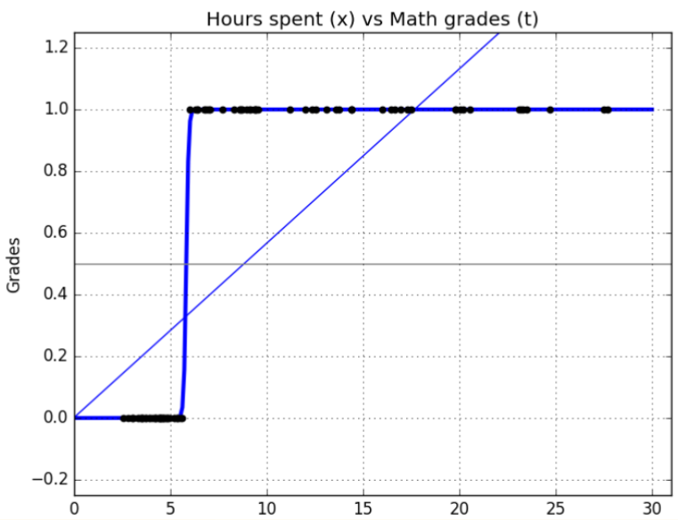

Logistic regression is a type of classification model used to determine the predicted class an input pattern belongs to. It models the posterior probabilities contingent on the input variables. (The term "posterior" comes from Bayesian statistics, where the posterior probability is the probability of a hypothesis given the observed data.)

In binary classification we have one output unit for each class, and for each input pattern we have:
	1 for the output unit corresponding to that class
	0 for all the other output units

#### Logistic Regression
Logistic (logit) regression aims to predict the probability that an example belongs to class "1" versus class "0". It uses the logarithm of the odds to model the binary prediction as a linear combination of independent variables, then applies a logistic function to convert log-odds to probability.
#### Linear Regression
In linear regression (function approximation), we are approximating a linear function from a set of noisy data. We have *N* observations, i.e. {$(\textbf{x}_i,y_i)$}, $i = 1, ... ,$ *N*, where:
- $x_i$ are the independent variables, also called regressors, which is a *K* dimensional vector $\textbf{x}_i \in \mathbb{R}^K$, and $\textbf{x}_i = [x_{i1}, x_{i1}, ... ,x_{ik}]^T$. (Reminder that $^T$ is the "inner product", or "transpose"). This is our input data.
- $y_i$ is the dependent variable, which is a scalar, $y_i \in \mathbb{R}^1$. This is what we what to learn to predict, with a predictor: $\hat{y}_i = \theta_0 + \sum_{k=1}^{K}\theta_k x_ik + \epsilon_i, i=1,2,...,N$
- $\hat{y}_i$: This is the predicted output variable.
- $\theta_0$, $\theta_k$: These are the model parameters or weights. $\theta_0$ is the y-intercept, and $\theta_k$ is the weight for the kth dimensional data.
- $\epsilon_i$: This is the residual or error term (difference between true and predicted value) for the i-th observation.
#### Odds vs Probability
Odds are different from probability, to demonstrate, let's say an event has a $p$ (probability) = 0.2, or 20%, chance of occurring. The odds for this are the ratio of the probabilities of the event happening, and not happening, like so: 0.2 / (1-0.2) = 0.25. We take these odds and apply a logarithm: $logit(p) = log(\frac{p}{1-p}) = log(p) - log(1-p) = -log(\frac{1}{p}-1)$ 

Consider a model with *n* independent variables $x_1$ to $x_n$ and one dependent variable, *Y*, which is a random variable that follows the Bernoulli distribution, which is denoted as $p = P(Y=1)$. The logistic model can be formally defined as:

$logit = log (\frac{p}{1-p}) = \theta_0 + \theta_1 x_1 + \theta_2 x_2 + ... + + \theta_n x_n$

(where the $\theta$'s are the coefficients / parameters of this logistic model, which we infer/learn from the data)
#### Logistic Regression in Practice
Let $x_0$ =1, so:

$\hat{y}_i = \theta_0 x_0 + \sum_{k=1}^{K}\theta_k x_ik + \epsilon_i = \sum_{k=0}^{K}\theta_k x_ik + \epsilon_i = \mathbf{\theta^T x_i} + \epsilon_i$ 

where $\mathbf{\theta}$ = $[\theta_0, \theta_1, ... , \theta_K]^T, \textbf{x}^i = [1, x_{i1}, ..., x_{iK}]^T$ 

- $\theta_0$, $\theta_1$, … , $\theta_n$: These are the coefficients or parameters of the logistic model that we learn from data.
- $x_1$, $x_2$, ,$x_n$: These are the independent variables. These are the features or attributes of our data.
- $\hat{y}_i$: This is the predicted output variable.
- $\textbf{x}_i$: This is the vector of the i-th observation's attributes.

For each pair of training samples, i = 1, 2 ,..., N, we aim to learn a function of the form:
$P(y_i =1 | \textbf{x}_i) = \frac{1}{1+exp(-\theta^T\textbf{x}_i)}$ and $P(y_i = 0| \textbf{x}_i) = 1 - P(y_i =1 | \textbf{x}_i)$ 

In plain English, we have a binary output variable $y$, and we want to model the conditional probability, when $x = X_i$. The unknown parameter $\theta$ can be estimated by maximum likelihood.

We define $\sigma(\textbf{x}_i) = \frac{1}{1+exp(-\theta^T\textbf{x}_i)}$ as the "logistic" or "sigmoid" function, equal to $P(y_i =1 | \textbf{x}_i)$.

#### Math Hours Spent vs Pass/Fail Example

We don't aim to predict a linear relationship between hours spent and grades, but instead a binary output of pass or fail.
#### Maximum Likelihood Estimation of Logistic Regression
We need to estimate the K + 1 unknown parameters, $\theta$, in our sigmoid function. We can use maximum likelihood estimation as a method of finding a set of parameters for which the probability of the observed data is greatest. 

Y is a binary random variable, so we use the Bernoulli distribution (used for binary). We write our function parametrized by $\theta$:

$h_\theta(X) = P(Y =1 | \textbf{X};0) = \frac{1}{1+exp(-\theta^TX)}$ 
and 
$P(Y=0 | X ; \theta) = 1 - h_\theta (X)$ 

From the Bernoulli distribution, we have:
$P(y | X ; \theta) = Bernoulli(h_\theta(X)) = h_\theta(X)^y(1-h_\theta(X))^{1-y}$

- $X$ denotes an N × (K + 1) matrix of independent variables, where each row is an observation $\textbf{x}_i$ , i = 1, · · · , N with K + 1 independent variables
- $h_\theta$: This is the predicted probability, or hypothesis, that output $Y$ is classified as 1 given input $X$.
- $y$: This is the true output variable.
- $P(y | X ; \theta)$: This is the likelihood of observing output $y$ given input $X$ parametrized by $\theta$.
- $\theta$: This is the set of parameters we look to optimize with Maximum Likelihood Estimation to best fit the model to the observed data.
- $L(\theta)$: This is the likelihood function, a mathematical representation of the probability our model's parameters give rise to the observed data.
- $J(\theta)$: This is the cost function, the negative log likelihood, which we look to minimize to achieve the best fit of the model to the observed data.
#### Derivation of the Likelihood Function:
The likelihood function with respect to $\theta$ can be defined as follows:
$L(\theta | y; x) = P(Y | X; \theta) = \prod_{i} P(y_i | x_i; \theta) = \prod_{i} h_{\theta}(x_i)^{y_i}(1 - h_{\theta}(x_i))^{1-y_i}$

We take the negative logarithm of the likelihood function to use as our cost function:
$- log(L(\theta | y; x)) = \sum_{i=1}^{N} [y_i log(h_{\theta}(x_i)) + (1 - y_i) log(1 - h_{\theta}(x_i))]$

Finally, we minimize this to obtain the maximum likelihood estimate of $\theta$:
$\theta_{MLE} = argmin_\theta - log(L(\theta | y; x))$
#### Math Example Results Interpretation:
After implementing the logistic regression model on the dataset with our Python Scikit Learn, we obtain the model's intercept, $\theta_0: -1.2725$ and the model coefficients $\theta_1: 0.2064$.

Now, we calculate the odds: 
$odds = \frac{p}{1 - p} = exp(\theta_0 + \theta_1x1) = exp(-1.2725 + 0.2064x1) = exp(0.2064 \cdot (-6.1652 + x1))$

As well as the probability:
$P(Y = 1) = \frac{1}{1 + exp(-(\theta_0 + \theta_1x1))} = \frac{1}{1 + exp(-0.2064 \cdot (-6.1652 + x1))}$ 

Interpreting these results, the intercept tells us the log-odds of passing the math exam if no hours were spent studying. From the equations above, we find that the odds were 0.28, or roughly 1 to 3, and the probability of passing was 0.22 with zero study hours.

Additionally, the equation tells us that if we were to increase our study time by an hour, we would increase the odds of passing the exam by $exp(\theta_1) = exp(0.2064) \approx 1.2292$. To just pass the exam, i.e., even odds or a probability of 1/2, we need to study at least $- \frac{\theta_0}{\theta_1} = 6.1652$ hours.

Given a certain number of hours a student studied, we can also predict the probability the student will pass the exam. For example, a student who studies 10 hours has a probability $P(Y = 1) = \frac{1}{1 + exp(-0.2064 \cdot (-6.1652 + 10))} = 0.6881$ of passing.
#### Main Assumptions of Logistic Regression:
1. Binary outcomes: The input patterns are divided into two categories/classes.
2. Independent observations: Observations should come from independent chronicles, not from repeated measurements or matched data.
3. Low or no multicollinearity among the independent variables: The variables should not be too highly correlated with each other.
4. Linearity of independent variables and log-odds: Logistic regression assumes that the relationship between the logarithm of the odds and the independent variables is linear.
5. Large sample size: To obtain reliable and stable estimates of parameters, a large sample size is preferable.
6. Rule of ten: We need at least 10 cases with the least frequent outcome for each independent variable in our model. For example, if we have 5 independent variables and the expected probability of our least frequent outcome is 0.10, then we would need a minimum sample size of 500 (10 * 5 / 0.10).