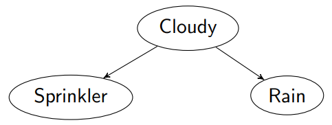

Example: Suppose we have a pile of biased coins that have two possible biases of $θ_{0.9} = 0.9$ and $θ_{0.1} = 0.1$. 

The probability of a coin have the bias $θ_{0.9}$ is $p(θ_{0.9}) = c$

Lets say we choose a random coin from the pile and toss it, then we replace the coin in the pile. We repeat this many times, to obtain a probability that the coin will land heads up, which is $p(x_h) = a$ 

Then we choose a coin from the pile that we know has a bias of $θ_{0.9}$, the probability of tossing heading with this coin is $p(x_h|θ_{0.9}) = d$

How can we derive the posterior probability $p(θ_{0.9}|x_h)$, that is, the probability of our coin having a bias of $θ_{0.9}$ given that we has tossed heads?

The total area of the whole box is 1. The area $a$ of the green disk $A$ represents the probability $p(x_h)$ that a coin will land with heads, $x_h$. The area $c$ of the pink disk $C$ represents the probability $p(θ_{0.9})$ that a coin has bias $θ = 0.9$. The overlap between $A$ and $C$ is the area $b$, which represents the joint probability $p(x_h, θ_{0.9})$ that a coin will land heads up and that a coin has bias $θ_{0.9}$.

From disk A we obtain: $p(θ_{0.9}|x_h) = \frac{b}{a} = \frac{p(x_h, θ_{0.9})} {p(x_h)}$ 

From disk C we obtain: $p(x_h|θ_{0.9}) = \frac{b}{c} = \frac{p(x_h, θ_{0.9})}{p(θ_{0.9})}$ 

If we multiply the denominators, we get:
	$p(x_h,θ_{0.9}) =  p(θ_{0.9} | x_h )p(θx_h)$
	$p(x_h,θ_{0.9}) = p(x_h | θ_{0.9})p(θ_{0.9})$ 

which means that:
$p(θ_{0.9} | x_h )p(θx_h) =p(x_h | θ_{0.9})p(θ_{0.9})$

which rearranged gives us:
$p(θ_{0.9} | x_h ) =\frac{p(x_h | θ_{0.9})p(θ_{0.9})}{p(x_h)}$

This final equation is **Bayes Theorem.**

#### Example
$\theta$ represents a specific disease, $x$ represents a specific symptom. The joint PMF is:

$P(\Theta)$ is the **prior distribution** (of disease) and $P(X)$ is **marginal distribution** (of symptoms).

What is the probability of observing $x_3$ (symptom) given different values of $\Theta$ (disease)?

$p(x_3|\Theta) = {p(x_3|\theta_1), p(x_3|\theta_2), . . . , p(x_3|\theta_{10})}$
={0, 1/15, 1/19, ... , 5/9}

which can be written as $P(X=x| \Theta) = p(x|\Theta)$. This is similar to the likelihood function in MLE: $L(\theta |x) = P_x(x; \theta)$ 
#### Bayes' Theorem for Probability Distributions
Given two random variables, $X$ and $\Theta$:
$p(\Theta | x ) =\frac{p(x |\Theta )p(\Theta )}{p(x)}$
where $p(\Theta | x )$ is called the **posterior distribution**, $p(x |\Theta)$ is the **likelihood function**, $p(\Theta)$ is called the **prior**, $x$ is a value of $X$, and $p(x)$ is a scalar called **marginal likelihood**. In plain English:
$posterior \:distribution = \frac{prior\: distribution × likelihood\: function} {marginal\: likelihood\: (model\: evidence)}$

1. **Posterior Distribution** $p(\Theta | x )$: This is what you're aiming to find out. The posterior distribution represents the probability of the parameter $\Theta$ given the observed data $x$. After observing the data, this distribution updates your belief about the uncertainty of $\Theta$.
2. **Likelihood Function** $p(x |\Theta)$: This is a function of $\Theta$ given fixed data $x$. It measures how probable the observed data $x$ is, for different values of $\Theta$. The likelihood is not a probability distribution over $\Theta$ because it does not integrate to 1 over $\Theta$. Instead, it's used to weigh the plausibility of different values of $\Theta$ based on the observed data.
3. **Prior Distribution** $p(\Theta)$: This represents what is known about $\Theta$ before observing the data $x$. The prior distribution reflects your initial beliefs about the parameter's values. It can be based on previous studies, expert knowledge, or even be a subjective choice if there's no prior information.
4. **Marginal Likelihood** $p(x)$: This is also known as the evidence. It is a normalization factor that ensures the posterior distribution is a proper probability distribution (i.e., it integrates to 1 over all possible values of $\Theta$).

There is a connection between the **likelihood function** and the **posterior distribution** in Bayesian inference, but there's a nuanced distinction in their roles and what they represent. While both the likelihood function and the posterior distribution relate to how the observed data $x$ informs us about the parameter $\Theta$, they do so in different ways:
- **Likelihood:** Measures how well different parameter values explain the observed data, without considering prior beliefs about those parameter values.
- **Posterior Distribution:** Represents the updated beliefs about the parameter values, integrating both the likelihood of the observed data given those values and the prior beliefs about the parameter values.
#### Back to the Example
What are the conditional probabilities that a patient each of these diseases given that they have the symptom $x_3$? 

$p(\Theta | x_3 ) =\frac{p(x_3 |\Theta )p(\Theta )}{p(x_3)} =\{0, 1/71, 0.01, 0.14, 0.22, 0.15, 0.17, 0.01, 0.11, 0.07\}$

In the Bayesian interpretation of the likelihood function, $\Theta$ is a random variable. A function whose value is proportional to the probability of the conditional probability distribution $X$ given $\Theta$.

What is the most possible disease given the patient has the symptom $x_3$?

We can trivially see that this is $\theta_5$, but for larger distributions we have a tool for this called the **Maximum a posteriori probability** (MAP) estimate. 

$\hat{\theta}_{MAP} = \underset{θ}{argmax} \; p(\Theta|x_3)=\theta_5$  

This is very similar to the maximum likelihood estimation (MLE), but the main difference between MLE and MAP is the incorporation of the prior distribution $p(\Theta)$  in MAP. MLE can be seen as a special case of MAP where the prior $p(\Theta)$ is uniform or non-informative. When the prior is uniform, the MAP estimate becomes equivalent to the MLE estimate because the prior does not influence the maximization—only the likelihood function does.
### Bayesian Networks
A Bayesian network is a probabilistic graphic model, in which nodes represent random variables, and edges represent conditional independence assumptions. All edges in Bayesian networks are directed. The edges are used to represent cause-effect relationships.

*A famous example of a Bayesian network*

There are many standard structures in Bayesian networks. In the below photo A is a direct *cause* of B, we could also say that B is a direct *effect* of A.

Each node in a Bayesian network has a conditional distribution given its parents:$P(X_i|Parents(X_i))$ 
This conditional distribution can be represented as a condition probability table (CPT) - the distribution over $X_i$ for each combination of parent values.

A normal **full joint distribution** is calculated:
$P(X_1,X_2,...,X_n) = \prod_{i=1}^n \: P(X_i|X_{i-1},...,X_1)$   

but in the context of Bayesian networks, we define the full joint distribution based of the edges as the product of the local conditional distributions:
$P(X_1,X_2,...,X_n) = \prod_{i=1}^n \: P(X_i|Parents(X_i))$   

This is the essence of a Bayesian network - a **Bayesian network** is a **compaction representation of a join probability distribution in terms of conditional distribution**.

Normally, representing the joint distribution of a large number of random variables explicitly can be prohibitively complex. For $n$ random variables, each with $k$ possible states, the full joint distribution would typically require $k^n−1$ probabilities to be specified (since the total probability must sum to 1).

However, Bayesian networks drastically reduce this complexity by exploiting conditional independence properties between variables. Instead of representing all possible combinations of variable states directly, a Bayesian network represents these dependencies using a directed acyclic graph (DAG).

**Conditional independence** is a fundamental concept in probability theory that implies that the probabilistic relationship between two or more variables can be decoupled given the knowledge of the state of certain other variables. In the context of Bayesian networks, this property allows us to simplify the representation of joint probability distributions significantly.
#### Direct Cause Edge
Let's look at the details of the specific case where a random variable has a direct cause on another random variable. For example, we notice the grass in our garden is wet, which might be caused by rain. We construct a Bayesian network to represent their probabilistic relationship:

Binary random variables are:
$W$ where $R_W$ = {0,1} to represent whether grass is wet (1) or not (0).
$R$ where $R_r$ = {0,1} to represent whether it has been raining (1) or not (0).

An edge presents a cause-effect relationship, called direct cause, or conditional dependence between the parent node (cause) and the child node (effect): $P(W|R)$

Let's say the probability of raining through a day is:
$P_R(R=1) = 0.4$ and thus $P_R(R=9) = 0.6$ 

and the probability that grass gets wet when it rains is 0.9, that is:
$P(W=1|R=1) = 0.9$ and thus $P(W=0|R=1) = 0.1$ 

and the probability that grass get wet without raining, (e.g., when someone turns on the sprinkler):
$P(W=1|R=0) = 0.2$ and thus $P(W=0|R=0) = 0.8$ 

The Bayesian network with CPTs:

In general the random variables are either **observed variables** (the ones we have knowledge about), and **unobserved variables** (those we don't know about, and therefore have to infer the probability). For example, we have observed that the grass is wet, what is the probability it rained? 

Based on Bayes theorem, the probability that it rained given the grass is wet can be calculated as:
$P(R=1|W=1) = \frac{P(R=1)P(W=1|R=1)}{P(W=1)}$ 

The marginal probability of wet grass ($P(W=1)$) can be computed by summing up the joint PMF over the possible values that it's parent node can take:
$P(W=1) = \sum_{r\in\{0,1\}} P(R=r, W=1) = \sum_{r\in\{0,1\}} P(W+1|R=r)P(R=r)$
=(0.9 * 0.4) + (0.2 * 0.6) = 0.48

Using this we can infer:
$\frac{0.9 * 0.4}{0.48} = 0.75$ 

Knowing that the grass is wet increased the probability of it rained from 0.4 to 0.75. This inference is called diagnosis, i.e., to obtain $P(Cause|Effect)$
#### Conditional Independence 
Two sets of variables A and B are **independent** iff $P(A) = P(A|B)$ or equivalently $P(A,B)=P(A)P(B)$.

Two random variables A and B are conditionally independent if they are independent given a third random variable C, written as: $\newcommand{\indep}{\perp \! \! \! \perp} (A\indep B) | C \iff P(A,B |C) = P(A|C)P(B|C)$

*Graphical Representation of Conditional Independence*

Suppose A, B and C can take one of 2 values - the complete join distribution would require $2^3 -1 = 7$ parameters, in contrast using conditional independence we need $1 +2 +2=5$ parameters.
#### Markov Condition 
Each random variable X is conditionally independent of its non-descendants, given its parents

$O_1$ and $O_k$ are neither parents, nor children of $X$, therefore given $P_1$ and $P_m$, $X$ is conditionally independent of all other nodes $O_1$ and $O_k$. The figure also defines the **Markov Blanket** of $X$, which is defined as $X$'s parents + children + children's parents, which is sufficient for inferring X.

A standard Bayesian network only allows for the four standard structures shown before, the following structures are not allowed:

What this means is that a node is **independent** of its **ancestors** given its parents, where the ancestor/parent relationship is with respect to some fixed topological ordering of the nodes.
#### Probabilistic Relationship: Indirect Cause

Here since *WetGrass* is independent of *Cloudy* given *Rain*, we have the joint probability distribution:
$P(C,R,W)=P(C)P(R|C)P(W|R)$ 
#### Probabilistic Relationship: Common effect

Suppose we identify another cause of wet grass, the sprinkler, we can then model the relationship as a converging connection. The joint probability distribution is :
$P(S, R, W ) = P(S)P(R)P(W |S, R)$

If neither W nor any of its descendants are observed, S and R are independent. If we can confirm one cause (e.g., rain is true) of an observation (e.g., grass is wet), it reduces the need to invoke alternative causes, e.g., sprinkler is on.
#### Probabilistic Relationship: Common Cause
It is natural to suppose that cloudy weather influence our decision to turn on the sprinkler or not and cloudy weather will also influence the chance of rain, we model this “common cause” probabilistic relationship using:

The joint probability distribution:
$P(C, S, R) = P(C)P(S|C)P(R|C)$ 

If C is observed, then S and R are independent.