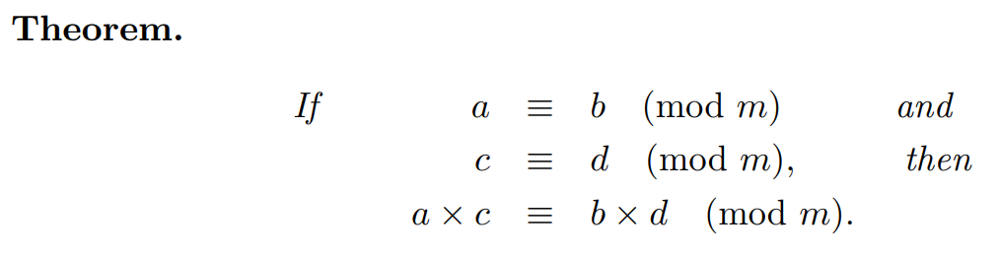
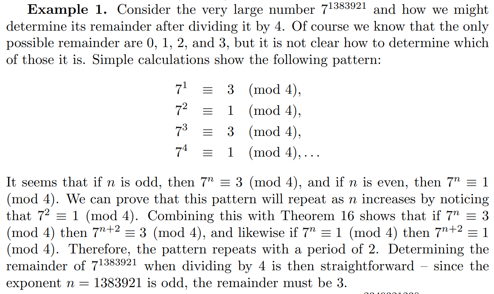

Most technological applications of modular arithmetic involve exponentials with very large numbers. For example, a typical problem related to encryption might involve solving one of the following two equations: 

$67930^{32319} = a (mod 103969)$
$67930^b = 48560 (mod 103969)$ 

The answers are not obvious at all from looking at the equations. Suppose we are asked to determine the remainder of the enormous number $10^{51239203}$ after dividing it by 5 - this number has over 50 million digits! Although this might appear impossible to solve, you might notice that 10 is divisible by 5, and the enormous number is just a multiple of 10. If the remainder of 10 when divided by 5 is 0, then so is any multiple of 10, including the enormous number. Of course the answer would be the same if we were attempting to divide it by 2 instead, but what would happen if we divide it by 3, 7, or some other number?





### A Second Strategy
Suppose we want to calculate **2^90 mod 13**, but we have a calculator that can't hold any numbers **larger than 2^50**.

Here is a simple **divide and conquer** strategy:

2^**90** = 2^**50** * 2^**40**

**2^50** mod 13 = **1125899906842624** mod 13 = **4**  
**2^40** mod 13 = **1099511627776** mod 13 = **3**

**2^90** mod 13 = (**2^50 * 2^40**) mod 13  
**2^90** mod 13 = (**2^50** mod 13 * **2^40** mod 13) mod 13  
**2^90** mod 13 = ( **4** * **3** ) mod 13  
**2^90** mod 13 = **12** mod 13  
**2^90** mod 13 = **12**

A recursive divide and conquer technique is show below in Python.
```python
# Recursive Python program 
# to compute modular power 
def exponentMod(A, B, C):
     
    # Base Cases
    if (A == 0):
        return 0
    if (B == 0):
        return 1
     
    # If B is Even
    y = 0
    if (B % 2 == 0):
        y = exponentMod(A, B / 2, C)
        y = (y * y) % C
     
    # If B is Odd
    else:
        y = A % C
        y = (y * exponentMod(A, B - 1, 
                             C) % C) % C
    return ((y + C) % C)
 
# Driver Code
A = 2
B = 5
C = 13
print("Power is", exponentMod(A, B, C))
```