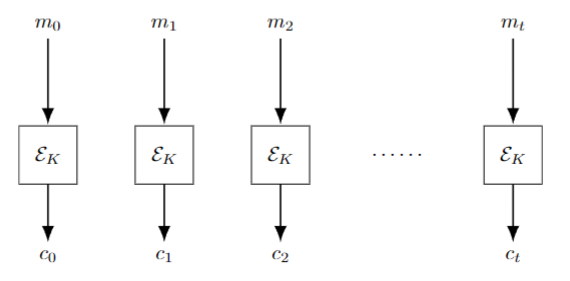
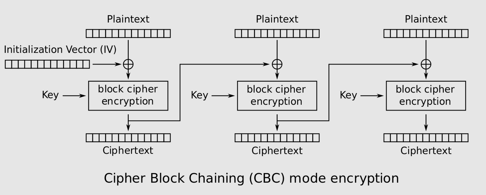
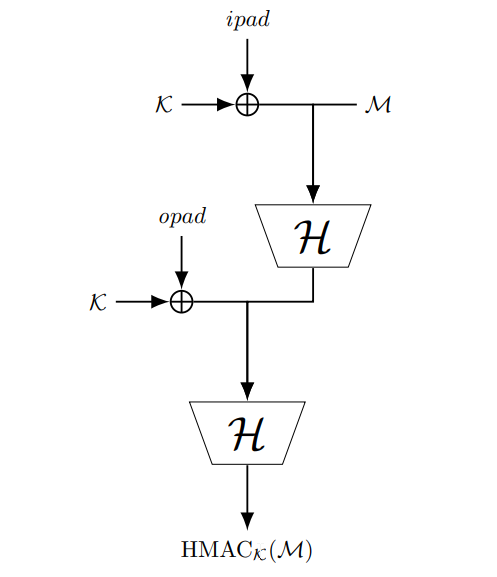
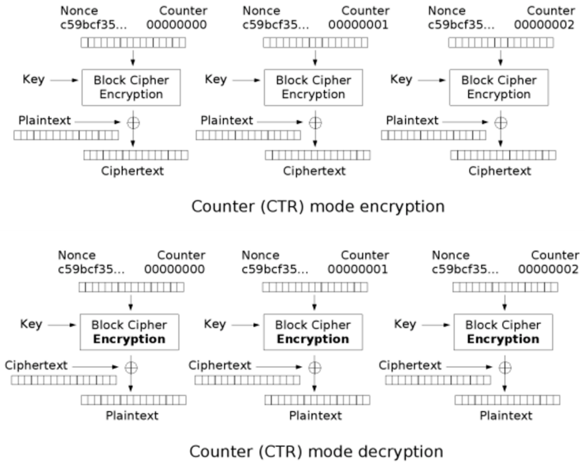

A hash of any message is a short string generated from that message. The hash of a message is always the same. Any small change makes the hash totally different. It is very hard to go from the hash to the message. It is very unlikely that any two different messages have the same hash, but not impossible (pigeonhole principle).

**Uses**
	Verification of download of message 
	Tying parts of a message together (hash the whole message) 
	Hash the message, then sign the hash (for electronic signatures) 
	Protect passwords 
	Store the hash, not the passwords

**Attacks on hashes**
Preimage attack: Find a message for a given hash: very hard. (Unless message is guessable, think list of 10m most common passwords)
Collision attack: Find two messages with the same hash. 
Prefix collision attack: A collision attack where the attacker can pick a prefix for the message.

#### Message Authentication Codes
MACs are used for authentication. 
Example: Alice and Bank share key k
Alice sends to bank ”Pay Bob £10”, $MAC_k$ (”Pay Bob £10”)
Attacker can edit message, but not $MAC$ without knowing the key $k$.

#### Electronic Code Book
This is the simplest method of encryption, we simply take blocks of our input and encrypt them all with the same key. This is susceptible to many attacks like:
1. **Pattern Recognition**: If the plaintext has repeating patterns, these patterns will be preserved in the ciphertext, which can leak information about the plaintext.]
	1. 
2. **Frequency Analysis**: If the plaintext has a known distribution (e.g., English text), an attacker can perform frequency analysis on the ciphertext to infer information about the plaintext.
3. **Block Replacement**: An attacker can replace blocks of ciphertext with other blocks to create a modified ciphertext that decrypts to a different plaintext, potentially causing significant damage.
4. **Known Plaintext Attack**: If an attacker has access to the plaintext and corresponding ciphertext, they can deduce the key by comparing the plaintext-ciphertext pairs.
5. **Chosen Plaintext Attack**: An attacker can submit chosen plaintexts to the encryption algorithm and observe the corresponding ciphertexts to deduce the key.
6. **Dictionary Attack**: If the encryption key is derived from a password, an attacker can try a list of common passwords (a dictionary) to find the correct key and decrypt the ciphertext.

	
#### Cipher Block Chaining (CBC) Mode
CBC (Cipher Block Chaining) is a mode of operation for block ciphers. It is used to encrypt a message that is longer than the block size of the cipher.

In CBC mode, each plaintext block is XORed with the previous ciphertext block before being encrypted. This introduces a dependency on the previous block, creating a "chain" of blocks. The first block (called the initialization vector or IV) is typically XORed with a random value known as the initialization vector (IV) to ensure that each message encrypted with the same key is unique.

Here's a step-by-step explanation of how CBC mode works:
1. **Initialization Vector (IV)**: A random value is generated and XORed with the first plaintext block to create the ciphertext. The IV is transmitted along with the ciphertext so that the decryption process can begin.
2. **XOR Operation**: Each subsequent plaintext block is XORed with the previous ciphertext block before being encrypted. This introduces a dependency on the previous block and creates a "chain" of blocks.
3. **Encryption**: Each XORed plaintext block is encrypted using the block cipher.
4. **Ciphertext**: The resulting ciphertext is transmitted to the receiver.
5. **Decryption**: The receiver uses the IV and the same key to decrypt the ciphertext. Each ciphertext block is decrypted using the block cipher.
6. **XOR Operation**: Each decrypted ciphertext block is XORed with the previous ciphertext block to recover the plaintext.
7. **Final XOR**: The IV is XORed with the first decrypted ciphertext block to recover the original plaintext.

CBC mode provides confidentiality and integrity but does not provide authenticity. It is vulnerable to certain attacks, such as the padding oracle attack and the chosen ciphertext attack. These attacks can be mitigated by using additional cryptographic techniques, such as message authentication codes (MACs) or authenticated encryption modes like GCM (Galois/Counter Mode).

*Standard CBC used for encryption*

*CBC used for MAC, we dont have to send all encryption data, just the last block to verify.*
#### HMAC 
We can use hashing to provide MACs, like in HMAC. There is an attack called a length extension attack that we need to consider when doing this - if we simply XOR'ed the key with the message block, and then hashed it, for each block, there is some internal state of the hashing algorithm that an attacker can determine (out of scope for this course), this can be used to add extra information to the message. To prevent this HMAC uses two hashing passes, and each time we XOR the key with two types of padding, inner and outer padding, which by convention are often '0x36' and '0x5C'. 

*HMAC process*
#### Counter Mode (CTR)
In counter mode we don't chain the blocks like we do in CBC, but instead we iterate the IV (aka nonce) by a +1 each pass.

Plain text: B1, B2, . . . , Bn 
IV: random number (sent in clear) 
Cipher text: C1, C2, . . . , Cn where 
	C1 = B1 ⊕ encrypt(IV) 
	C2 = B2 ⊕ encrypt(IV + 1)
	· · · 
	Cn = Bn ⊕ encrypt(IV + n − 1)
	

Like all other modes we assume that the sender and receiver both have the private key. The sender needs to send the ciphertext and the nonce / IV. 

One downside to CTR is it is susceptible to **known plaintext attacks**. This means that if an attacker knows what the message plaintext is, they can manipulate this by simply XORing, the ciphertext with a XOR of the original message and the modified message: $ENC_{CTR}(M_1) ⊕ (M_1 ⊕ M_2)$.

#### CCM (Counter with CBC-MAC)
CCM is a type of authenticated encryption algorithm, that is one that both encrypts (like CBC and CTR) and authenticates (like CBC-MAC and HMAC), that involves using block chaining like CBC-MAC, and a counter like in CTR mode. 

New Terms:
1. **A1, A2, ..., An (Associated Data)**: These blocks represent the associated data that is authenticated but not encrypted. This can include header fields or any data that should be integrity-protected but not kept secret.
2. **P1, P2, ..., Pn (Plaintext Data)**: These are the plaintext data blocks that will be encrypted and authenticated.
3. **CTR Mode Encryption**:
    - The counter (ctr) is combined with the IV and incremented for each block of plaintext.
    - The result is encrypted with the key (EK) to produce a keystream block.
    - This keystream block is then XORed (denoted by the ⊕ symbol) with the plaintext block (P1, P2, ...) to produce the ciphertext block (C1, C2, ...).
4. **CBC-MAC Authentication**:
    - A1, A2, ..., An and the ciphertext blocks are processed through a CBC-MAC (Cipher Block Chaining Message Authentication Code) to produce an authentication tag.
    - For the CBC-MAC, the data is XORed with the previous encrypted block (or IV for the first block), and then encrypted with EK. This process is repeated for each block.
    - The final block is then encrypted to produce the authentication tag (T_tag), which is appended to the ciphertext to ensure the integrity and authenticity of the message.
5. **T (Authentication Tag)**: This is the output of the CBC-MAC process. It is used to verify the integrity of both the encrypted data and the associated data upon decryption.

