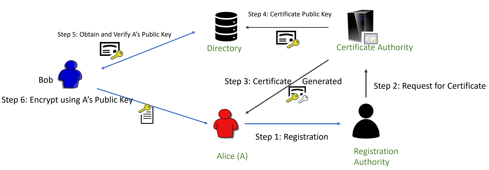
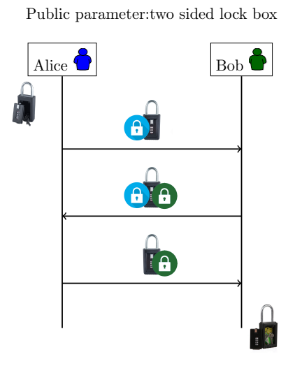
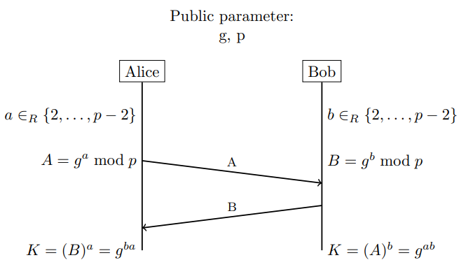
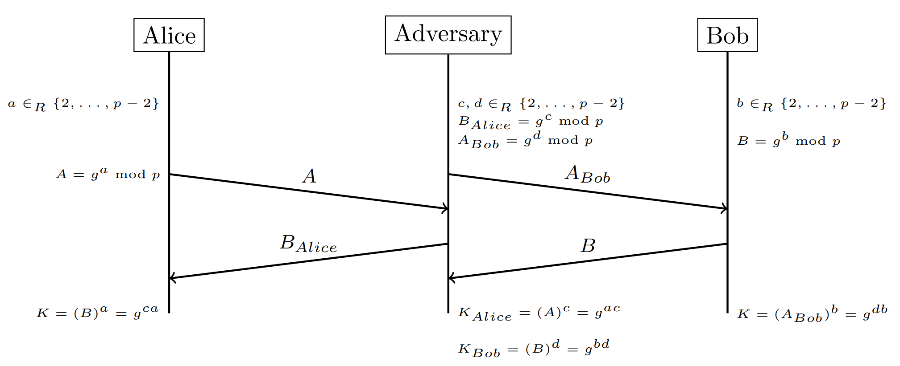

##### Key Concepts of Cryptography
• Confidentiality  
• Message Integrity  
• Sender Authentication  
• (soft) Sender Undeniability (non-repudiation)

Previously all the technique for encryption we looked at are **symmetric key** encryption, where both participants have the same private key. This becomes an issue when wanting to speak to many people, or more technically servers (as we do nowadays), so instead we can use public key cryptography, where every user has a public / private key pair. We need to store / receive the public keys of participants, but this is not protected information, and we never need to share private keys. 

**Message integrity** is a property that verifies that the message is untampered with - we can use **signatures** to do this. We can sign a message using a signing algorithm and our **private key**, and the receiver can be verify the signature using our public key.

Now lets say we want to make sure that a public key is genuine. The way this works usually is that we have a **trusted oracle** (certificate authority), with a globally known public key, this authorities key is often bundled with the operating system, and is taken to be genuine. This authority then signs certificates (usually of certificate issuers), and then these issuers can provide a signature for keys, to ensure genuineness. 

A **private key** has **two** uses, it can be used to **DECRYPT** and to **SIGN**. 
A **public key** has **two** uses, it can be used to **ENCRYPT** and to **VERIFY** a signature.

#### Multi Round Solution to Secure Key Exchange
In order to verify the public key, we can use a **multi-round solution**. This involves encrypting our public key in a "two sided lock box", and sending this to our recipient, they then lock with their key pair and send it back, we then decrypt our side, the "box" (our public key) is now secured only with the recipients public key - once sent, they can decrypt it to get access to the public key.

The system described above is a very simple implementation of a multi-round solution, but this can be extended to also include authentication, key agreement, and other features. A very common implementation of a multi-round solution is **TLS**.

#### Diffie Hellman Key Exchange
Another version of key exchange is the Diffie Hellman key exchange system. This involves picking a prime number $p$, and $g$, which is a primitive root modulo $p$ (less than $p$). $p$ is very large, often 2048 or 4096 bits - the size of $p$ is necessary for good security. Alice picks a number between 2 and $p$-2 at random, she then calculates $A = g^a mod (p)$. A is then sent to Bob. Bob picks another number between 2 and $p$-2 at random, and works out $B = g^b mod (p)$, and sends this to Alice. A quirk of modular arithmetic is that when we raise a number like A to b, like $A^b$, this is equal to $B^a$. Both parties do this, and the resulting number is a shared key. 

*A visualisation of DHKE.*

DHKE is susceptible to a **man-in-the-middle** attack. This is where a third-party intercepts the A and B, and falsifies that it is each other party. We can solve this using RSA.

#### RSA
RSA has three Algorithms (Gen, Enc, Dec):

Maths reminder:
	- Greatest common divisor (**GCD**) of two numbers is the largest possible number which divides both the numbers exactly.
	- Factors of 30 - 1, 2, 3, 5, 6, 10, 15, 30
	- Factors of 42 - 1, 2, 3, 6, 7, 14, 21, 42
	- 6 is the common factor and the greatest one, so is the GCD.

$Gen$, on input a security parameter $\lambda$:
	 • Generate two distinct primes $p$ and $q$ of same bit-size $\lambda$
		 Lets say 3 and 11
	 • Compute $N = pq$ and $\phi (N) = (p − 1)(q − 1)$  
		 N = 33, $\phi(N)$ = 20
	 • Choose at random an integer $e (1 < e < \phi(N))$ such that $gcd (e,\phi(N))= 1$  
		 Pick one from the set {3 7 9 11 13 17 19}, let's say 7 
	 • Let $ℤ_N^∗ =\{x | 0 < x < N$ and $gcd(x,N)=1\}$
		 For us, the set is {1 2 4 5 7 8 10 13 14 16 17 19 20 23 25 26 28 29 31 32}
	 • Compute $d$ such that $e . d mod \phi (n) ≡ 1$ 
		 One solution is d = 3 :  *(3 * 7) mod 20 = 1* 
	 • Public key $PK = (e, N)$. The private key $SK = e, d, N$
		 (e, n) => (7, 33)
		 (e, d, n) => (7, 3, 33)

$Enc(PK, m)$: On input an element $m \in \mathbb{Z}^*_N$ and the public key $PK = (e, N)$ compute:
	- $c = m^e (mod N)$
	- The encryption of _m = 2_ is $c = 2^7 mod( 33) = 29$ 

$Dec(SK, c)$: On input an element $c \in \mathbb{Z}^*_N$ and the private key $SK = (e,d,N)$ compute:
	- $m=c^d ( modN)$
	- The decryption of c = 29 is $m = 29^3 mod(33) = 2$

» RSA security depends on hardness of finding d from e. N;
	Related to hardness of factoring of N.
» The textbook algorithms are deterministic. In practice, some random padding is used.
» Shor’s quantum algorithm can solve factoring in polynomial time. However, a quantum computer of required capacity is still quite far away in the future.
» Wikipedia says any m < N would work. Strictly speaking, it is required that gcd(m, N) = 1. On the other hand, finding a m < N such that gcd(m, N) > 1 will lead to finding p or q, and breaking the system
#### Digital Signatures

We can use RSA for signatures, these are used to verify that the sender is who they say they are (authentication). This is possible because RSA.Enc and RSA.Dec and inverse operations, we can perform them in any order we please. Lets say we have a message, M. We can hash this message and run RSA.Dec on the hash using our private key. We then send this over and the recipient can verify the authenticity of this message by running RSA.Enc on the signature, and then hashing the message and comparing the two. In maths:
	▶ Public Functions A hash function $H : \{0, 1\}^∗ → Z^∗_N$
	▶ Keygen: Run $RSA.Keygen. pk = (e, N), sk = (d, N)$
	▶ Sign: Input: $sk$, $M$. Output $σ = RSA.Dec(sk, H(M)) = H(M)^d mod N$ 
	▶ Verify: Input: $pk, M, σ$. If $RSA.Enc(pk, σ) = H(M)$ output accept, else reject 
	▶ If $σ^e mod N = H(M)$, output accept, else reject
