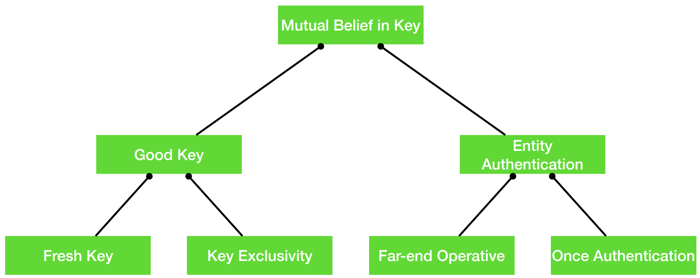

#### Networks
Transmission Control Protocol (**TCP**) is a protocol that runs on top on IP. If an IP packet gets lost, it requests that it is resent. To allow multiple connections TCP uses ports. A **TCP socket** connection is defined by destination IP, destination port, source IP, and source port. The destination port normally depends on the service: WWW runs on port 80, SSH on port 22, DNS on 53. The source port is normally chosen at random.

Every machine (or network connector like a WiFi or ethernet chip specifically) has a unique **MAC address**, e.g. 48:d7:05:d6:7a:51. 

Each machine that is connected to a router is supplied a local IP address, like 192.168.1.21, using **DHCP** (Dynamic Host Configuration Protocol). DHCP takes a MAC address and assigns an IP address.

The Address Resolution Protocol (**ARP**) allows the router to find out which IP address is being used by which machine (MAC address). ARP takes an IP address and returns a MAC address.

Even though the router knows which IP address it assigned to each device through DHCP, ARP is still necessary for devices to resolve IP addresses to MAC addresses within the local network. This is because devices need to know the MAC address of the destination device in order to communicate with it at the data link layer.

Home routers usually have a **single external IP address**, the router is responsible for deciding what traffic is to be sent to each local machine.

Domain Name Servers (**DNS**) are responsible for converting human-readable names like google.com into IP addresses. 

#### Cryptographic Protocols
Cryptographic protocols are fundamental in ensuring secure communication over networks. We have seen some components of these protocols like Diffie Hellman.

##### A Simple Protocol
1. $A → B : A$
2. $B → A : \{N_a\}K_{ab}$ 
3. $A → B : \{N_a + 1\}K_{ab} , \{Pay\:Elvis\:£5\}K_{ab}$

This protocol is susceptible to an attack where an interceptor can resend a message, as the message is encrypted with the same key each time, like:

1. $A → B : A$
2. $B → A : \{N_{a1}\}K_{ab}$ 
3. $A → B : \{N_{a1} + 1\}K_{ab} , \{Pay\:Elvis\:£5\}K_{ab}$
4. $A → B : A$
5. $B → A : \{N_{a2}\}K_{ab}$ 

A wants to send:
6. $A → B : \{N_{a2} + 1\}K_{ab} , \{Pay\:Bob\:£5\}K_{ab}$

C can intercept and send to B:
6. $A → B : \{N_{a2} + 1\}K_{ab} , \{Pay\:Elvis\:£5\}K_{ab}$

##### A Better Protocol
1. $A → B : A$
2. $B → A : N_{a}$
3. $A → B : \{N_{a}, Pay\:Elvis\:£5\}K_{ab}$

Now Bob can be sure that:
- he is talking to Alice
- A wants to send Elvis £5
- A's messages are fresh (not replayed)

A prerequisite of this protocol is that A and B share a key. The principals need to set up a session key using a **Key Establishment Protocol**. To be **sure** they are communicating with the correct principal, they must either **know each others public keys** or use a **Trusted Third Party** (TTP).

#### The Needham-Schroeder Public Key Protocol
Assume Alice and Bob know each others public keys, can they set up a symmetric key?

1. $A → B : E_B(N_a,A)$
2. $B → A : E_A(N_a,N_b)$
3. $A → B : E_B(N_b)$

$N_a$ and $N_b$ can then be used to generate a symmetric key, like in Diffie Hellman, BUT A and B cannot be sure they are talking to eachother and not an interceptor. The attacker $C$ acts as a man-in-the-middle:

1. $A → C : E_C(N_a,A)$
	1. $C(A) → B : E_B(N_a,A)$
	2. $B → C(A) : E_A(N_a, N_b)$
2. $C → A : E_A(N_a,N_b)$
3. $A → C : E_C(N_b)$
	1. $C(A) → B : E_B(N_b)$

This is possible because B doesn't send there identity back in step 2, so C can fake they are B to A. A simple fix would be:

1. $A → B : E_B(N_a,A)$
2. $B → A : E_A(N_a,N_b, B)$   //B is added here, encrypted with A's public key, so C cannot fake that they are B.
3. $A → B : E_B(N_b)$

Now A and B have shared nonce's $N_a$ and $N_b$, they can form a shared session key to encrypt messages like: 
4. $B → A : \{M\}_{key(N_a,N_b)}$

This is secure, assuming that each 'principals' private key is secure, and kept safe, BUT governments can force users to give their private keys, or in a worst case scenario, a hacker could obtain private keys. If this happens we want to maintain that previous messages cannot be decrypted. For example, if an attacker was sniffing on the networks, and received all of the packets from 1, 2, 3, 4..., AND they had the private keys, even at a later date, they could work out the ${key(N_a,N_b)}$, and access the message. To prevent against this we need to maintain **forward secrecy**.

A protocol has **Forward Secrecy** if it keeps the message secret from an attacker who has: 
• A recording of the protocol run
• The long term keys of the principals. 

#### Station-to-Station Protocol
STS has **forward secrecy**:

1. $A → B : g^x$
2. $B → A : g^y, \{S_B(g^y,g^x)\}_{g^{xy}}$
3. $A → B : \{S_A(g^y,g^x)\}_{g^{xy}}$
4. $B → A : \{M\}_{g^{xy}}$

$x$, $y$, $g_{xy}$ are not stored after the protocol run, meaning A's and B's keys don't let the attacked read $M$.

What if Alice and Bob don’t know each other’s public keys to start off with?
- Could meet face-to-face to exchange keys, but what if limited by geography, also this is a common requirement of modern communication, needs to be done safely online.
- Get a trusted third party (TTP) to sign their identity and public key: **a certificate**.

The "full" STS protocol adds **certificates** for A and B, these contain their public key signed by a **TTP**:
1. $A → B : g^x$
2. $B → A : g^y,Cert_B, \{S_B(g^y,g^x)\}_{g^{xy}}$
3. $A → B : Cert_a, \{S_A(g^y,g^x)\}_{g^{xy}}$
4. $B → A : \{M\}_{g^{xy}}$
Now A and B can be sure that A is A and B is B, given that the certificates are signed by a TTP

#### The Needham-Schroeder Key Establishment Protocol

$A$ and $B$ use a trusted third party $S$ to establish a key $K_{ab}$:
1. $A → S : A, B, N_a$
2. $S → A : \{N_a,B, K_{ab}, \{K_{ab}, A\}_{K_{bs}}\}_{K_{as}}$ 
3. $A → B : \{K_{ab}, A\}_{K_{bs}}$
4. $B → A : \{N_b\}_{K_{ab}}$
5. $A → B : \{N_b +1\}_{K_{ab}}$

This above protocol maintains that A and B **are** who they say they are, thanks to the trusted third party. One issue with this is that Alice can reuse and old key, much later:
1. $A → B : \{K_{ab}, A\}_{K_{bs}}$
2. $B → A : \{N_b\}_{K_{ab}}$
3. $A → B : \{N_b +1\}_{K_{ab}}$

#### Key Establishment Goals
When establishing keys, we say a **good key** is one such that it is both:
- **Fresh**: the key established is new (either from some trusted third party or because it uses a new nonce).
- **Exclusive**: the key is only known to the principals in the protocol.
#### Authentication Goals
When communicating, we say we have achieved **Entity Authentication** when:
- **Far-end Operative**: $A$ knows that $B$ is currently active, i.e. operational, and able to participate in the protocol.
	- By verifying that the entity is active, far-end operative authentication helps to prevent replay attacks, where an attacker might reuse previously captured authentication data to impersonate an entity.
	- For instance when $A$ sends $B$ a nonce $N_b$, $B$ could respond with the nonce signed by $B$ like: $S_B(N_a)$
- **Once Authentication**: $A$ knows that $B$ wishes to communicate with $A$
	- Once authentication adds a layer of consent and intentionality to the authentication process. It's not enough that an entity can be identified; they must also be verified to want to initiate or continue communication at this moment.
	- For instance, $B$ might have the name $A$ in the message, like: $B → A : S_B(A)$

When we have both of these we know that $A$ knows that $B$ is currently active and wants to communicate with $A$, which means:
1. **The entity is who they claim to be** (through traditional authentication mechanisms like passwords, digital certificates, or biometric data).
2. **The entity is currently active and participating** in the communication, making it harder for attackers to use stolen or intercepted data.
3. **The entity has the current intention of communicating**, adding a layer of consent that further protects against unauthorized use of credentials or identities.
#### Mutual Belief in a Protocol
A protocol provides **Mutual Belief** in a key $K$ for Alice with respect to Bob if, after running the protocol, Bob can be sure that: 
- $K$ is a good key with $A$
- Alice can be sure that Bob wishes to communicate with Alice using $K$
- Alice knows that Bob believes that $K$ is a good key for $B$

NOTE: Mutual Belief **DOES NOT** maintain **Forward Secrecy**, this is a separate distinct goal 

*Hierarchy of Goals*
#### Which Protocols Achieve the Goals?
##### A Simple Protocol
1. $A → B : A$
2. $B → A : \{N_a\}K_{ab}$ 
3. $A → B : \{N_a + 1\}K_{ab} , \{Pay\:Elvis\:£5\}K_{ab}$

**Key freshness**: No, $K_{ab}$ is not anew for each session, its a longstanding key between $A$ and $B$.
**Key exclusivity**: Yes, Key exclusivity is dependent on the initial secrecy and integrity of $K_{ab}$
**Far-end operative**: No, does not inherently provide evidence of being far-end operative as it lacks dynamic proof of participation.
**Once authentication**: No, lacks explicit mechanisms for once authentication, as it does not authenticate the messages' contents or their source explicitly in the protocol steps.
**Mutual Belief**: No

**Forward Secrecy**: No, $K_{ab}$​ could be obtained by government or hackers to read $M$.
##### The Needham-Schroeder Public Key Protocol (with B identity sent)
1. $A → B : E_B(N_a,A)$
2. $B → A : E_A(N_a,N_b, B)$   //B is added here, encrypted with A's public key, so C cannot fake that they are B.
3. $A → B : E_B(N_b)$
4. $B → A : \{M\}_{key(N_a,N_b)}$

**Key freshness**: Yes, achieves key freshness through the exchange of nonces $N_a$​ and $N_b$.
**Key exclusivity**: Yes, achieves key exclusivity through the use of public key encryption, ensuring only the intended recipient can decrypt the nonce and session key, assuming that A and B have each others **true** public keys.
**Far-end operative**: Yes, provides evidence of being far-end operative through the exchange of nonces encrypted with the participant's public key.
**Once authentication**: Maybe, achieves once authentication by including $B$'s identity in the encrypted message, ensuring $A$ communicates with $B$ and vice versa, but if B is not added in step 2, then it doesn't have once-authentication.
**Mutual Belief**: Maybe, dependant on once-authentication, AND the assumption that A and B have each others **true** public keys.

**Forward Secrecy**: No, session key could be worked out if private keys are obtained by government or hackers.
##### Station-to-Station Protocol
1. $A → B : g^x$
2. $B → A : g^y, \{S_B(g^y,g^x)\}_{g^{xy}}$
3. $A → B : \{S_A(g^y,g^x)\}_{g^{xy}}$
4. $B → A : \{M\}_{g^{xy}}$
**Key freshness**: Yes, achieves key freshness via the Diffie-Hellman exchange ($g^x$ and $g^y$), generating a new session key $g^{xy}$ for each session.
**Key exclusivity**: Yes, achieves key exclusivity through the encrypted signatures and the Diffie-Hellman mechanism, ensuring only the participating parties know $g^{xy}$
**Far-end operative**: Yes, provides evidence of being far-end operative through the exchange of digitally signed messages.
**Once authentication**: Yes, achieves once authentication through the exchange of digitally signed messages, incorporating the other party's Diffie-Hellman component ($g^y$ or $g^x$).
**Mutual Belief**: Yes, achieves all four goals.

**Forward Secrecy**: Yes, even if hackers / gov get the private keys, they cannot work out $x, y$ or $g^{xy}$, so they cannot read $M$
##### The Needham-Schroeder Key Establishment Protocol
1. $A → S : A, B, N_a$
2. $S → A : \{N_a,B, K_{ab}, \{K_{ab}, A\}_{K_{bs}}\}_{K_{as}}$   
3. $A → B : \{K_{ab}, A\}_{K_{bs}}$
4. $B → A : \{N_b\}_{K_{ab}}$
5. $A → B : \{N_b +1\}_{K_{ab}}$

**Key freshness**: Maybe, if Alice reuses the key then it isn't fresh, so we must perform the FULL protocol each time, this may be difficult / expensive if there is a cost to using the trusted third party. 
**Key exclusivity**: Yes, achieves key exclusivity through encryption with $K_{as}$​ and $K_{bs}$​, ensuring that only the server and the intended party can access $K_{ab}$​
**Far-end operative**: Yes, provides evidence of being far-end operative through the response mechanism with $N_b$​ and $N_b​+1$
**Once authentication**: Yes, implicitly achieves once authentication through the use of encrypted messages that include the identities ($A$ and $B$) and nonces.
**Mutual Belief**: Maybe, only if key is not reused, and is instead refreshed with third-party each time.

**Forward Secrecy**: No, if gov / hackers could obtain $K_{as}$​ and $K_{bs}$​, then it isn't exclusive.

